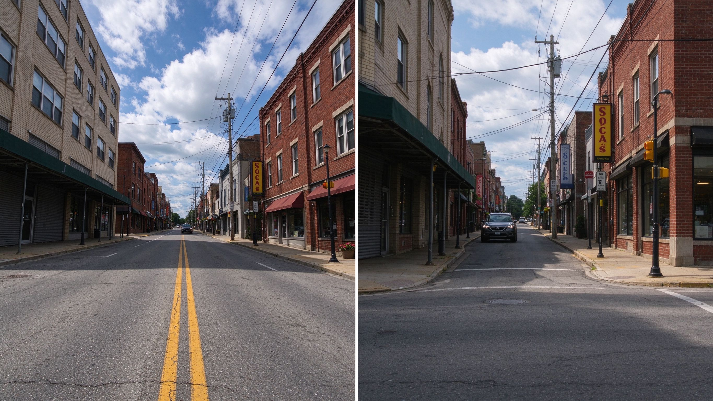
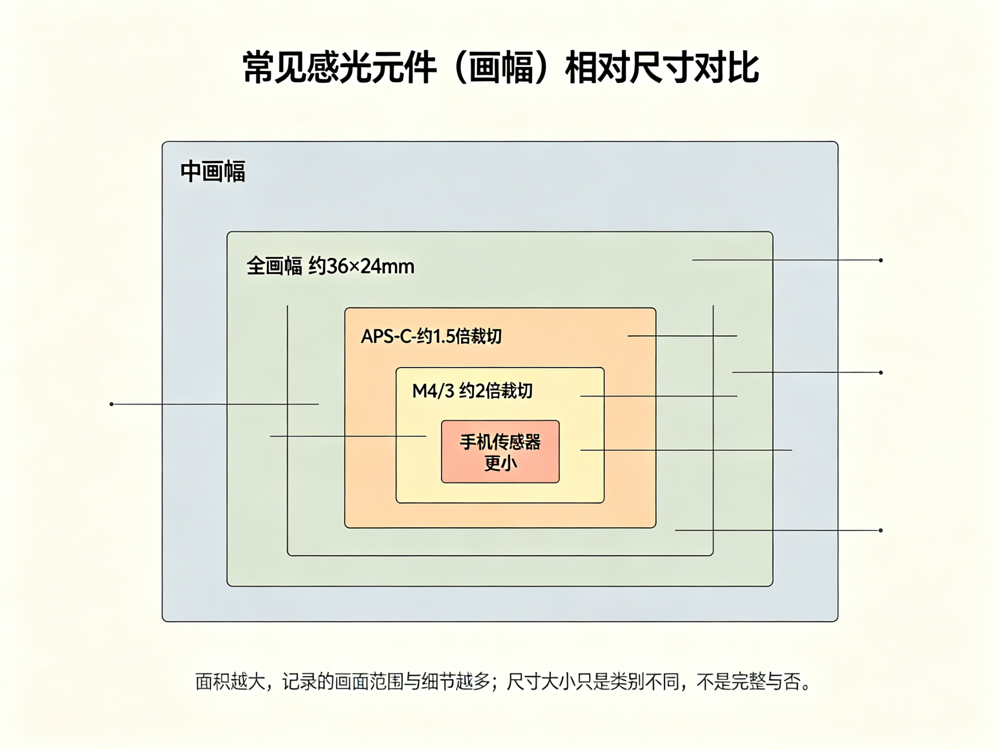

# 第 2 课：相机、镜头与画幅入门

这一课先把后面会反复出现的器材词汇讲清楚：相机由什么组成、镜头上的数字表示什么、画幅是什么，以及镜头怎样装到机身上。单反和无反的历史变化放在第 3 课按时间顺序讲，本课只建立理解它们所需的结构基础。

## 1. 相机怎样形成一张照片

最简化地看，一套可换镜头相机由镜头、机身和记录影像的感光面组成：

```text
场景 → 镜头 → 机身里的感光元件 → 处理器 → 照片文件
```

镜头把场景中的光形成影像；感光元件接收光线；机身控制曝光、对焦并把信号处理成文件。手机也遵循这个基本过程，只是镜头、传感器和处理器集成在一个小机身中。

## 2. 镜头上的毫米数：焦距

镜头上常见 `18mm`、`35mm`、`50mm`、`200mm` 等数字，称为**焦距**。焦距是镜头的光学参数，不是镜头外壳的长度。

在画幅相同、拍摄位置相同的情况下：

- 焦距较短，画面视角通常较宽，能纳入更多场景。
- 焦距较长，画面视角通常较窄，远处主体在画面里显得更大。

```text
同一位置、同一画幅看同一场景

短焦距：┌────────────────────────┐  收进范围较大
中焦距：     ┌──────────────┐       范围较窄
长焦距：         ┌────────┐           范围更窄
```

图 1：焦距主要改变镜头呈现的取景范围。

摄影中常说的**广角、标准、长焦**，是结合画幅后对视角的粗略分类。同一焦距装在不同画幅上，取景范围可能不同，所以这些词不能脱离画幅单独判断。



上图：同一位置拍同一条街——左半用广角，画面纳入整条街道与两侧建筑；右半站在原地换成长焦，画面只截取街角那一片，远处物体在画面里更大。焦距改变的是取景范围，不是把远处拉近的魔法。（原创生成示意图，非真实照片）

### 2.1 焦距和透视的区别

焦距改变取景范围；**透视关系主要由拍摄位置决定**。

如果站在原地把焦距从 35mm 换成 100mm，画面主要是变窄，像从大画面中截取了中间一部分。若为了保持人物在画面中的大小而后退，人物与背景的相对大小和距离感会改变。这种变化常被称为长焦的“压缩感”，它主要来自拍摄者后退后观察位置改变，而不是长焦镜头单独改变了空间。

### 2.2 定焦、变焦和对焦

- **定焦镜头：** 焦距固定，例如 35mm。需要改变取景范围时，通常要移动位置或更换镜头。
- **变焦镜头：** 焦距能在一个范围内改变，例如 24–70mm。转动变焦环可以调整取景范围。
- **对焦：** 调整镜头成像状态，使某个距离上的主体清晰。定焦镜头也能对焦；“定焦”说的是焦距固定，不是不能调焦。

## 3. 感光元件和画幅

数码相机中的感光元件（图像传感器）负责接收光线。不同相机的感光元件物理尺寸不同。摄影中说的**画幅**，在这里主要指感光元件的尺寸类别；照片的 3:2、4:3、1:1 则是长宽比例，二者不是一回事。

常见画幅的大致关系如下，图不按实际尺寸绘制：

```text
┌────────────────────────────┐ 中画幅（规格不止一种）
│  ┌──────────────────────┐  │ 全画幅：约 36 × 24 mm
│  │  ┌────────────────┐  │  │ APS-C：不同厂商略有差异
│  │  │  ┌──────────┐  │  │  │ M4/3：约 17.3 × 13 mm
│  │  │  └──────────┘  │  │  │ 手机传感器通常更小
│  └──────────────────────┘  │
└────────────────────────────┘
```

图 2：常见感光元件的相对尺寸示意。



上图：把几类常见感光元件按大致比例叠在一起——最外是中画幅，往里依次是全画幅（约 36×24mm）、APS-C、M4/3，最中心那块很小的才是手机传感器。面积越大，通常能记录的视角和细节越多；但这只是尺寸类别不同，不代表小画幅“不完整”。（原创生成示意图，非真实照片）

**全画幅**约为 36 × 24mm，尺寸与一格 35mm 胶片相近，所以成为常见参照。它不代表其他画幅“不完整”。传感器越大，制造成本、镜头覆盖范围和机身设计往往也会受到影响；大画幅有自身优势，小画幅也可能更便携、成本更低。

### 3.1 为什么同一镜头在不同画幅上的取景范围不同

镜头会在相机内部投射出一个圆形影像。感光元件只记录落在自己范围内的部分。较小的感光元件记录到的范围较窄，因此同一拍摄位置、同一焦距下，主体看起来会更大一些。

```text
镜头投射的影像范围
┌──────────────────────────┐
│  ┌────────────────────┐  │ ← 全画幅记录较大范围
│  │     ┌────────┐     │  │ ← APS-C 记录较小范围
│  │     └────────┘     │  │
│  └────────────────────┘  │
└──────────────────────────┘
```

图 3：较小画幅记录到镜头影像中较小的一块。不是镜头焦距变了。

### 3.2 裁切系数和等效视角

把全画幅作为比较基准，常把全画幅的裁切系数记为 1 倍。APS-C 常见约 1.5 倍或 1.6 倍；M4/3 约 2 倍。粗略换算是：

> 等效焦距 ≈ 镜头实际焦距 × 裁切系数

例如 APS-C 上的 50mm 镜头，如果按 1.5 倍计算，视角大致相当于全画幅 75mm 镜头。镜头实际焦距仍然是 50mm；“75mm 等效”只是在说取景范围。

```text
全画幅 50mm        → 参考取景范围
APS-C 50mm（1.5×） → 约等于全画幅 75mm 的取景范围
M4/3 50mm（2×）    → 约等于全画幅 100mm 的取景范围
```

图 4：等效焦距比较视角，不改变镜头真实焦距。

手机上标注的“等效 24mm”通常也是指视角约相当于全画幅 24mm，而非手机镜头实际焦距是 24mm。手机还可能用数码裁切、多摄像头切换或算法融合改变画面。

## 4. 卡口是什么

镜头和机身连接的接口叫**镜头卡口**。它是机身前方的环形连接结构，通常通过卡榫和旋转动作锁紧镜头。卡口既要把镜头固定住，也要让镜头与机身保持准确距离和位置。

现代卡口通常还有电子触点，让机身和镜头交换信息，例如控制光圈、驱动自动对焦、报告焦距或协调防抖。老式镜头和机身可能通过机械拨杆传递部分信息；不同年代和品牌的接口设计并不相同。

```text
镜头后端                         相机机身
┌────────────┐   对准、插入、旋转   ┌──────────────┐
│卡榫 触点  ○│  ───────────────→  │○ 触点  卡口环│
└────────────┘                     └──────────────┘
         卡口负责固定镜头，并建立光学位置和信息连接
```

图 5：镜头卡口的简化示意。具体结构依品牌和系统而异。

镜头是否能安装，首先看卡口是否匹配；能装上也不一定代表全部功能可用。**转接环**是放在镜头和机身之间的连接件，可以让某些不同卡口组合使用，但自动对焦、光圈控制或防抖功能可能受限。

因此，买可换镜头相机时，选择的往往不只是某一台机身，而是一个由机身、镜头、闪光灯、附件、维修和兼容性组成的系统。历史上品牌会推出新卡口，也会努力维持旧镜头兼容；这些选择会影响用户是否愿意换系统。具体品牌竞争按时间顺序放在第 3 课讲。

## 5. 取景结构的入门：单反和无反是什么

这一节只解释名称和结构，历史过程放在第 3 课，避免同一段历史讲两遍。

### 5.1 单反

**单反**是“单镜头反光相机”的简称。它有一块反光镜，取景时把镜头看到的光线反射到光学取景器；拍摄时反光镜抬起，让光到达胶片或传感器。

```text
取景：场景 → 镜头 → 反光镜 ↗ 光学取景器
拍摄：场景 → 镜头 → 反光镜抬起 → 胶片/传感器
```

### 5.2 无反

**无反**是没有这套反光镜和光学取景通道的可换镜头相机。传感器把实时画面送到屏幕或电子取景器，摄影者看到的是电子显示的影像。

```text
取景与拍摄：场景 → 镜头 → 传感器 → 屏幕/电子取景器
```

单反与无反的名称说的是相机内部的取景结构，不是画质等级，也不是“专业”和“业余”的区别。无反仍然可以有取景器；只是取景器显示的是电子图像。

## 6. 把几个容易混淆的词放在一起

| 词语 | 它描述什么 | 它不表示什么 |
|---|---|---|
| 焦距 | 镜头的光学参数 | 镜头外壳长度 |
| 画幅 | 感光元件的尺寸类别 | 照片的长宽比例 |
| 裁切系数 | 不同画幅取景范围的换算关系 | 镜头焦距真的改变 |
| 卡口 | 镜头和机身的连接及通信接口 | 画幅大小 |
| 单反/无反 | 相机的取景结构 | 专业等级或画质等级 |
