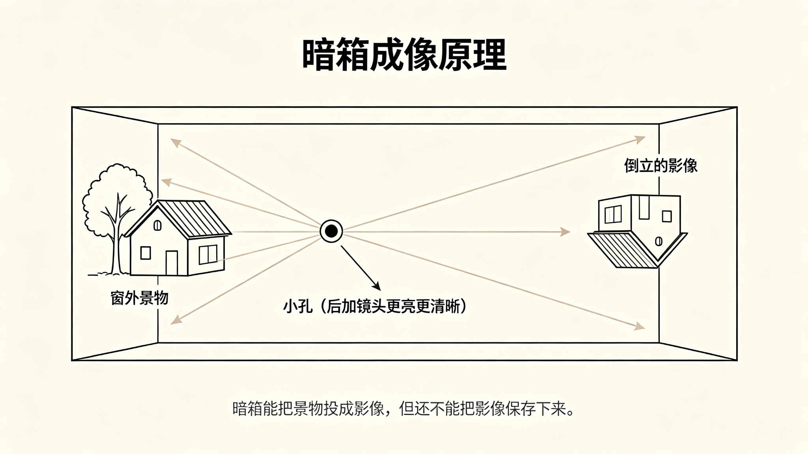
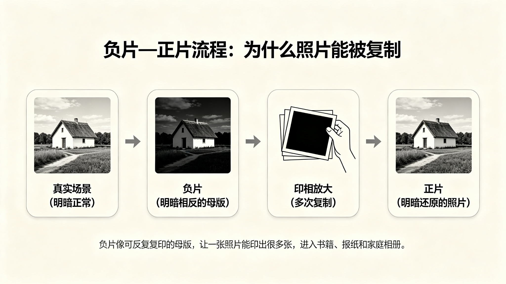
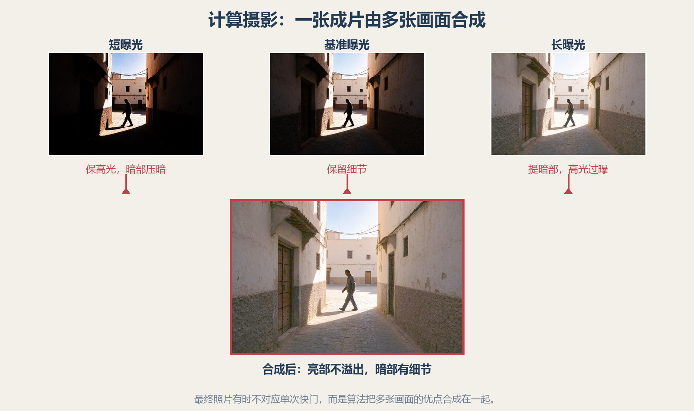

# 第 3 课：摄影简史——从暗箱、胶片到计算摄影

摄影史按时间顺序讲。每个阶段先交代当时的人遇到什么问题，再介绍新技术怎样解决问题，以及为什么有些标准留下来、有些退出主流。涉及相机结构和器材名词时，先用第 2 课的基础概念。

## 1. 暗箱：有了影像，还没有照片

人们很早就发现，光线通过小孔进入黑暗空间，会在对面形成倒立影像。后来加入镜头，影像可以更亮、更清楚。这个装置称为**暗箱**（camera obscura，意为“暗室”），画家曾用它辅助描画建筑和风景。

```text
窗外景物          小孔/镜头             暗箱内壁
   ↑                 ·                    ↓
  房屋 ─────────── 光线穿过 ─────────→ 倒立影像
```

图 1：暗箱能投出影像，却不能自动把影像保存下来。



上图：一间暗室的剖面——窗外的小屋发出光线，穿过左壁的小孔后交叉会聚，在对面内壁上投出一个上下颠倒的影像。暗箱解决了“成像”，却还差一步：没有一种遇光会变化、又能把影像固定下来的材料。（原创生成示意图，非真实照片）

所以摄影术还缺一件事：找到一种遇光会变化、而且变化可以固定的材料。摄影史最早的主线，就是光学成像与感光化学终于接上了。

## 2. 1820—1840 年代：影像终于能留下来

### 2.1 尼埃普斯与“等太阳画画”

法国发明家约瑟夫·尼埃普斯在金属板上涂布感光沥青，让暗箱影像长时间照射。受光部分变硬，之后洗去未硬化的材料，留下了影像。他把方法称为**日光绘画**。现存最著名的作品《窗外景色》通常定年为 1826 或 1827 年，曝光据估计长达数小时。

想象一下：你拍一张照片，要让相机对着窗外几个小时。太阳在移动，屋顶上的阴影也在变，这张照片记录的不是今天理解的“某一瞬间”，而更像一段时间里光线的总和。早期照片曝光这么长，人像当然很难自然微笑：别说表情，呼吸和轻微晃动都可能让脸糊掉。

### 2.2 达盖尔摄影术与发明权

尼埃普斯与画家、舞台布景设计师路易·达盖尔曾合作改进摄影。尼埃普斯去世后，达盖尔继续研究。1839 年，**银版摄影术**正式向公众公布，摄影由此迅速传开。

银版是在抛光的镀银铜板上形成影像，细节非常精致，但每块银版基本是一张独一无二的成品，复制不方便。达盖尔因此获得巨大声望，尼埃普斯的早期贡献一度被忽略。这段历史提醒我们：技术发明常是多人接力，而谁被历史记住，还会受到传播、商业和政治的影响。

**早期自拍小故事：** 1839 年，费城人罗伯特·科尼利厄斯在自家院子里给自己拍摄肖像。他需要把相机架好、在阳光下坐定，并在曝光期间尽量不动。没有自拍杆，但有一件更难的事：自己同时当摄影师和模特，还得等曝光完成。

### 2.3 塔尔博特与负片—正片

英国科学家威廉·亨利·福克斯·塔尔博特发展了纸负片方法。负片的明暗与现实相反，但可以利用它多次印出正片。银版法像一张精致但唯一的原件；负片法则像能反复复印的母版。

后来胶片摄影延续了“负片—正片”这条路线。照片可以复制以后，才更容易进入书籍、报纸、家庭相册和档案。摄影从一次性的物件，开始成为可以广泛传播的信息。



上图：从左到右——真实场景明暗正常；拍下的负片明暗正好相反，像一张母版；再通过印相放大，就能反复复制；最后得到明暗还原的正片。银版法是一张独一无二的原件，负片法则让照片可以复印、流传。（原创生成示意图，非真实照片）

## 3. 1850—1880 年代：摄影师背着暗房出门

湿版玻璃底片能拍出细节很好的影像，却要求摄影者在材料干之前完成曝光和显影。摄影师出门常带着玻璃板、药水、相机和临时暗房帐篷。拍风景不是“相机一背就走”，更像带着一个小型化学实验室远行。

后来干版玻璃底片和更方便的感光材料逐渐成熟，底片可以预先制备，现场工作轻松了一些。技术上的意义非常实际：摄影者能把注意力从“怎么让药水别干”转回到“眼前发生了什么”。

这一时期还有一个常被讲成段子的故事：摄影会不会让画家失业？摄影确实改变了肖像委托、写实绘画和新闻记录，但没有消灭绘画。相反，摄影承担了新的记录工作后，绘画也更自由地探索非写实表达。新媒介往往改写旧媒介的角色，而不是简单把它清零。

## 4. 1880—1930 年代：卷片、柯达与 35mm 小相机

### 4.1 “你按快门，剩下的交给我们”

乔治·伊士曼推动柔性卷片和简化相机。1888 年推出的 Kodak 相机把复杂流程包装成普通人也能使用的服务：用户拍完整卷后寄回公司，由公司冲洗、打印并装上新胶卷。1900 年推出的 Brownie 盒式相机进一步降低了价格和使用门槛。

这不只是相机革新，而是商业模式革新：相机、胶卷、冲洗和打印连成完整链条。摄影大众化后，街头、旅行、家庭生活中的照片数量大增。摄影从“拍一张要认真筹备”变成日常记录。

### 4.2 电影胶片怎么变成静态摄影标准

35mm 胶片最初主要用于电影。徕卡工程师奥斯卡·巴纳克制作小型相机时，采用这种胶片；他原本也用小型摄影测试电影胶片的曝光。徕卡 I 于 1925 年公开推出，使用 24 × 36mm 画格。

一格 35mm 底片比大画幅小，但相机可以随身携带，并较快地连续拍摄。底片放大、镜头和冲印技术逐渐成熟后，小画幅的便利开始超过底片尺寸小的缺点。新闻和纪实摄影尤其受益：决定性瞬间往往稍纵即逝，能随身带着相机比携带一块大底片更重要。

一个有趣的历史反转：电影胶片格式进入静态摄影，后来又成为数码时代“全画幅”的尺寸参照。今天说全画幅，指的就是数字传感器大致等于 35mm 胶片一格的 36 × 24mm，而不是“所有其他尺寸都不完整”。

### 4.3 为什么市场会同时保留多种画幅

小画幅更便携，一卷能拍更多张；大画幅更容易制作细节丰富的大照片，但设备重、拍摄慢。中画幅处在两者之间。它们服务的任务不同，所以摄影史并不是小画幅一路把大画幅淘汰的单线故事。

一种格式要成为标准，通常还需要相机、镜头、胶片生产、冲印服务和用户习惯一起支持。格式的技术表现只是条件之一，配套是否成熟同样重要。

## 5. 单反出现：第 2 课里的结构进入历史

先回忆第 2 课的定义：**单反**通过反光镜把镜头里的画面送到光学取景器；**无反**没有这面反光镜，主要通过传感器和电子显示取景。这里讲它们何时出现、为何受到重视，不再重复完整结构说明。

1930 年代，35mm 单反开始出现。早期结构并不完美，取景器、反光镜回位和操作速度都有限。战后，眼平取景器、自动回位反光镜和自动光圈等改进让单反更适合快速拍摄和更换镜头。

1959 年，尼康推出 Nikon F。它重要的不只是某个单项参数，而是把机身、可换取景器、马达、闪光灯和镜头群组织成一套可靠系统。新闻和体育摄影师需要快速换镜头、追焦、连拍，并在不同城市找到熟悉的维修和配件。系统可靠性让单反逐步成为许多专业工作的主力。

佳能、尼康、宾得、奥林巴斯等厂商在不同年代竞争：谁的自动对焦更快、机身更可靠、镜头更丰富、系统更容易扩展，都会影响用户选择。某个品牌被广泛采用，不代表其它品牌没有好相机，而是当时的系统、销售和服务网络组合更适合许多摄影者。

## 6. 彩色摄影：马铃薯淀粉也进了相机

彩色摄影的实验在 19 世纪已出现，但很长时间难以稳定、便宜地拍摄和冲印。1907 年开始销售的 Autochrome 彩色玻璃板使用染色的马铃薯淀粉颗粒作为微小彩色滤镜。透过这些颗粒观看，光线与黑白影像组合成彩色照片。

它的照片色彩柔和，常像一幅带颗粒的绘画；但玻璃板易碎、曝光较慢，流程也不够方便。1930 年代，Kodachrome 等多层彩色胶片逐渐成熟，彩色摄影更适合旅行、杂志和家庭使用。

黑白没有因彩色出现而消失。黑白照片能简化颜色信息、突出明暗与形状，也常因材料和冲印流程而形成独特质感。技术有新旧，表达方式不必排队退场。

## 7. 1930—1970 年代：单反系统、彩色胶片与即时成像

35mm 单反逐渐成熟，自动曝光、内置测光、自动对焦和电子控制陆续进入相机。品牌竞争开始从“相机能不能拍”发展到“整套系统是否快、准、可靠、好用”。佳能 1987 年推出 EOS 650 与 EF 电子镜头系统，是一个后来影响很大的节点：机身与镜头通过电子方式通信，镜头马达由镜头侧驱动。佳能当时没有延续原有 FD 卡口的直接兼容，用户要面对换系统成本，但新接口也更适应后来的自动对焦发展。

与此同时，即时成像走了另一条路。宝丽来让照片在拍摄后不久直接显现；1972 年 SX-70 折叠相机把单反取景和自显影彩色照片装进一台可折叠设备。照片从相机里出来后逐渐显影，拍摄变成一种当场分享的社交活动。

## 8. 画幅标准的一个“幽灵”：APS 胶片为什么没成主流

1996 年，柯达、佳能、富士、尼康、美能达等厂商共同推出 APS（Advanced Photo System）胶片标准。它使用更小的 24mm 胶片，改善装片方式，可记录拍摄信息，并允许用户选择不同的照片比例。冲洗时胶片还能回到原来的暗盒，配套索引图方便挑选照片。

这个设计很先进，像是胶片时代的用户体验升级。但它要求消费者换相机、胶卷和冲印习惯。数码摄影此时已经开始快速进步，大家不愿意为一个新胶片格式再迁移一次，APS 后来退出大众主流。

数码相机行业后来把接近 APS 胶片 Classic 画格尺寸的部分传感器叫作 APS-C。数字传感器尺寸并不与胶片完全一样，但名称延续下来。胶片格式被淘汰，名字却留在新技术里，这就是一个标准留下的“幽灵”。

## 9. 数码摄影：柯达做出了原型，行业却必须重写生意

1975 年，柯达工程师史蒂夫·萨松用 CCD 传感器做出早期数码相机原型。CCD 是早期常见的一类图像传感器：它把落到感光面上的光转换成电信号，再读出为数字数据。机器约有烤面包机那么大，图像只有约 10,000 像素、黑白显示，数据存到磁带上，回放要接电视。它不能和今天的相机比画质，却证明了一个关键概念：照片可以直接成为数字数据。

“柯达发明数码却拒绝数码，最后倒闭”是流传很广的段子，但真实历史复杂得多。柯达长期参与数码成像，也推出过数码产品；难处在于胶卷、相纸和冲印曾构成它庞大的利润链条，而数字影像把整条链条重新洗牌。它面对的是既有生意转型、消费者习惯改变和新竞争者同时到来的压力。

1990 年代末和 2000 年代，数码单反逐渐进入新闻和专业工作。早期传感器很贵，很多机身用比 35mm 胶片小的传感器；小传感器能降低成本，也带来较窄的取景范围。随着传感器制造进步和成本下降，APS-C 数码单反走向普及，全画幅数码机身也陆续进入专业和高端市场。

## 10. 从单反到无反：为什么成熟路线会让位

无反相机去掉单反的反光镜，传感器把实时画面送到电子取景器或屏幕。它在早期遇到的实际困难包括电子显示延迟、耗电、连续对焦能力和镜头系统不成熟，因此没有一出现就取代单反。

2008 年，奥林巴斯和松下公布 Micro Four Thirds 系统标准；松下 G1 是早期重要的可换镜头无反相机。它证明无反可以是完整系统，但单反当时仍有成熟的光学取景器和追焦表现。

之后传感器读取速度、片上相位对焦、电子取景器和处理器持续进步。2013 年索尼 α7 系列把全画幅传感器放入相对紧凑的无反机身，让无反进入更多高端用户的视野。无反能够实时预览曝光、识别人眼和直接进行视频对焦；这些能力逐渐改变了市场权衡。

传统单反厂商也开始建设无反系统。这不表示单反突然不能用，而是厂商的新机身和新镜头研发逐渐转到无反。用户既有的单反和镜头仍然可以工作，转接环也让部分旧镜头继续使用。

### 为什么换卡口会影响用户

第 2 课已经介绍过：**卡口**是镜头与机身固定、定位和通信的接口。一个品牌的镜头卡口稳定使用几十年后，用户可能拥有多支镜头、闪光灯和附件。改用新卡口可能带来更适合新相机的镜头设计，但也让旧器材兼容成为问题。

因此，品牌更换卡口既是技术选择，也是用户和产业链的选择：新设计能带来多少好处？旧镜头能否转接？自动对焦和防抖是否可靠？新镜头什么时候补齐？用户是否愿意继续投资？这些问题比“这台新机多几百万像素”更能解释系统竞争。

## 11. 手机与计算摄影：算法加入成像链

手机摄像头让摄影设备始终在手边，移动处理器则能快速分析和合成图像。手机夜景模式可能合并多张照片；面对很亮和很暗同时出现的画面，手机也可能合并不同亮度的信息；人像模式估计主体与背景，再模拟虚化；全景模式把连续画面拼接起来。这里先认识“照片可能由多张画面合成”这一历史变化；这种高反差场景处理在第 10 课会以 HDR 的名称完整讲解。

于是最终照片有时不再对应单次曝光：拍运动主体可能出现重影，复杂发丝可能被虚化算法误判，多张画面合成也可能让明暗显得过于平均。现代摄影既要理解镜头和曝光，也要知道相机或手机怎样处理图像。



上图：手机夜景或 HDR 并不是只按一次快门——它连拍多张：短曝光防止亮部溢出，长曝光把暗部提亮，再由算法把几张的优点合成一张亮部不溢出、暗部有细节的成片。所以这张照片记录的不是某一瞬间，而是多帧信息的叠加。（原创生成示意图，非真实照片）

## 12. 摄影史时间线

```text
暗箱        光学投影，但不能保存影像
1820s       尼埃普斯留下早期永久影像
1839        达盖尔摄影术公开；负片复制路线也在发展
1888/1900   Kodak 与 Brownie 推动大众摄影
1907        Autochrome 彩色玻璃板销售
1925        Leica I 推动 35mm 小型静态摄影
1930s       彩色胶片和 35mm 单反逐步发展
1959        Nikon F 展示成熟、可扩展的单反系统
1975        柯达工程师萨松制作数码相机原型
1987        Canon EOS/EF 电子卡口系统推出
1996        APS 胶片标准尝试更新大众胶片体验
1999-2000s 数码单反进入专业和大众市场
2008        Micro Four Thirds 系统与可换镜头无反发展
2010s       全画幅无反、手机与计算摄影快速发展
```

图 2：时间线用于看技术先后与相互影响；旧技术不会在新技术出现时立刻消失。

## 13. 读摄影史时要留意的事情

- “第一个”常有不同定义：最早实验、最早保存至今、最早公开、最早商业成功，可能是不同作品或产品。
- 标准不是因为完美才胜出。生产成本、已有用户、售后、镜头群和市场时机都会改变输赢。
- 一种技术失去主流，不代表它毫无价值。胶片、单反和不同画幅仍有人使用，只是产业资源和大众选择改变了。
- 品牌史不等于摄影史全貌。本课用主要厂商节点解释系统竞争，后续可以再增加其他国家、地区、女性摄影者、纪实与艺术流派等专题。
