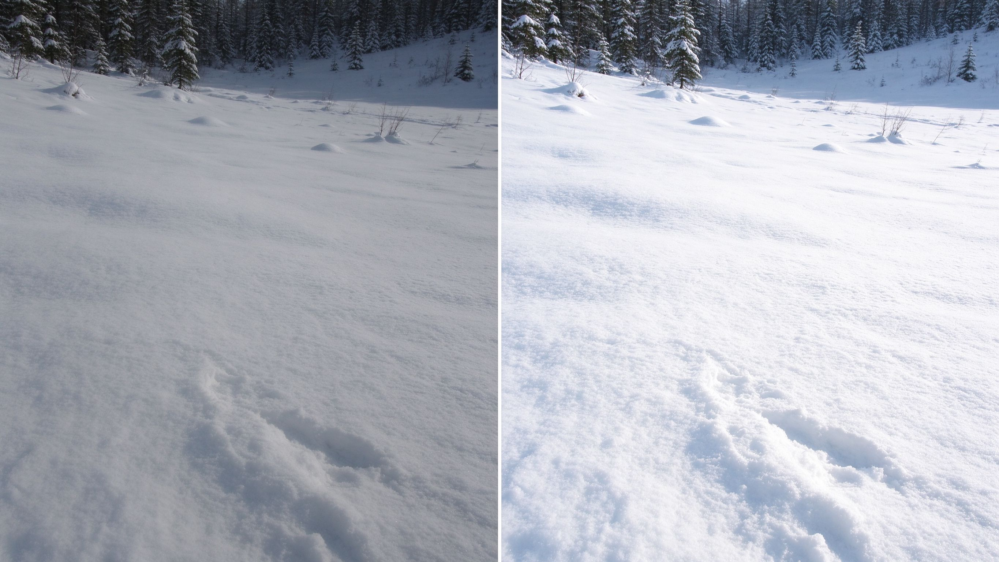

# 第 9 课：自动曝光与测光

## 1. 需要了解的知识

### 1.1 相机怎样“判断”亮度

相机测光系统接收取景画面的明暗信息，并按照内部算法估算曝光参数。相机并不知道你拍的是白雪、黑猫还是灰墙；它只能分析收到的光，并依照测光模式和默认目标给出建议。

因此，相机测光不是理解场景，而是按规则计算。亮白场景可能被自动压暗，大片黑色场景可能被自动提亮，摄影者需要判断相机建议是否符合画面意图。

### 1.2 常见曝光模式

- **P（程序自动）：** 相机决定快门和光圈，用户可调整部分选项。
- **A/Av（光圈优先）：** 用户选光圈，相机决定快门；适合优先控制景深的场景。
- **S/Tv（快门优先）：** 用户选快门，相机决定光圈；适合优先控制运动的场景。
- **M（手动曝光）：** 用户设置快门和光圈；ISO 可手动或自动。适合需要固定曝光、复杂光线或连续拍摄一致性的情况。

不同品牌的字母和功能略有区别。自动模式不是“不会摄影”，手动模式也不自动代表更专业；关键是知道自己要控制什么。

### 1.3 测光模式

- **评价/矩阵测光：** 综合画面多个区域估算，适合多数日常场景。
- **中央重点测光：** 更重视画面中央区域，同时考虑周围。
- **点测光：** 重点读取画面很小区域的亮度，适合明确指定测光对象，但需知道测光点落在哪里。

名称和覆盖范围因厂商而异。测光模式决定“重点看哪里”，不会改变真实光线。

### 1.4 曝光指示尺

手动模式下，取景器或屏幕常显示 `-3 … 0 … +3` 一类刻度。它表示当前设置与相机测光建议之间的差异：0 代表符合相机当前测光目标，不保证就是你想要的画面亮度。

自动模式中，这把尺通常用于曝光补偿。向正方向补偿，照片通常更亮；向负方向补偿，照片通常更暗。

### 1.5 自动曝光的限制

相机通常试图让测光区域落在中间亮度附近。雪景、大面积白墙容易被压灰；黑色背景容易被抬亮；逆光人脸可能成为暗剪影。遇到这些场景，要看主体和表达目标，必要时使用曝光补偿、点测光或手动曝光。

上图：相机把大面积白色压成灰蒙蒙的中灰，是测光最常见的陷阱之一；适当正曝光补偿后，雪才呈现明亮的白色和层次。逆光时人脸也会被相机优先照顾背景而拍成暗剪影——这些都说明自动测光只是按规则估算，不是替你判断主体。（原创生成示意图，非真实照片）

## 2. 问题

### 2.1 相机测光能不能知道你拍的是白雪还是黑色衣服？

### 2.2 想控制背景虚化，优先考虑哪种曝光模式？

### 2.3 想优先冻结运动，哪种模式更方便？

### 2.4 手动模式下曝光指示尺在 0，是否一定曝光正确？

### 2.5 为什么雪景在自动曝光下可能显得灰？
