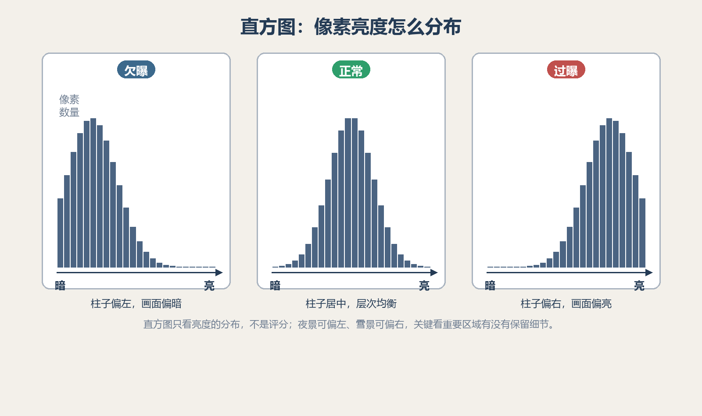
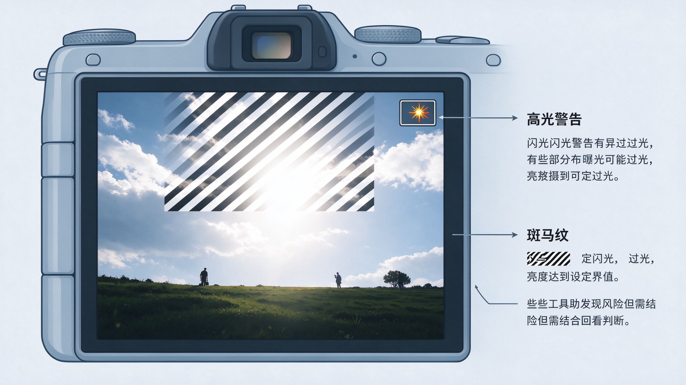
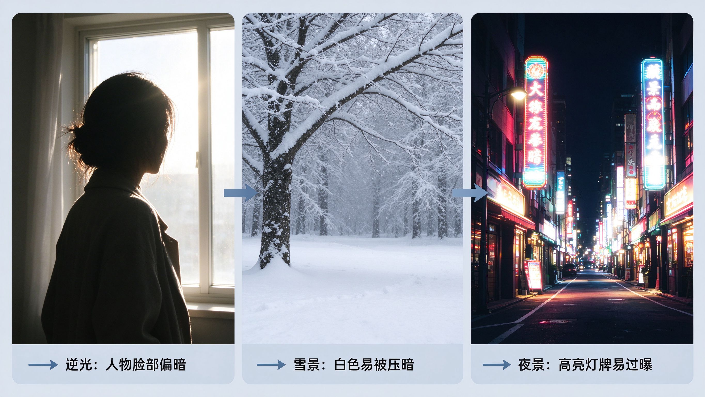
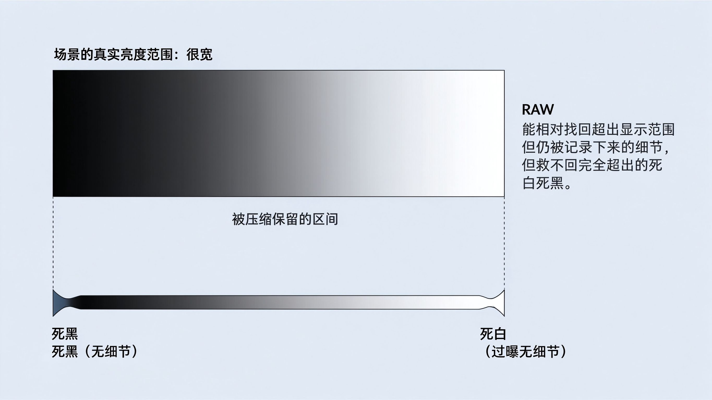
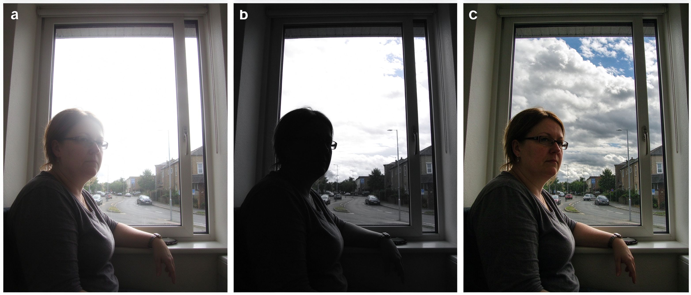

# 第 10 课：曝光补偿与曝光检查

## 1. 需要了解的知识

### 1.1 曝光补偿是什么

曝光补偿让摄影者告诉自动曝光系统：在相机测光建议基础上，照片应更亮或更暗。通常以 EV 档位表示：`+1 EV`约亮一档，`-1 EV`约暗一档。

在光圈优先或快门优先下，相机通常通过调整未锁定的参数实现补偿；具体改变哪项取决于模式、自动 ISO 和设置。手动曝光且 ISO 固定时，曝光补偿可能不起作用或只移动指示尺；不同设备行为有差异。

### 1.2 直方图怎么看

直方图横轴大致表示从暗到亮，纵轴表示相应亮度像素数量。左侧堆积多，画面暗部像素多；右侧堆积多，亮部像素多。

```text
暗部                 中间调                 亮部
|----------------------|----------------------|
阴影像素多                                  高光像素多
```

图 1：直方图是像素亮度分布，不是“好照片评分”。

直方图贴近边缘可能表示暗部或亮部细节被截断，但黑夜照片本来就可能大量落在左侧，雪景也可能集中在右侧。应看重要区域是否丢失细节，而不是强求图形居中。



上图：直方图的横轴大致是从暗到亮，纵轴是相应亮度的像素数量。场景里暗部多，柱子就偏左堆积；亮部多，柱子就偏右堆积。像上面这种高反差的窗边画面，直方图会出现“左、右两头高、中间低”的双峰——这不是曝光错了，而是画面本来就同时有很多暗部和亮部。（原创生成示意图，非真实照片）

除了亮度直方图，很多相机和后期软件还能显示 **RGB 分通道直方图**，把红、绿、蓝三个通道的分布分开看。某个通道在边缘顶满，可能表示那一层颜色被截断：例如天空的蓝色通道溢出时，蓝天会失去层次、发白甚至偏青；白色花瓣的红色通道溢出时，高光会显得不自然。拍摄或修图时扫一眼分通道直方图，能比只看亮度更早发现“颜色层面的细节也丢了”。

### 1.3 高光警告与斑马纹

回放时闪烁的高光警告提示某些区域可能过曝；视频或取景时的斑马纹也可提示亮度达到设定阈值。这些工具帮助发现风险，但通常有阈值、预览和文件格式限制，不一定精确代表 RAW 细节已完全丢失。



上图：回放或取景时，过曝区域会以闪烁的高光警告或斑马纹提示，帮你在拍摄时就发现“这片可能没细节了”，而不是等回到电脑上才发现。（原创生成示意图，非真实照片）

### 1.4 逆光、雪景和夜景

- **逆光人像：** 相机可能优先照顾明亮背景，人物脸部偏暗；可对脸部测光或适当正补偿、补光。
- **雪景：** 大面积白色容易被自动系统压暗，可适当正补偿并检查雪的纹理。
- **夜景：** 画面本来就应有暗部，不必把夜晚强行拍成白天；同时留意高亮灯牌是否过曝。

补偿应依据主体和画面目标，不存在一个适用于所有逆光、雪地或夜景的固定档位。



上图：这三种场景都容易让自动曝光“猜错”。面对它们，先想清楚你最想保住的是脸、雪的纹理还是灯牌，再决定正向或负向补偿，并用直方图和高光警告检查。（原创生成示意图，非真实照片）

### 1.5 为什么照片的明暗是有限的：场景范围与显示范围

先想一个问题：晴天窗边，窗外是刺眼的白日，室内几乎照不到光。用眼睛看，云和屋里的桌椅你“都知道”在那里；可一旦拍下来，往往不是窗外一片死白，就是室内黑成一片，很难两头都清楚。这不是相机出了问题，而是所有“能把照片显示出来”的东西——传感器、屏幕、相纸，也包括我们的眼睛——能容纳的明暗跨度都是有限的。

现实场景的亮度跨度（从最暗的影子到最亮的高光）通常远大于任何设备能显示的范围。一张照片要在屏幕或纸上呈现，就得把场景里很大的明暗跨度，**压缩**进一个有限的显示范围内。压缩必然带来取舍：把暗部照顾清楚一点，亮部就可能顶到极限变成死白；反过来保亮部，暗部就可能掉进死黑。

```text
场景的真实亮度范围：  ██████████████████████   （很宽，从暗到亮）
屏幕/纸张能显示的：    ▄▄▄▄▆▆▆█▆▆▆▄▄▄▄         （有限）
                       └──── 照片只能把场景“挤”进这一段，
                             超出两端的，就成了死黑或死白
```

所以曝光从来不是“把照片调到全都亮”，而是**替这个有限的范围决定，这一张最该保住哪一段**：

- 窗外和脸，哪个更重要？保脸，窗外可能过曝；保窗外，脸可能变暗。
- 剪影、逆光、夜晚，本来就是有意保留“亮部或暗部不提供细节”的反差，这同样是取舍，不是错误。

RAW 能做的，是让取舍的余地**相对大一些**：它记下的信息比 JPEG 多，后期可以把过亮或过暗的部分往回拉，找回一部分本来看不到的细节。但它救不回完全超出传感器记录上限的死白或死黑——那里没有信息，就无从找回。所以前期决定“保哪边”，仍是按下快门那一刻最重要的事。



上图：场景的真实亮度范围通常比任何设备能显示的宽得多。照片要把这个大范围“挤”进有限的显示范围里，两端的部分就变成死黑或死白；RAW 能相对找回仍在记录内、只是超出显示范围的信息，却救不回完全超出的那部分。（原创生成示意图，非真实照片）

（进阶，可先跳过：有一种思路叫**向右曝光**——在不把亮部推过溢出的前提下，尽量让画面偏亮，把更多信息记到高亮一侧，后期再压回来。它对高反差场景往往比“按暗部提亮”更省画质，但每次都要权衡会不会把高光推死。）

### 1.6 从“亮不亮”进阶到“细节记住了吗”

曝光检查的核心不是把直方图调到好看的形状，而是判断重要亮部和暗部是否还留有可用信息。RAW 文件通常比 JPEG 留有更多调整空间，且白平衡可在后期重新解释；但 RAW 不是“永不过曝”，高光一旦超过传感器记录上限，仍没有纹理可恢复。JPEG 已经过相机的白平衡、对比度、降噪和色调处理，预览与直方图也常以 JPEG 为依据，因此它们应被视为提醒，而非 RAW 数据的绝对边界。

白平衡与曝光也要分开判断：照片偏暖或偏冷，首先是颜色解释问题，不必用曝光补偿来处理。可以用白平衡让中性色更自然，也可以保留夕阳、钨丝灯等环境光的色彩来表达气氛。

### 1.7 HDR：让高反差场景保留更多明暗细节

**HDR** 是 *High Dynamic Range* 的缩写，中文常译作“高动态范围”。这里的“动态范围”不是指画面里有动作，而是指从最暗的阴影到最亮的高光之间的亮度跨度。

例如，在室内拍窗边的人：如果按人脸曝光，窗外可能一片白；如果按窗外曝光，人脸可能变成黑影。HDR 的思路是针对同一个静止场景拍摄不止一张照片：一张较暗，优先保留窗外和亮部；一张正常；一张较亮，优先保留室内和暗部。相机或软件再把各张照片中较有用的亮、暗细节组合起来，得到一张明暗信息更完整的照片。



上图：同一室内窗边人物。左格按人脸曝光，窗外过曝成死白；中格按窗外曝光，人脸变成黑色剪影；右格是 HDR 合成，窗外的云和人物的脸都保住了细节。一次曝光很难同时兼顾极亮和极暗，HDR 正是为了在这样的大跨度场景里保留两边。（原创生成示意图，非真实照片）

```text
较暗曝光：保亮部细节  ─┐
正常曝光：保中间调    ─┼→ 合成 → 同时兼顾亮部与暗部的照片
较亮曝光：保暗部细节  ─┘
```

手机的“自动 HDR”或“夜景”常会在你按下一次快门时，暗中连续拍摄多帧并自动合成；相机则可能提供“包围曝光”功能，让你拍一组不同明暗的照片。无论哪种方式，最后都要把场景的大亮度跨度压缩到屏幕或纸张能显示的范围，这个过程会改变照片的明暗关系。因此 HDR 的目标不是让阴影全部变亮、颜色全部变重，而是在保留细节与保持自然观感之间作选择。

**适合尝试 HDR 的情况：**

- 窗外很亮的室内、日出日落、逆光建筑、风景等明暗反差大的画面。
- 主体和相机都比较稳定，能让不同照片对齐的画面。
- 亮部和暗部的纹理都确实是画面想保留的信息。

**不一定适合的情况：**

- 人、车、树叶或水面在快速移动时，不同帧的位置不一致，合成后可能出现重影或边缘异常。
- 太阳、灯丝、反光点等很小的极亮区域，本来就可以是纯白，不必为了保住它们而牺牲整张照片。
- 希望得到剪影、强烈逆光或夜晚深暗气氛时，保留反差本身可能比“全部看清”更符合表达。

使用 HDR 后仍要回看照片：窗外的云、人物的脸、暗部的纹理是否保留？边缘有没有重影？画面是否亮得失去时间感或层次？这些问题比“HDR 是否已打开”更重要。

## 2. 问题

### 2.1 自动曝光时，照片偏暗，曝光补偿应往哪个方向尝试？

### 2.2 直方图没有居中，是否表示曝光错误？

### 2.3 直方图最右侧出现像素，可能意味着什么？

### 2.4 为什么雪景常要尝试正曝光补偿？

### 2.5 夜景照片是否应该把暗部都提亮？

### 2.6 RAW、JPEG 与高光警告之间是什么关系？

### 2.7 什么时候适合尝试 HDR？它不能解决什么？

### 2.8 照片偏暖或偏冷时，为什么不能优先用曝光补偿解决？
