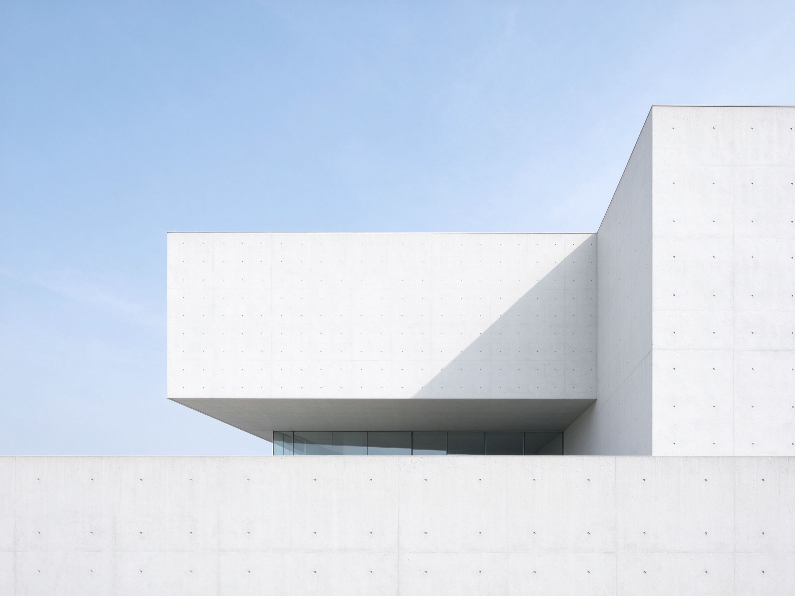
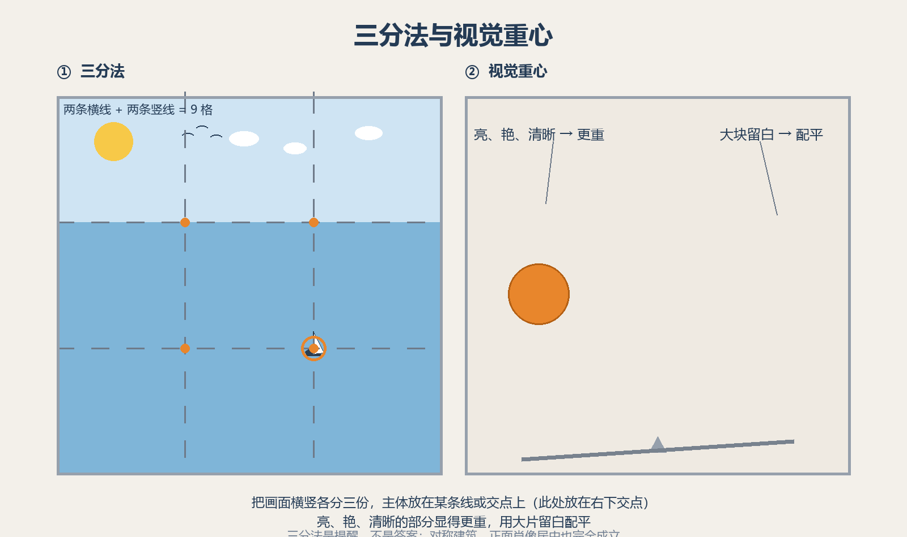

# 第 14 课：画面边界、视觉重心与留白——安排观看的路径

第 13 课先决定主体；这一课讨论主体放在哪里，以及画面为什么有时安稳、有时紧张。构图不是把主体套进固定格子，而是安排观众的观看路径。

## 1. 画面边界不是透明的

画面边界是照片的四条边。它会把现实切成一个有限的片段，也会影响物体看起来离观众多近、有没有活动空间。主体靠近边缘时，常有紧张、急促或即将离开的感觉；主体周围有较多空间时，常显得安静、孤立或从容。

先检查四条边和四个角：有没有半截路牌、过亮的空白、被不小心切断的人？保留或裁掉都可以，但必须能说出理由。

## 2. 什么是视觉重心

**视觉重心**不是物理中心，而是画面里让眼睛感觉“分量最重”的位置。明亮、鲜艳、清晰、面积大、位置靠边或有人脸的部分，通常都会显得更重。

一张照片不需要左右完全一样。人物站在左边、右边留出一片暗海面，仍可能平衡：人物有明确分量，海面提供呼吸和方向。若左侧有一张亮脸，右下角又突然出现一块强烈红色，眼睛可能不断被拉扯；这时可改变位置、等待红色离开，或重新裁切。

## 3. 留白是有意留下的空间

**留白**指画面里有意保留、相对简单的区域。它不一定真是白色：天空、墙面、阴影和模糊背景都可以成为留白。

上图（与第 23 课极简建筑同款）：一片大面积留白的天空和简洁的几何块面。留白不一定真是白色——天空、墙面、阴影和模糊背景都可以，它让主体更突出、画面更安静。（原创生成示意图，非真实照片）留白能让主体更突出，也能表现距离、安静、孤独或人物前进的方向。

判断留白是否有效，问两个问题：它是否让主体更清楚？它是否让画面产生需要的情绪？若两题都是否定，空出来的地方可能只是没有组织好。

## 4. 三分法是提醒，不是答案

把画面横竖各分成三份，交点附近常是容易安排主体的位置，通常称为**三分法**。它的价值是提醒摄影者别总把主体钉在正中，也要观察主体周围的空间。

但正中构图也完全可以成立：对称建筑、正面肖像、道路尽头或希望强调稳定感时，居中可能更有力量。不要先问“有没有放在三分线”，要先问“这个位置有没有服务主体”。

上图：左半图把画面横竖各分三份，两条横线加两条竖线得到四个交点，是安排主体的常用位置——这里把小船放在右下交点；右半图说明视觉配重——亮、艳、清晰的部分显得更重，用另一侧的大面积留白把画面“配平”。三分法只是提醒别总把主体钉在正中，对称建筑、正面肖像居中也完全成立。（原创生成示意图，非真实照片）

## 5. 实拍检查：移动一步，再拍一次

面对同一主体，至少拍两种位置：一次居中，一次移到左或右侧，并刻意给人物视线或行进方向留空间。回看时比较：哪张让人更容易看懂主体？哪张边缘更干净？哪张的空白有意义？

下一课会学习线条、形状、重复和空间层次，它们能进一步把分散的元素组织成画面。
