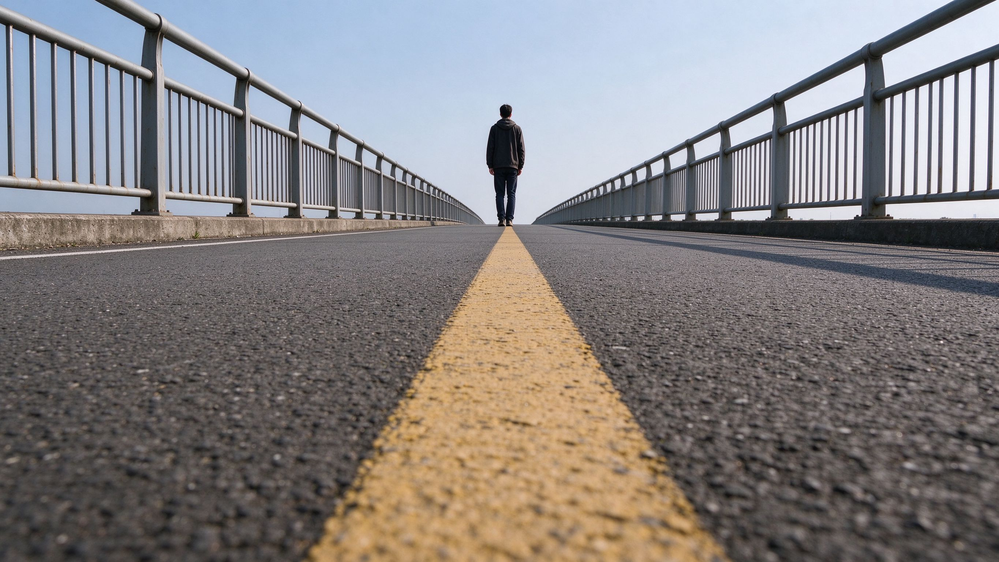
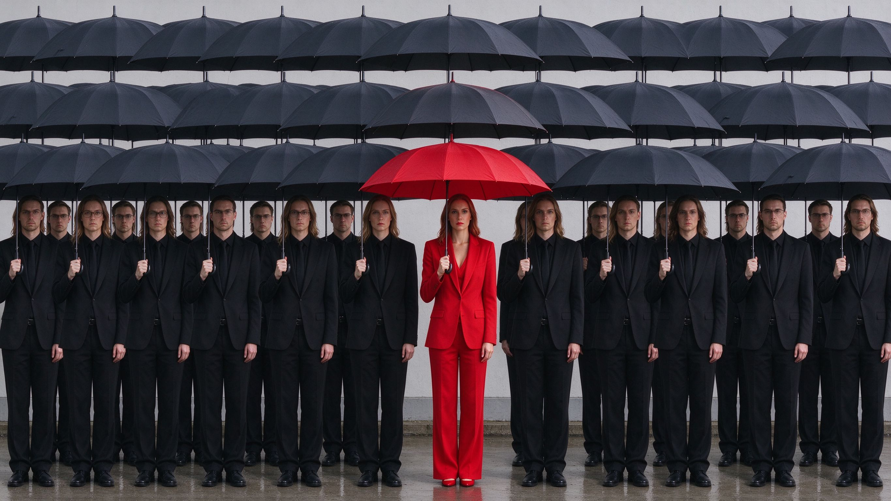
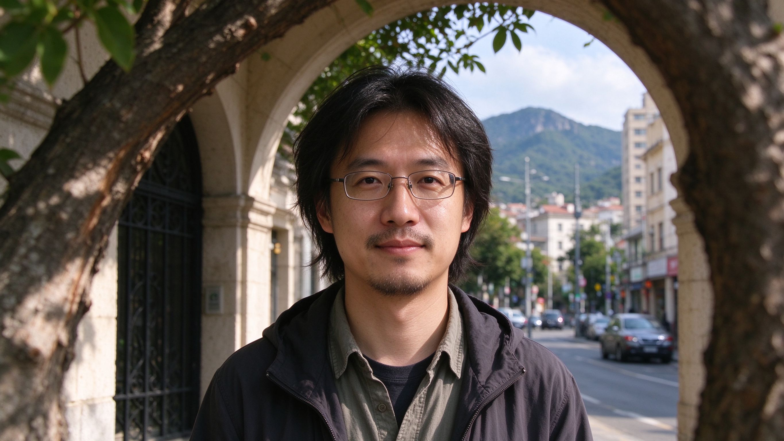

# 第 15 课：线条、形状、重复与空间层次——让画面有组织

照片里的物体不只是在“被拍到”，还会形成线条、形状和前后关系。这些元素能让观众更快看懂画面，也能制造节奏与空间感。

## 1. 线条会带领眼睛

道路、栏杆、河流、墙边、人物视线和光影边界都可能成为**线条**。线条不必真的画在地上；只要许多元素朝同一方向排列，眼睛就会沿着它移动。

拍摄时观察线条从哪里开始、通向哪里。若它通向主体，通常能帮助观看；若它把眼睛直接带出画面，或在主体头上形成杂乱交叉，就可能造成干扰。低机位拍道路、稍微移动位置避开交叉线，往往就能改变效果。

上图：一条笔直的路从画面近处伸向远方，观众的视线会沿着它被带到远处的主体。线不必真的画出来——路面、护栏、墙边、人影的排列都可以成为引导线，关键看它把眼睛带到哪里。（原创生成示意图，非真实照片）

## 2. 形状和框中框

门、窗、影子、山的轮廓和人物姿态会形成**形状**。简单、清楚的形状容易被识别；复杂形状也可以有力量，但要避免主体轮廓与背景黏在一起。

用门洞、窗框、树枝或前景在主体周围围出一个边界，常称为**框中框**。它不是一定要把主体关进框里，而是借近处物体提示“请看里面”。框本身太亮、太抢眼时，反而会变成新主体。

上图（与第 21 课同款）：门洞、窗框、楼梯扶手或影子在主体周围围出一个边界，就是在用框中框引导观看。它提示观众请看里面，但框本身如果太亮、太抢眼，就可能反客为主。（原创生成示意图，非真实照片）

## 3. 重复、节奏和打破节奏

一排窗、一组杯子、许多相似的人或树，会形成**重复**；规律的重复让画面有节奏。重复中突然出现一个不同的元素，例如一排黑伞中的红伞，常会自然成为主体。

拍重复时先决定要拍“规律”还是“那个不同”。想拍规律，就让边缘整齐、避免无关物打断；想拍不同，就让不同元素足够明显，并给它适当空间。

上图：一排相似的黑伞形成规律的重复与节奏，中间那个红衣红伞的人是唯一不同的元素，观众会自然落在它身上。先决定要拍规律还是拍那个不同，再安排边缘和位置。（原创生成示意图，非真实照片）

## 4. 前景、中景、背景：建立空间层次

离镜头近的部分叫**前景**，主体所在的主要区域常称**中景**，远处环境是**背景**。三者不必每张都有，但在风景、街景和环境人像中，前景可以把观众带进画面，背景可以交代地点和尺度。

前景不是随便把东西塞到镜头前。它应该提供方向、色彩、纹理或遮挡关系；如果只是黑乎乎一团且没有作用，就会抢占画面。

上图：前景的树干、拱门让画面有了进入感，中景的人物是主体，远处的城市与山交代了地点和尺度。三层不必每张都有，但有层次的照片通常更好懂——前提是前景要有方向或遮挡作用，而不是一团没用的黑影。（原创生成示意图，非真实照片）

## 5. 练习：只用一个元素组织画面

任选一种元素练习十分钟：找一条引向主体的线；找一个门窗形成框中框；找一组重复；或找一个有前景、中景、背景的场景。每次拍完说出：我用的是哪一种元素？它把眼睛带到哪里？若没有带到主体，下一张该移动到哪里？

下一课会学习视点、角度和距离：同一条线、同一组形状，会因站位不同而完全改变。
