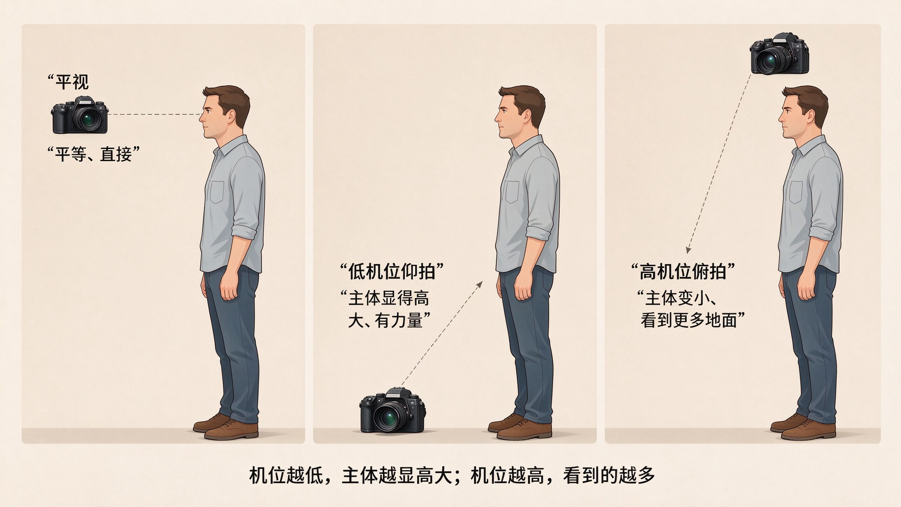
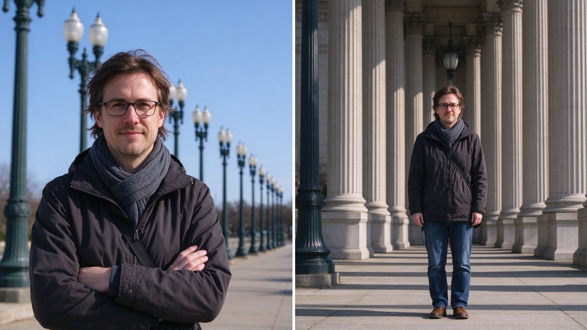

# 第 16 课：视点、角度、距离与透视——先移动，再变焦

镜头决定收进多少范围，摄影者站在哪里则决定画面里物体怎样相互靠近、遮挡和排列。这个观看位置叫**视点**。

## 1. 角度改变关系，不只是“拍高一点”

平视是相机大致和主体同高；俯拍是从上向下看；仰拍是从下向上看。平视常让人感觉平等、直接；俯拍能看见地面图案，也可能让人显得小；仰拍能强调高度、力量或压迫感。

这些只是可能性，不是固定情绪字典。拍儿童时蹲下来，能让观众进入他们的视线高度；拍建筑时后退并仰拍，可能显出高度，也会让垂直线看起来向上汇聚。

上图：同一棵树，只改变相机高度——左半平视与主体同高，看起来平等直接；中间低机位从下往上仰拍，树显得高大、树干线条向上汇聚；右边高机位从上往下俯拍，树显得小，却能看清地面图案和物体排列。机位高低改变的不只是“拍高一点”，而是主体显得多大、前景是否挡住它。（原创生成示意图，非真实照片）

## 2. 距离决定透视关系

**透视**是近处物体看起来更大、远处物体看起来更小，以及平行线在远处看似靠近的视觉关系。它主要由拍摄距离和位置决定，不是某支镜头单独造成的魔法。

例如，靠近人物拍、让远处建筑留在背景中，人物会显得较大；后退很远再用长焦距拍到同样大小的人物，背景会显得离人物更近。这常被叫作“长焦压缩”，但真正改变关系的是你后退了。

上图：同样大小的主体，左半靠近用广角拍，背后的建筑和人群显得远、透视强烈；右半后退到远处用长焦把人物拍成同样大小，背景被拉近、紧贴在人物身后，前后距离感被压缩。长焦压缩不是镜头的魔法，是你后退后观察位置改变的结果。（原创生成示意图，非真实照片）

## 3. 焦距和移动各解决什么

第 2 课已经讲过：焦距主要改变取景范围；移动位置主要改变透视和遮挡。实拍时先移动，寻找能让主体与背景分开的站位；再用焦距决定要收进多少内容。这样比站在原地不停变焦更容易得到有关系的画面。

不能移动时，例如在看台、马路对面或安全区域内，变焦当然很有用。关键是知道自己牺牲了什么：站位没有改变，物体之间的空间关系也不会改变。

## 4. 高度与前景

改变高度常能改变前景是否挡住主体。拍桌面时把相机放低，杯子可能遮住后面的手；站高一点，桌面图案和物体排列会更清楚。拍风景时蹲低，近处草叶可能成为前景；站高，远处地形更容易展开。

每次改变高度，都要重新检查边缘和背景。低角度不自动更有冲击力，高角度也不自动更有秩序；选择应来自你希望观众看到什么关系。

## 5. 练习：同一主体的五个视点

选一棵树、一个人或一张桌子，在安全前提下拍五张：平视、蹲低、站高、靠近、后退。尽量让主体在画面中大小相近，再比较背景与主体的关系怎样变化。不要只挑“最漂亮”的一张；为每张写一句：这个视点让什么变得更明显？

下一课会把色彩、明暗和反差加入画面组织，学习怎样用光让观看路径更清晰。
