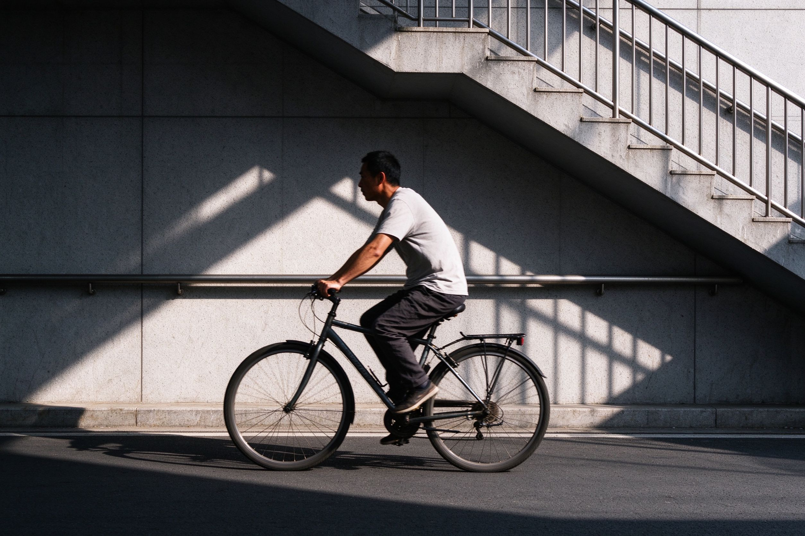
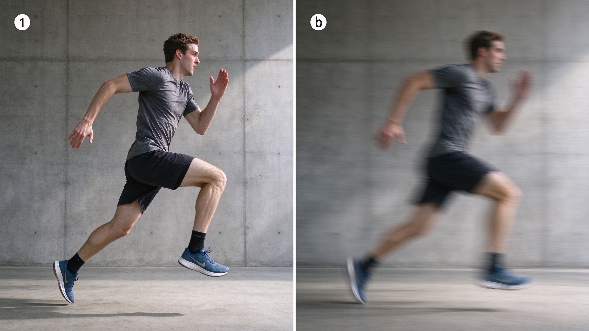

# 第 18 课：瞬间、动作、姿态与画面信息——等到照片发生

摄影记录时间，但不是每个时刻的信息都一样清楚。人物刚好回头、手碰到物体、两个人的视线相遇、车进入一束光里，都会让照片从“有一个人”变成“正在发生一件事”。

## 1. 什么是决定性瞬间

**决定性瞬间**不是指某个神秘的唯一时刻，而是指画面中的动作、位置、表情和背景关系恰好清楚、有意义的一瞬间。它可能持续不到一秒，也可能在静物中等待很久：例如云影刚好落到建筑上。

不要只盯着主体本身，也观察它即将走到哪里、谁会进入画面、背景会不会变干净。预判比反应更重要：先构好图、先设好曝光和对焦，再等待事情进入画面。

上图（与第 21 课同款）：决定性瞬间不是把快门按得快，而是先构好几何和光，再等动作、位置与背景恰好同时到位。预判与等待，比连拍更重要。（原创生成示意图，非真实照片）

## 2. 姿态比“人在不在”更有信息

同一个人站着、低头、伸手、回望或迈步，会传递完全不同的信息。拍人物时，注意手、脚、肩膀和视线：手被身体挡住、脚恰好切在边缘、眼睛半闭，都可能让照片显得不完整。

不必要求人物摆出标准姿势。自然动作往往更有生命力；重要的是选择能说明动作方向和人物状态的那一帧。

## 3. 连拍与单张等待

连拍是在按住快门时连续记录多张，适合动作快、难预判的场景。它增加选择机会，却不能替代观察：若背景杂乱、焦点错误或快门太慢，拍得再多也很难解决。

慢节奏场景可用单张等待。把相机构好，等人物走到光里、等手势展开、等背景里的人离开。连拍是工具，等待也是工具；选择取决于变化速度和你能否预判。

## 4. 快门和表达

第 7 课讲过：短快门更容易凝固动作，长快门会记录运动轨迹。想让跳跃停在空中，要优先保证够快的快门；想让舞蹈或流水留下轨迹，则可以让运动成为画面的一部分。

上图（与第 7 课同款）：想让人物悬停在空中就选高速快门，想让舞蹈或流水留下轨迹就用慢速快门。清晰不是唯一目标，关键是表达这一刻的姿态还是这一段时间的流动。（原创生成示意图，非真实照片）

清晰不是唯一目标。关键是观众能否读懂你要表达的是“这一刻的姿态”，还是“这一段时间的流动”。

## 5. 练习：先观察十秒，再按快门

选择一个有人活动的安全场景，例如校园走廊、路口或运动场。不要立刻拍，先观察十秒：主体会往哪里走？哪一处背景更干净？什么时候动作最清楚？然后拍一组照片，从中选一张并写下：我等的是什么？若没有等到，下一次该提前站在哪里？

下一课会把前面所有知识收拢成一种习惯：怎样观察、分析和评价一张照片，而不是只说“好看”或“不好看”。
