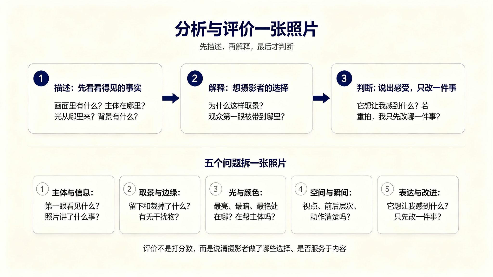
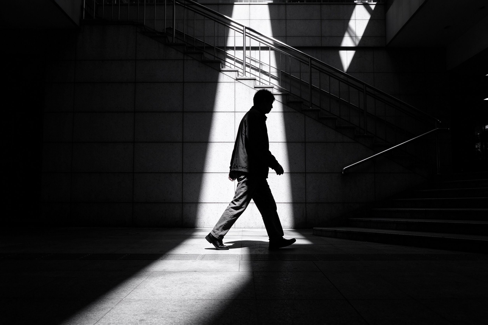

# 第 19 课：观察、分析与评价一张照片——把“好看”说清楚

评价照片不是给它打一个绝对分数，而是理解摄影者做了哪些选择、这些选择是否服务于照片内容。你可以喜欢或不喜欢一张照片，但最好能说出原因。

## 1. 先描述，再判断

看照片时先回答看得见的问题：画面里有什么？主体在哪里？光从哪里来？背景有什么？再回答解释性问题：摄影者为什么这样取景？观众第一眼被带到哪里？最后才说自己的感受和判断。

这样能避免一开始就用“构图不好”“颜色不对”替代观察。照片也许不是构图错误，而是摄影者有意让主体贴边；颜色也许不是白平衡失误，而是在保留夜晚灯光的暖感。

## 2. 用五个问题分析照片

1. **主体与信息：** 我第一眼看见什么？照片让我知道发生了什么吗？
2. **取景与边缘：** 留下和裁掉了什么？有没有干扰物或有意义的环境？
3. **光与颜色：** 最亮、最暗、最鲜艳的地方在哪里？它们在帮助主体吗？
4. **空间与瞬间：** 视点、前后层次、人物动作和背景关系是否清楚？
5. **表达与改进：** 它想让我感到什么？若重拍一次，我只会先改哪一件事？

“只改一件事”很重要。一次想同时重拍焦距、角度、曝光、姿态和颜色，很难知道哪个改变真正有效。

上图：这张图把本课的方法收拢成一张框架图。上半是顺序：先描述看得见的事实，再解释摄影者为什么这样取景、观众第一眼被带到哪里，最后才说出自己的感受和判断；下半是拆一张照片时可依次问的五个问题。评价不是打一个绝对分数，而是说清摄影者做了哪些选择、这些选择是否服务于照片内容。（原创生成示意图，非真实照片）

## 3. 区分技术问题与表达选择

对焦落错、快门太慢导致不想要的拖影、重要高光没有细节，这些通常是需要修正的技术问题。主体故意很小、画面故意很暗、背景故意凌乱，则可能是表达选择；要结合照片意图判断，而不是按统一模板改正。

同一技术现象也可能有两种结果：人物模糊若让动作不可读，可能是失误；若背景清楚、人物拖出速度感，可能是有意的表现。评价前先问“它是否达到了自己的目的”。

## 4. 怎样复盘自己的照片

拍完不要只挑一张最满意的，也保留一张失败但值得分析的照片。给每张写三句：我原本想拍什么？实际哪里成功或失败？下一次先做什么改变？

复盘时把照片并排比较尤其有效：同一场景的不同距离、不同等待时机、不同明暗处理，会让你的选择一目了然。

上图（与第 24 课同款）就是很好的练习对象：主体与信息、取景与边缘、光与颜色、空间与瞬间、表达与改进，你可以用本课五个问题把它拆一遍，再想想若重拍一次只会先改哪一件事。（原创生成示意图，非真实照片）摄影进步不是记住更多规则，而是越来越快地发现画面中的关系并作出选择。

## 5. 综合练习：完成一张有意图的照片

任选一个日常主题，例如“放学后”“窗边”“等待”“红色”或“雨”。拍摄前写一句你想让观众看见或感到什么；拍摄时完成第 13 课的主体检查、第 14 课的边缘检查，并至少尝试两种视点。最后选一张，按本课的五个问题写 100 至 200 字分析，再写一句下次重拍时最先要改变什么。

第三部分到这里完成。之后若进入后期处理、专题拍摄或作品项目，可以继续用这套观察和复盘方法，而不是把摄影重新变成只调参数的练习。
