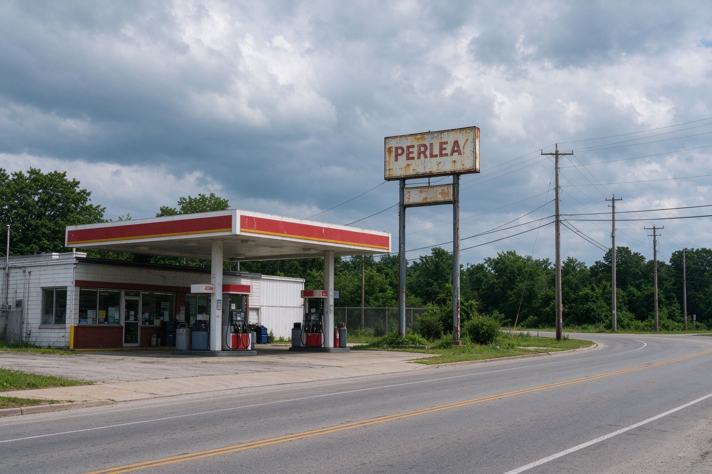
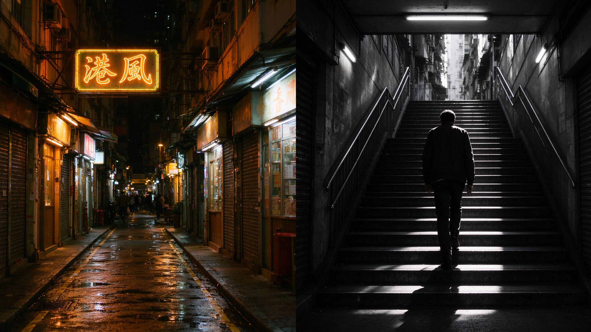

# 第 20 课：摄影风格学习地图——先知道自己想往哪里走

进入后期之前，先回答一个比“用哪个软件”更重要的问题：我希望这张照片让人怎样观看和感受？**风格**不是套上一个滤镜，也不是复制某台相机的颜色；它是摄影者反复作出的一组选择：拍什么、不拍什么，站在哪里，用怎样的光、颜色、距离、时间和处理方式来呈现。

风格没有一个封闭、权威的总目录。题材、历史流派、地区语境、商业用途和个人习惯会彼此交叉：一张街头人像可以是纪实的、黑白的、电影感的，也可以带有某个城市的时代气息。学习时不要问“它到底属于哪一类”，而要用这张地图找到值得研究的方向。

## 1. 用六个维度描述一张照片

### 1.1 题材与任务：拍什么，为谁而拍

题材是照片主要关注的对象或工作目标。常见方向包括：

- **人像：** 棚拍肖像、环境人像、家庭与生活方式、人像时尚、观念人像。
- **风光与自然：** 壮阔风景、亲密风景、自然细节、天文、野生动物。
- **街头、纪实与旅行：** 日常公共空间、社会议题、长期项目、地方生活、旅行叙事。
- **建筑、城市与室内：** 建筑记录、城市景观、空间几何、房产与设计。
- **静物、食物与产品：** 物品质感、商业产品、食物、花卉、桌面叙事。
- **时尚、编辑与广告：** 服装、品牌、造型、概念叙事、商业传播。
- **体育、舞台与活动：** 动作、现场、演出、婚礼、新闻事件。
- **观念、抽象与实验：** 不以“说明一个对象”为目的，而用形状、材料、拼贴、摆拍或后期提出想法。

题材告诉你应该练习什么，但不替你决定风格。风光可以冷静、绚丽、极简或带有人类活动痕迹；人像可以亲密、客观、时尚、戏剧化或像日记。

### 1.2 视觉语言：画面怎样组织

视觉语言是观众在照片中直接看得到的做法：居中或偏置、紧密或留白、几何或松散、抓拍或摆拍、单张或系列。可先从以下成对选择观察：

| 方向 | 常见特征 | 适合研究的问题 |
|---|---|---|
| 直接、清晰 | 清楚边缘、稳定结构、较少修饰 | 细节与事实怎样成为力量？ |
| 柔焦、绘画感 | 柔和边缘、朦胧光线、手工质感 | 模糊怎样表达记忆或梦境？ |
| 极简 | 少元素、大留白、颜色或形状简洁 | 去掉什么后，主体更有力？ |
| 几何、秩序 | 对称、重复、建筑线条、严格边界 | 结构怎样制造节奏？ |
| 碎片、快照感 | 倾斜、近距离、局部裁切、偶然性 | 不稳定感怎样对应生活速度？ |
| 摆拍、电影感 | 控制光线、服装、场景与动作 | 画面是在记录还是在建构故事？ |
| 长期类型学 | 重复规则拍相似对象 | 比较如何产生社会或形式意义？ |

### 1.3 明暗、颜色与质感：照片怎样“呼吸”

这是后期最直接能调整的层面，但应从拍摄意图开始。可观察：高调或低调、低反差或高反差、暖或冷、饱和或克制、干净或颗粒、真实肤色或有意偏色、细节锐利或柔软。它们不是好坏标签，而是情绪与信息的选择。

**黑白**不是把彩色“去掉”。它让颜色关系退后，明暗、形状、质感和人物表情更突出。**胶片感、年代感、电影感**也不是一个固定预设：它们可能来自颗粒、色偏、反差、宽窄画幅、布光、服装、地点、时代道具和叙事节奏的组合。

### 1.4 时间与方法：照片怎样被得到

抓拍、等待、连拍、摆拍、长曝光、多重曝光、拼贴、扫描旧照片、AI 或合成影像，都会影响照片的真实性线索与观看感受。**纪实**通常以记录当下事件或现象为主要目的；它并不等于没有取舍。若使用摆拍、合成或大幅删改，也要在合适场景中对观众说明，尤其是新闻、公共事件和人物故事。

### 1.5 地区、时代与文化语境：从线索出发，不贴标签

“港风”“日系”“法式”“新中式”“复古”等网络名称，常把多个来源混在一起：城市建筑、流行电影、杂志、服装、胶片、社交平台和某个时期的生活记忆。它们可以作为找参考的入口，不能替代对具体作品、作者和文化背景的理解。

学习一个地区或年代的视觉风格时，应追问：参考的是哪座城市、哪个年代、哪种媒介和哪些创作者？画面中的人是否被尊重地呈现？不要把某个国家、地区或族群压缩成固定滤镜与刻板印象。

### 1.6 器材与后期：它们提供选择，不替代观看

相机品牌确实会提供不同的 JPEG 渲染和预设，但这只是最终样貌的一部分。富士的胶片模拟会同时调整颜色、反差和色调；例如官方把 Velvia 定位为更高饱和、高反差的风光与自然倾向，把 PRO Neg. Std 定位为柔和层次的人像倾向。它们是起点，不是“富士人像一定更好”或“某品牌天生属于某题材”的证明。RAW 文件保留更大的后期选择空间；镜头、光线、白平衡、曝光、显示器和调色流程同样会改变结果。

网上说的“尼康黄”“佳能红”“索尼色彩”等，多是用户在特定机型、JPEG 设置、镜头和时代条件下形成的经验印象。课程会把它们作为比较案例，而不把它们教成稳定、普遍的品牌人格。

## 2. 值得认识的摄影史语言

下面不是必须背诵的流派名单，而是学习参考作品时常会遇到的方向：

- **画意摄影：** 用柔焦、特殊印相和绘画式处理强调情绪与手工感。
- **直接摄影与现代主义：** 强调清晰、形式、物体本身和摄影媒介的特性。
- **新视觉与新客观：** 用不寻常视点、几何、工业与细节观察现代生活。
- **超现实与实验摄影：** 通过拼贴、暗房、错位或梦境感制造非日常观看。
- **纪实、报道与街头摄影：** 在现实时间与公共空间中寻找人、事件和社会关系。
- **新彩色摄影：** 把日常环境中的颜色、平凡物件和城市空间作为严肃主题。
- **新地形学与当代风景：** 关注人类建设、工业和自然之间的真实关系，而不只寻找壮丽风景。
- **摆拍、观念与电影化摄影：** 通过控制场景、演员、道具和光线提出叙事或观念。

这些方向会在后续课程配合代表作品学习。它们能帮助我们建立词汇，却不限制个人创作；一张照片完全可以同时借用多种语言。

下面几张示范图（均为原创生成示意图，非真实照片）来自 21–28 课，对应本段提到的几种风格语言，方便你在记名词之前先看见它们大概长什么样：

上面从左到右大致对应：画意（柔焦绘画感）、直接摄影（黑白突出明暗形状）、新彩色摄影（把平凡环境作为严肃主题）、新地形学（人类工业痕迹）、街头摄影（公共空间中的观察）、以及港风这类被过度简化的地区标签。它们相互可以交叉，一张照片也完全可以同时借用多种语言。（原创生成示意图，非真实照片）

## 3. 大师不是模板：用案例学习“选择”

学习作者时，重点不是复制色调，而是拆解其选择。后续会按题材分组研究，例如：

- 风光与形式：Ansel Adams、Edward Weston、Stephen Shore、Edward Burtynsky。
- 人像与身份：August Sander、Irving Penn、Richard Avedon、Rineke Dijkstra、肖全。
- 街头与日常：Henri Cartier-Bresson、Robert Frank、Vivian Maier、森山大道、何藩。
- 纪实与长期项目：Dorothea Lange、Walker Evans、W. Eugene Smith、Sebastião Salgado、解海龙。
- 时尚与编辑：Edward Steichen、Irving Penn、Helmut Newton、Sarah Moon、陈漫。
- 摆拍与观念：Cindy Sherman、Jeff Wall、Gregory Crewdson、王庆松。

每次案例学习都用同一组问题：他/她拍什么？用怎样的距离与光？颜色和后期在做什么？照片对人物、地点和时代采取什么态度？哪些方法可以练习，哪些只属于其项目与语境？

## 4. 风格学习的正确起点：建立参考板

建立一个**参考板**，也就是按主题收集并并排比较的图片组。先选一个小方向，例如“阴天街头的克制颜色”“窗边自然光人像”或“城市夜晚的孤独感”，收集 12 至 20 张作品；每张只写三项：主体与场景、视觉特征、它带来的感受。

接着找共同点，而不是直接复制预设：它们是否都靠近主体？阴影是否很深？背景是否杂乱？红色是否只出现一点？人物有没有看镜头？最后做一次自己的小拍摄，用同一个主题拍 10 张，再比较“我借用了什么方法、我的生活里有什么不同”。

下一课将把这张地图落到题材：不同题材的工作目标、伦理边界和视觉选择怎样影响后期方向。
