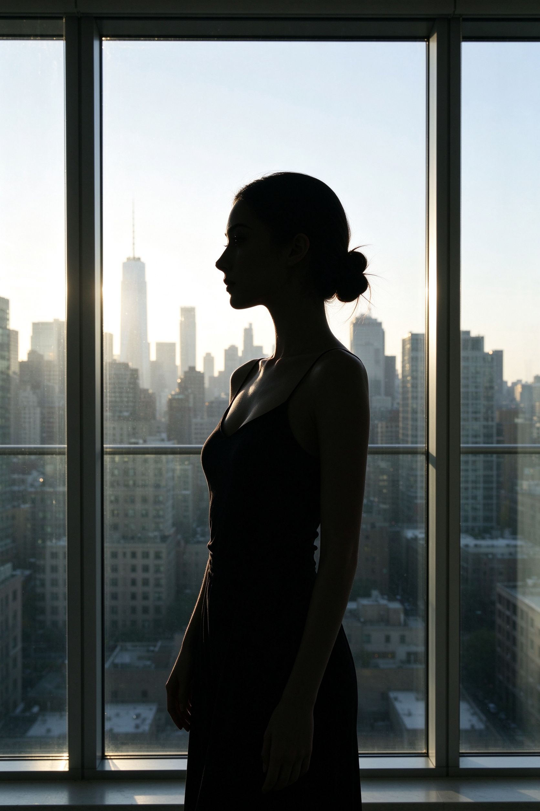

# 第 21 课：题材地图与方向选择——八类工作目标、伦理与后期取向

上一课我们画了一张风格学习地图，用六个维度去描述任何一张照片：题材与任务、视觉语言、明暗颜色与质感、时间与方法、地区与时代语境、器材与后期。这一课把这张地图落到题材上。

很多人学摄影是从"我想拍得像某某"开始的，然后一路追滤镜、追机身、追镜头。但真正决定一张照片该往哪边走的，是它的**题材**：你要为谁拍、要让观众看见谁、看见什么、看到哪一步。同一片墙，拍它作为建筑记录、作为街头背景、作为产品展台，三件事在取景距离、光线选择和后期取舍上几乎是相反的方向。

这一课把常见的八类方向一次铺开。每一类只谈三件事：**它为谁而拍、解决什么观看问题；它涉及人或地点时有什么不能越过的线；它的视觉选择天然把后期推向哪种取舍。** 八类之间会交叉，后面第 22–24 课会挑人像、风光与建筑、街头与纪实三组，用第 20 课的六维模板再钻进去。

## 1. 题材不是标签，是一份工作委托

先区分两个词。**题材**是照片主要服务的对象和任务：一个人、一片风景、一条街、一件商品、一个瞬间、一个想法。**风格**是你用什么画面语言去完成这份任务。题材告诉你该练什么、该问什么问题；风格是你在这个任务里反复作出的选择。

接下一份"拍摄任务"之前，先在心里把三件事问清楚：

1. **为谁而拍？** 是被拍的那个人自己想看，还是杂志读者、买家、观众、我自己？委托人不同，底片的命运完全不同。
2. **画面里谁在场、谁会被看见？** 一个人、一片私人土地、一个正在经历困难的群体，和一片无人的风景，伦理重量完全不同。
3. **后期我敢不敢动到什么程度？** 这不是道德洁癖，而是题材本身的契约：纪实照片删一个路人，和产品照把一支口红修得更饱满，是两种完全不同的工作，前者可能越界，后者本来就是工作内容。

这三件事下面会反复出现。

## 2. 人像：认识一个具体的人

**它是什么：** 以一个人或几个人为主体，让观众去看这个人的状态、身份或关系。它不等于"把脸拍清楚"——一张只拍手、背影或窗边剪影的照片，也可以是人像。

上图：窗边的侧影剪影，轮廓清晰、曝光正确。它没有拍到正脸，却仍然是一张完整的人像——人像的核心是让观众看见这个人的状态，而不是把脸拍得够不够清楚。（原创生成示意图，非真实照片）

**为谁而拍：** 家庭影集里的人像是给家人看的，环境人像是给杂志读者看的，证件照是给机构看的，观念人像是给自己或画廊看的。被拍者在照片里是"主角"还是"样本"，决定了镜头该靠近还是退后、该让他看镜头还是不看。

**伦理边界：** 拍人最容易出问题的不是技术，而是同意与尊严。对方知不知道自己在被拍？知不知道这张照片会被放到哪里？你有没有把一个普通人的疲惫、窘迫或外貌特征，变成观众猎奇的对象？拍弱势群体、未成年人、病患、边境线上的人时，"我拍得好看"远远不够——要问这张照片在替谁说话，被拍的人有没有可能因为这张照片受到二次伤害。

当你举起相机对准一个人的时候，最先出现的不是构图和光线，而是一个更难回答的问题：**谁有权解释他/她？** 你在拍一个不常被镜头认真对待的人——家里的长辈、路边的小贩、另一种文化里长大的朋友——你说的故事，是他/她愿意被讲的那个吗？2026 年的手机让"随手拍人"变得几乎没有成本，也正因为如此，这一层自觉才更需要刻意练习：先让对方知道你拍的是什么、会放在哪里，再决定要不要按下快门。具体的拍法（摆拍、环境人像、抓拍）与伦理尺度，第 22 课会完整展开。

**后期取向：** 人像的后期核心是**肤色与身份的诚实**。磨皮、瘦脸、去瑕、换唇色，做到哪一步算"修饰"，做到哪一步算"换人"？给家人拍，可以迁就他喜欢的样子；给客户拍，按合同；做纪实或艺术人像，每一处改动都要问自己：我是在优化这个人，还是在抹掉他这个人？

## 3. 风光与自然：让人观看一片土地

**它是什么：** 以自然地貌、天气、植物、天象为主体。它不等于"壮丽大场景"——一片落叶、一块被水冲过的石头、窗台上十分钟的影子，都可以是风光。

**为谁而拍：** 给登山杂志的读者看路线，给环保机构看一片正在消失的湿地，给自己记录一次日出，给旅行平台做壁纸。目标不同，你要不要把自己拍进去、要不要保留脚印和垃圾，答案都不同。

**伦理边界：** 风光看似最安全，其实有自己的红线。不在禁飞区放无人机，不在生态脆弱区为了机位踩出一条新路，不在国家公园长时间占着最佳机位排队到别人失去拍摄机会。更微妙的是**真实性**：把秋天 P 成夏天、把三张不同时间的云合成一张、把山顶上本来有的电线杆和垃圾全部抹掉——如果这是给品牌做艺术大片，没问题；如果这张照片被配文"这里就是某某山原本的样子"，那就是用照片伪造了一片土地。

**后期取向：** 风光是后期介入最深的题材之一。曝光合成、接片、局部压暗提亮、白平衡偏移，在这个题材里几乎是工作的一部分。但有一条线：**改变光线形状和时间是可以的，改变地貌本身要非常小心。** 把一座山的山脊修掉一块、把不存在的湖补上，那已经不是这片土地了。

中式审美里"山水"从来不只是风景照片的对象，而是一种"可游可居"的观看方式——山要有来路、水要有去处、留白要能让人想象自己走进去。这种观看会在第 23 课用现代示范图展开，并在第 25 课与画意摄影的传统衔接。

## 4. 街头与纪实：在公共空间里遇到的人

**它是什么：** 在公共空间里，不预先安排，去截取正在发生的日常、事件和社会关系。它不等于"扫街"这个动作，也不等于"黑白抓拍"这个滤镜。

**为谁而拍：** 街头摄影常常是给自己看的，是观察方法；纪实摄影则通常有一个更明确的托付——让观众看见一件被忽略的事。

**伦理边界：** 这是伦理问题最密集的一类。在公共空间拍照，法律上多数地方允许拍摄可见的公共行为，但**允许不等于应该**。拍一个正在哭泣、争吵、病痛、乞讨的人时，你是在记录一件公共事件，还是在消费他的脆弱？拍完之后，对方有没有权利问一句"你拍我干什么"？把一个路人的窘迫放到网上，他的家人、同事、老板会看到，这件事你想过没有？

社会纪实的伦理重量，在于照片里的人会不会因此受到伤害。一张改变了一群人的命运的纪实照片，照片里的人却可能从此被全世界反复凝视——她是否同意过这种凝视？今天在街上按下快门前，先想清楚：这个人知不知道我在拍？这张照片会出现在哪里？如果它传播开，对他的工作、家庭、网络生活意味着什么？纪实的力量有多大，责任就有多大。

街头摄影的另一个标杆是亨利·卡蒂埃-布列松（Henri Cartier-Bresson）。他的"决定性瞬间"讲的不是快，而是在那零点几秒里，形式、事件和人的状态刚好同时到位。

上图：街头决定性瞬间的示范。注意它并不是把快门按得够快，而是画面里的几何框架、人物位置和动作刚好在一个瞬间同时成立。（原创生成示意图，非真实照片）

> 著录：Henri Cartier-Bresson，Magnum Photos 代理摄影师，作品页示例：[magnumphotos.com/photographer/henri-cartier-bresson](https://www.magnumphotos.com/photographer/henri-cartier-bresson/)（现代受版权作品，链接著录，核验日期 2026-10-01）

看他的街头作品时，重点不要放在"他怎么抓的这么快"，而要看：他站在多远的位置？画面里的人知不知道自己被拍？他让观众站在一个什么距离上去看那个事件——是和当事人并肩，还是远远地旁观？

**后期取向：** 街头与纪实的后期最克制。不把路人从关键背景里删掉（因为那个背景就是事件的一部分），不把两个人拼到一张照片里制造"他们当时在一起"的假象，不把彩色调成某种情绪滤镜来替观众下结论。黑白在这个题材里不是滤镜，而是一种让颜色退后、让关系和形状浮出来的选择——这个问题第 25 课会专门讲。

## 5. 建筑与城市：空间怎样被使用

**它是什么：** 拍一座建筑、一条街道、一个室内空间，或者人在城市里留下的痕迹。它不等于"建筑长得好看"。

**为谁而拍：** 给建筑师拍完工照，给房产平台拍样板间，给城市记录留档案，给自己拍一种情绪。前两种是"说明空间"，后两种是"借空间说话"。

**伦理边界：** 私人住宅、医院、学校、政府建筑内部不是你想进就能进；拍别人店铺的门面时，门头上的店名、二维码、营业执照都可能让人不适；在敏感设施周围长时间架三脚架，被保安盘问是正常的，不要觉得是针对你。

你在街头举起相机时，**拍摄一座城市，你拍到的从来不只是楼。** 你选择把谁留在画面里、把谁裁出去、把路过的行人当作前景还是障碍，本身就是对这座城市的一种叙述——今天依然如此。城市摄影真正的问题不是"楼正不正、构图满不满"，而是：我拍下的这座城，是谁的城、为谁留下了痕迹？

**后期取向：** 建筑摄影的后期几乎绕不开**透视校正**：垂直线要直，楼不能往后倒。这是工作要求，不是过度修图。但反过来，把天空换成更绚烂的晚霞、把街对面的另一栋楼 P 掉让画面更干净，要先想清楚这张照片是在"表达一个气氛"还是"记录这个现场"。前者可以，后者不行。

## 6. 静物与产品：让物被看得更清楚

**它是什么：** 以一件或一组静止的物为主体——花、食物、器物、商品、桌面陈设。它不等于"把东西摆漂亮"。

**为谁而拍：** 给电商卖货，给杂志做食物图，给自己拍桌上一只旧杯子。卖货的图要让买家放心下单；艺术静物要让观众第一次"看见"这只物本身的形状和纹理。

**伦理边界：** 商品图的核心伦理是**不误导**。食物照可以打光、可以摆盘，但不要为了让酱汁看起来亮而刷一层油、不要为了让模特皮肤好而把她的痣修到客户认不出来——尤其是食品和美妆，过度修饰就是虚假宣传。

静物摄影最纯粹的工作，不是把东西摆漂亮，而是——**让观众第一次认真看一件每天被忽略的东西。** 你可以今天就用手机试：找一件桌上的旧物（杯子、钥匙、一只水果），关掉顶灯，用手电或台灯从侧面打一道光，看它的形状、纹理和阴影怎样自己浮现出来。拍摄对象不必名贵，重点是你能不能让它被"看见"。

**后期取向：** 静物和产品的后期是工作本身。布光、抠图、修瑕、校色、把一颗水珠加回去，这些动作在别的题材里可能叫"造假"，在这个题材里叫"交付"。但工作本身也有边界：把商品的颜色修到和实物不一致，就是越过了和买家之间的那条线。

## 7. 时尚与编辑：造型、身体与品牌叙事

**它是什么：** 用服装、化妆、造型、场景和光线，去呈现一种身份、一种生活方式或一个品牌世界。它不等于"拍美女帅哥"。

**为谁而拍：** 杂志、品牌、广告、艺人团队。这是所有题材里**委托人最明确**的一类——你是在为一个团队的概念服务，不是自己随便拍着玩。

**伦理边界：** 模特是合作者，不是道具。拍摄前对服装、暴露尺度、后期修改范围要有共识；拍完之后未经同意不要把未修图外传。身体修图的尺度在过去十年已经被广泛讨论：把腰修细三厘米、把腿拉长、把皮肤磨成塑料——这些动作今天在很多杂志和品牌那里已经主动收手，因为观众已经不信任那种"不像真人"的图像。

**后期取向：** 时尚编辑的后期本来就是叙事的一部分：调色、拼贴、合成、换背景，都在预算里。但这恰恰提醒我们：当一张照片看起来"太完美"的时候，它可能从一开始就不是在记录现实，而是在建造一个广告世界。看懂这一点，你就不会把杂志上的皮肤、身材和光线当成日常照片的标准答案。

## 8. 活动与运动：留住那个瞬间

**它是什么：** 婚礼、演出、比赛、会议、发布会——在不可重复的现场，把关键瞬间留下来。它不等于"用高速快门抓清楚"。

**为谁而拍：** 新人要回看他们那天哭了没有；体育编辑要挑一张能上版面的动作；品牌要知道活动来了多少人、气氛如何。这三种委托人要的照片完全不同。

**伦理边界：** 不要为了机位钻到比赛场地上干扰运动员；不要在婚礼上把新人挡在你的镜头后面；不要拍正在痛苦、受伤、崩溃的参与者去博眼球。事件发生的顺序是真实的一部分——不要在后期把"摔倒之后爬起来"和"摔倒前"剪成另一个故事。

**后期取向：** 这个题材的后期最忌讳的是**事后拼动作**。连拍十张，挑一张姿势最好的——这是工作。把五张里最好的手、最好的脸、最好的球合成一张"完美瞬间"，如果这是体育新闻，就是造假。

## 9. 观念与实验：用照片提出一个问题

**它是什么：** 不以"说明一个真实存在的对象"为目的，而是用摆拍、拼贴、合成、材料、身体、文字去提出一个想法或情绪。它不等于"P 得很炫"。

**为谁而拍：** 自己、画廊、展览、一本作品集。这个题材里，"你到底在问什么"比"你拍到了什么"更重要。

**伦理边界：** 这一类是合成和建构本身，所以**诚实的声明**特别重要。如果你拍的场景是搭出来的、人物是演员、素材是拼的，不要让观众误以为这是新闻现场。当代艺术里大量作品是摆拍和合成的，这没有问题；问题是把它们混进纪实的语境里。

**后期取向：** 在这个题材里，后期就是拍摄。合成、染色、做旧、拼贴，没有"该不该动"的问题，只有"你这个想法要不要靠这一刀来成立"的问题。

## 10. 题材不是笼子：下一步怎么选

八类题材不是八个互斥的抽屉。一张环境人像可以同时是纪实，一张城市照片可以同时是建筑和街头，一张产品静物可以带有观念。重要的是：**每一次按下快门之前，你知道自己主要在为哪一类工作负责。**

后面第 22–24 课会回到最容易入门的三组，用第 20 课那副六维眼镜一组一组钻进去：

- **第 22 课**看人像、时尚与身份——自然光、棚拍、环境人像，以及拍人时绕不开的同意与尊严。
- **第 23 课**看风光、自然、建筑与静物——壮阔与亲密、极简与当代风景，以及中式山水和器物影像怎样改变我们的观看。
- **第 24 课**看街头、纪实、旅行与日常——观察方法、长期项目，以及在公共空间拍陌生人时那条看不见的线。

现在不要急着八类同时开始。挑一个你最近一周真的能拍到的方向——楼下的早餐店、窗边的光、家里的一只杯子、一个你愿意聊半小时的朋友——先把这一个题材的"为谁而拍、谁在场、后期敢动哪一刀"想清楚。

## 练习：选一个题材，拍十张同题作业

从八类里只选**一个**你最近能碰到的题材，例如"通勤路上的人""窗台上的光""家里的一只旧物""下班时的路口"。用同一个题材拍十张，不要换主题。拍完之后对每一张回答三句话：

1. 这一张主要是为谁拍的？
2. 画面里有没有人？如果有，他/她知不知道、愿不愿意？
3. 如果要后期，这一刀在这个题材里是"工作"还是"越界"？

把这十张和三句话并排放在一起看。你会发现，不是十张照片里哪张最好，而是这十张其实在回答十一个不同的问题——其中真正属于这个题材的，可能只有两三张。

下一课进入人像：我们用第 20 课的六维眼镜，一层一层看自然光人像、棚拍肖像、环境人像是怎样被组织出来的，以及当镜头对准一个具体的人时，同意和尊严为什么永远比光线先到。
