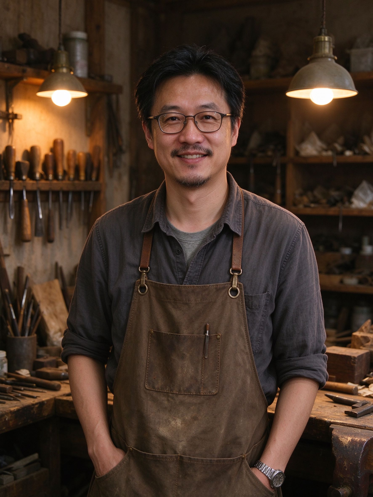
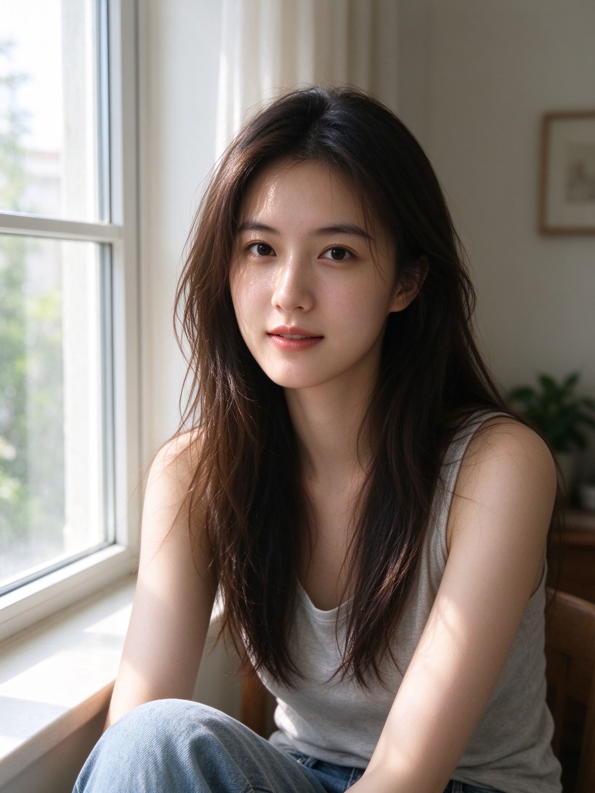
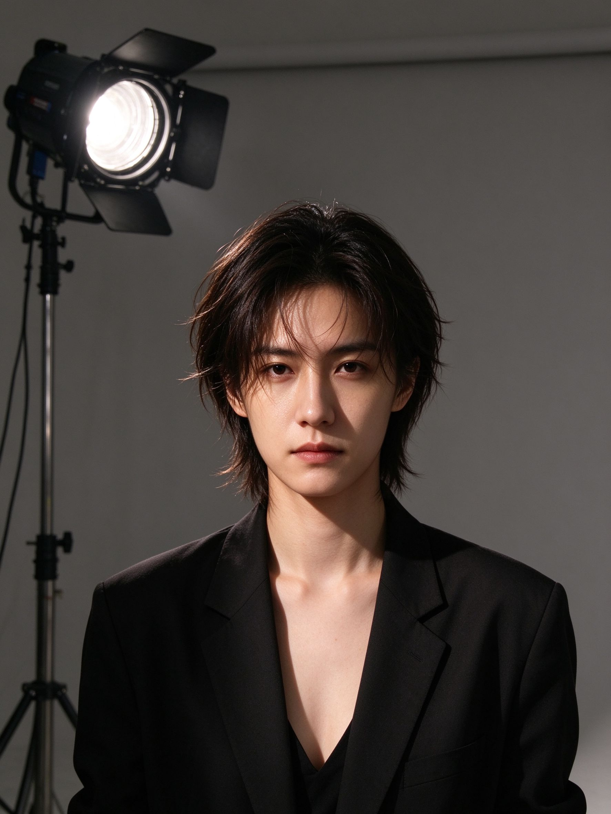
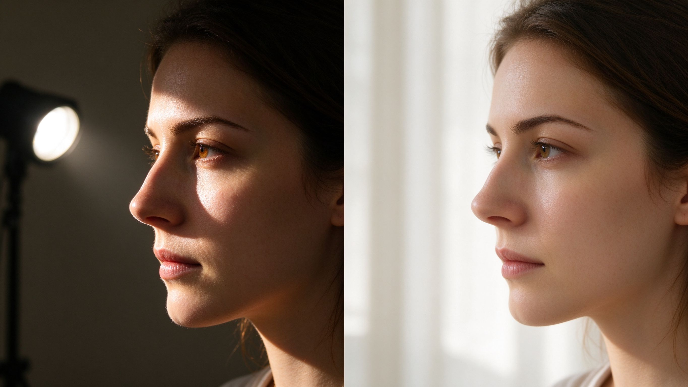
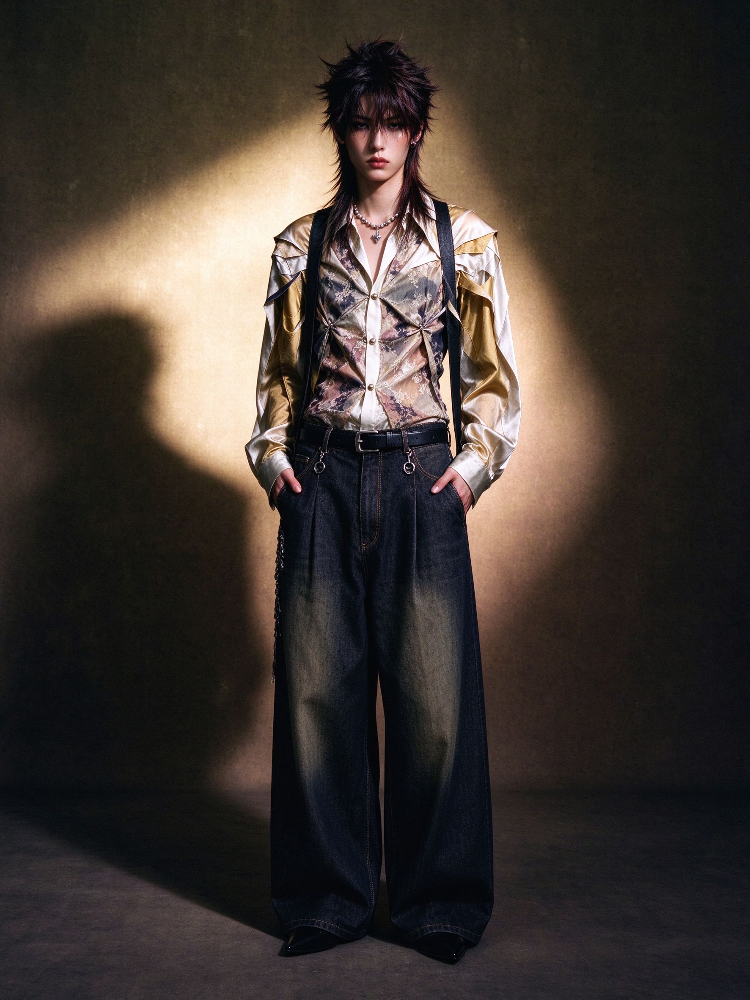

# 第 22 课：人像、时尚与身份——光、距离与谁有权被看见

第 21 课把题材地图铺开了。这一课戴上第 20 课那副六维眼镜，钻进人像与时尚这一组最容易入门、也最容易出问题的题材。

先立一条原则：**人像不是“把脸拍清楚”。**一张只拍手、背影或窗边剪影的照片可以是人像；一张把脸拍得很清楚却完全没在讲这个人的照片，反而不是。人像真正在做的，是决定观众怎样观看一个人、怎样理解一个人。

## 1. 题材与任务：拍谁、为谁而拍

**它是什么：** 以一个人或几个人为主体，让观众去看这个人的状态、身份或关系。

**为谁而拍：** 家庭影集里的人像是给家人看的；环境人像是给杂志读者看的；证件照是给机构看的；观念人像是给自己或画廊看的。被拍者在照片里是“主角”还是“样本”，决定了镜头该靠近还是退后、该让他看镜头还是不看。
拍人之前，先在心里问三句话：

1. **他/她知不知道自己在被拍、照片会被放到哪里？** 这是同意问题，不是礼貌问题。
2. **我在把这个人拍成什么？** 一个疲惫的人可以被拍成“生活的真实”，也可以被拍成“猎奇的对象”，差别全在你怎样取舍。
3. **这张照片会不会让他/她受到二次伤害？** 拍弱势者、未成年人、病患时，“我拍得好看”远远不够——要问这张照片在替谁说话。

当代中国的人像摄影里，肖全的《我们这一代》（1985–1995）是绕不开的例子：他用数年为当时中国文艺界的许多人物拍摄肖像，照片里的姿态和目光带着那个年代的温度（[肖全 — 人物介绍](https://zh.wikipedia.org/wiki/%E8%82%96%E5%85%A8)；肖全，1990 年代中国人物肖像；现代受版权作品，仅链接著录；核验日期 2026-10-01）。看他的作品，重点不是“拍得清楚”，而是**他对被拍者采取的距离和态度**——这是人像最核心的选择。

## 2. 视觉语言：背景是说话的一部分

人像的画面组织，几乎总是在“靠近还是退后”和“保留环境还是裁掉环境”之间做决定。

**环境人像**把人物放在一个能说明他身份的场景里：手艺人身后是工具和材料，医生身后是诊室，母亲身后是孩子的房间。环境不是装饰，它在替人物说话。下面这张示范（原创生成示意图，非真实照片）里，木工站在自己的工作间，身后的工具、木料和灯光一起说明“他是谁、他在做什么”。

**特写与背景虚化**则把环境退到几乎看不见，让观众只看这张脸和它的表情。什么时候该留环境、什么时候该虚掉背景？看环境是否帮助理解这个人——如果是，保留；如果只是杂物，虚掉或换个角度让它不碍事。

人物看镜头还是不看镜头，也是视觉语言。**直视镜头**意味着承认摄影者的存在、甚至直接对观众说话；**不看镜头**则更像“我刚好在旁观这个人”——两种都在表达关系，只是方向不同。

## 3. 明暗、颜色与质感：光是风格的一半

人像的“风格感”有一大半来自光，而不是滤镜。先看两种最常遇到的光。

**自然光**（尤其窗光）柔和、有方向、不戏剧化。它让皮肤质感自然、眼神温柔，容易拍出“亲近、日常”的感觉——正好适合家庭肖像和生活方式类照片。下面这张示范（原创生成示意图，非真实照片）是窗边的自然光人像：光从侧面来，脸上有一层柔和的过渡，背景虚化成生活空间。

**棚拍**用可控的主灯、辅灯和背景，把光的方向、软硬、明暗比完全握在手里。它适合拍“目的明确、被建构”的肖像：杂志、证件、品牌、概念人像。下面这张示范（原创生成示意图，非真实照片）里，一盏主灯在脸上打出明确的明暗分界，背景是干净的中灰——一切都为“突出这个人”服务，也自带一种“刻意”的距离感。

同一个人，窗光和棚拍会是两张完全不同的照片。区别不在相机，而在**你希望观众离这个人近一点，还是远一点、客观一点**。光的方向（侧光、逆光、顶光）、光的软硬（硬光见棱角、柔光见细腻）、以及是否做剪影，都是你可以反复调整的风格开关。

上图：同一个人、同一张侧脸。左半边是硬光——一盏小面积光源，明暗分界锐利、阴影边缘硬、对比强；右半边是柔光——大面积窗光，明暗过渡平滑、阴影柔和细腻。光的软硬，是人像里最常用、也最容易看懂的风格开关。（原创生成示意图，非真实照片）

## 4. 时间与方法：抓拍、等待，还是摆拍

人像大多是摆拍的——你在取景器里和对方一起决定姿势和表情。但“摆拍”不等于“僵硬”。好的人像常常是：你先和对方聊起来，等他/她放下防备、露出自然的瞬间，再按快门。这里真正难的是一种**等待**：不是等光线，而是等一个人在你面前松弛下来。

抓拍的人像则完全不同。街头抓拍一个人的脸，往往没有经过同意，这在第 24 课会专门讲它的伦理。你只要记得：**拍一张人的脸，比拍一个人的背影，负担重得多。** 越近、越有辨识度、越暴露脆弱，越需要谨慎。

## 5. 地区、时代与文化语境：身份不是标签

人像里的服装、场景和道具，会不自觉地带着时代和地区的信息。这既是力量，也是责任。

力量在于：一张今天拍的人像，十年后看，发型、穿着、房间陈设本身就是“年代感”的证据（第 25 课讲过这个道理）。责任在于：不要把某个地区、某个族群、某种职业的人拍成“刻板印象”。**拍人时最容易出的错，是把“这个人”拍成“这一类人的样本”。** 被拍者首先是一个具体的人，而不是“一位农民”“一名网红”“某个地方的人”。
时尚人像尤其要小心这一点。时尚拍摄本来就是“建造一种身份或生活方式”——它可以用服装和造型塑造“独立”“慵懒”“先锋”等感觉。下面这张示范（原创生成示意图，非真实照片）是时尚编辑感的肖像：造型、姿态和光线都是被设计的，它不是在记录这个人“本来是谁”，而是在建构一种风格化的形象。

看清这一点，你就不会把杂志上的皮肤、身材和光线当成“普通人的标准答案”——它是一组被建造的选择。

## 6. 器材与后期：肤色与身份的诚实

器材上，人像没有“必须要有的镜头”。靠近一点用标准或中焦，退后用长焦把背景压缩，环境人像用广角交代环境。真正影响画面的是**你站多远、选什么背景、用什么样的光**——器材只是让你更接近这个选择。

后期是人像最容易越界的地方。核心问题是：**做到哪一步是“修饰”，哪一步是“换人”？**

- 给家人拍，可以迁就他喜欢的样子；
- 给客户拍，按合同；
- 做纪实或艺术人像，每一处改动都要问自己：我是在优化这个人，还是在抹掉他？

时尚编辑的后期本来就是叙事的一部分——调色、合成、换背景都在预算里。但这恰恰提醒你：当一张照片“太完美”的时候，它可能从一开始就不是在记录现实，而是在建造一个广告世界。看懂这一点，你既不会被它误导，也能在需要时主动选择“建造”还是“记录”。

## 练习：同一个朋友，四种拍法

找一个愿意被你拍的家人或朋友，不换对象，用四种方式各拍一张：

1. **自然光**：让他/她坐到窗边，用侧光拍一张亲近的肖像。
2. **环境**：保留他/她最常待的、能说明身份的场景，拍一张环境人像。
3. **棚拍感**：找一面干净背景，用一盏台灯或手机闪光灯打出方向明确的光，拍一张“刻意”的肖像。
4. **摆拍全身**：设计一个姿态和表情，拍一张“他/她在扮演一个形象”的照片。

并排看这四张，写下：每一张里，光在替这张照片说什么？背景在替这个人说什么？哪一张你觉得离这个人最近，哪一张最远？拍的时候，你有没有先问过他/她愿不愿意？

下一课我们进入风光、自然、建筑与静物：壮阔与亲密、极简与当代风景，以及中式山水怎样改变我们的观看。