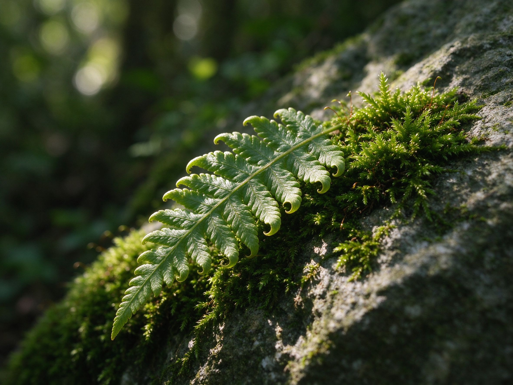
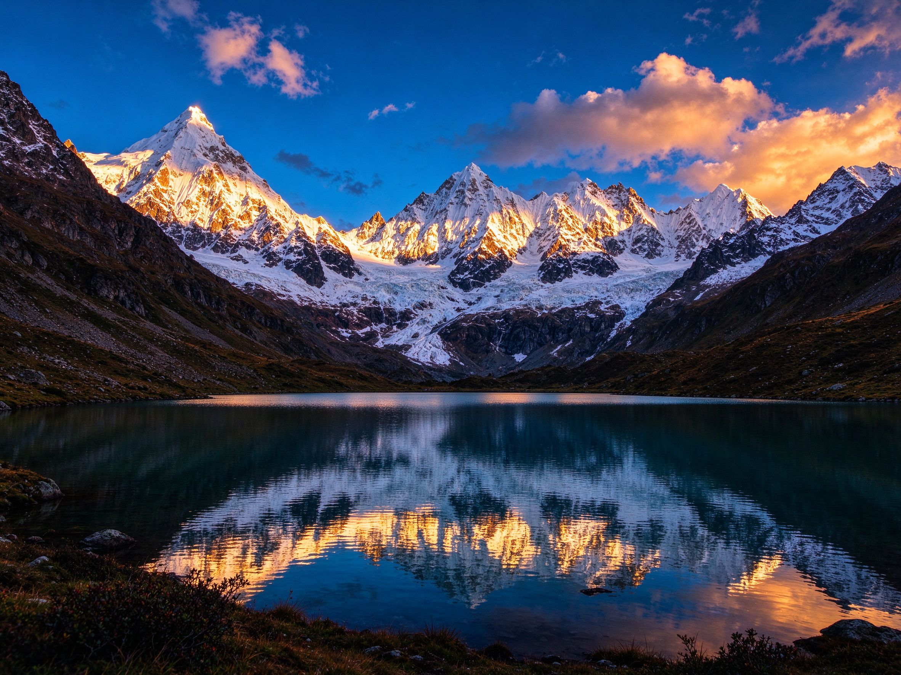
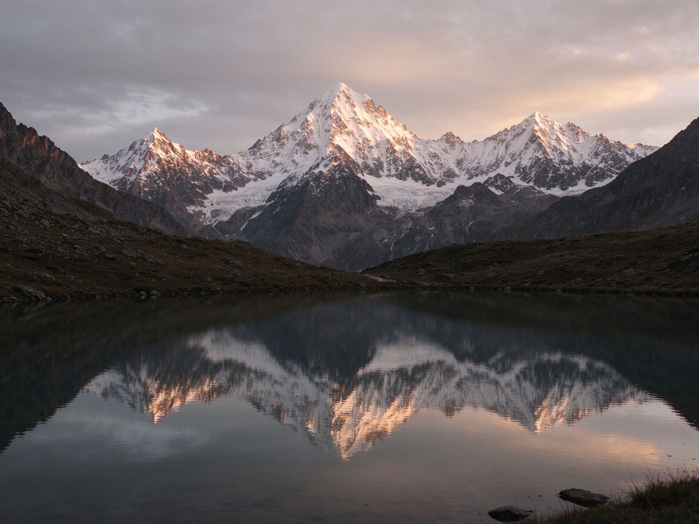
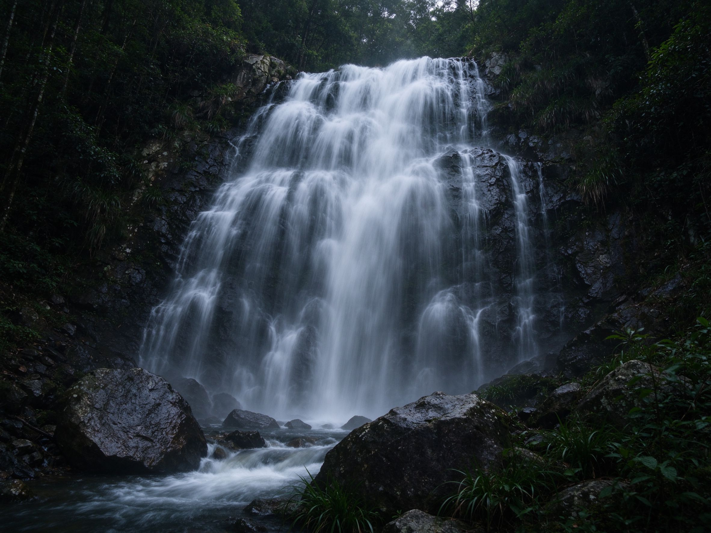
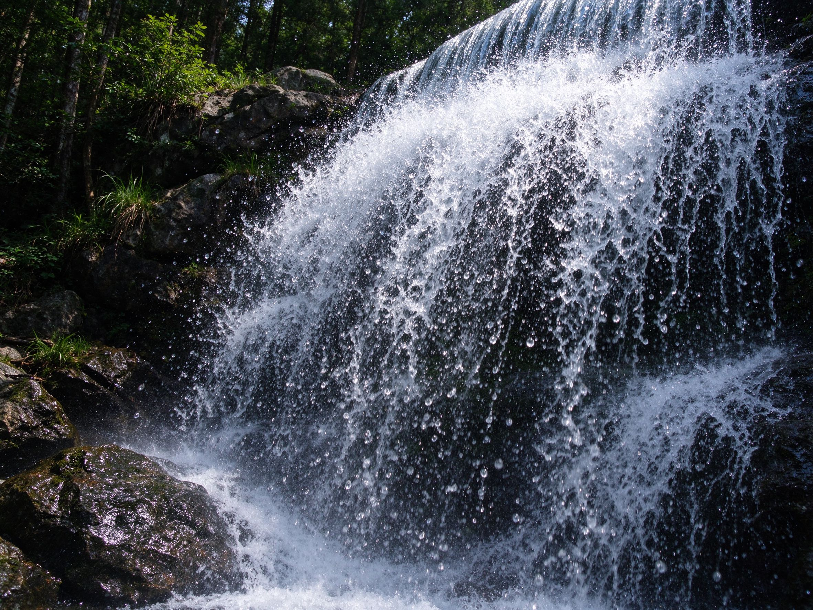
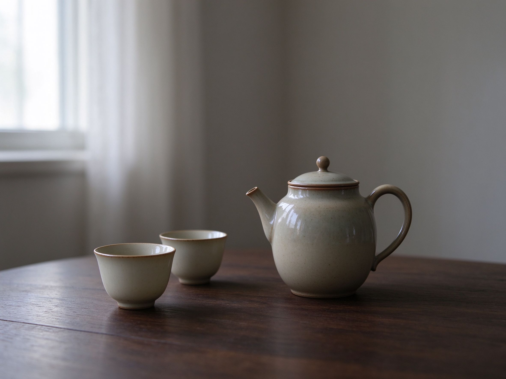

# 第 23 课：风光、自然、建筑与静物——用六维眼镜看"安静的对象"

前面几课我们用六维模板拆了人像和时尚。这一课把同一副眼镜对准风光、自然、建筑与静物——这些看似"安静"的题材，其实每一个画面都充满了选择：站在哪里、等多久、保留多少天空、压暗多少阴影、让颜色多饱和、让水面多光滑。风光不是"到了好地方随手拍"，静物也不是"把东西摆整齐拍清楚"。它们和人像一样，是摄影者反复作出的一组风格选择。

## 1. 题材与任务：拍什么，为谁而拍

### 1.1 壮阔风景与亲密自然

"风光"这个词容易让人想到雪山大湖、日出云海。但风光摄影内部有很大的任务差异：**壮阔风景**追求的是尺度感、自然的伟力和人在天地间的位置；**亲密风景**则凑近了看——一片蕨类的叶脉、岩石上的苔藓、雨后水洼的倒影。

上图：亲密风景的示范——一片蕨类叶脉与苔藓的侧光特写。和壮阔全景相比，它把镜头凑到脚边，让材质与纹理成为画面的主角。（原创生成示意图，非真实照片）前者为"宏大叙事"服务，后者为"感受质地"服务。同一个山谷，你可以站在山顶拍全景，也可以蹲下来拍脚边的一块石头，这是两种完全不同的照片。

壮阔风景的代表路线是从安塞尔·亚当斯（Ansel Adams）延续下来的：大画幅相机、纯净的自然、从黑到白的丰富灰阶。他拍的优胜美地不是"打卡照"，而是把山脉当作纪念碑来拍——精确、庄重、有仪式感。参考：[Ansel Adams 官方网站](https://www.anseladams.com/)（作品受版权保护，仅链接学习，核验日期 2026-10-01）。

亲密自然的代表是爱德华·韦斯顿（Edward Weston）：他拍青椒、拍贝壳、拍蔬菜，把日常物体拍得像雕塑。对韦斯顿来说，一片卷心菜叶子的形态和一座山的形态没有本质区别——重要的是形状、质感和光线如何在二维平面上组织。参考：[Edward Weston 遗产页](https://edward-weston.com/)（作品受版权保护，仅链接学习，核验日期 2026-10-01）。

### 1.2 建筑：记录空间还是表现几何

建筑摄影的任务也分两种：一种是**记录性**的——这个建筑长什么样、空间怎么用；另一种是**表现性**的——我只提取它的线条、面、光影关系，把建筑当成抽象构成来拍。前者你需要交代环境和比例，后者你只需要一个角、一扇窗、一道阴影。

### 1.3 静物与商业呈现

静物摄影是最可控的题材：物体是你摆的，光是你打的，背景是你选的。正因为可控，它更考验你"想让观众感受到什么"。商业静物（产品、食物、家居）追求干净、诱人、信息明确；个人静物则可以更安静、更暧昧——一杯茶、一本书、窗台上的光。

上图是一张极简建筑的原创生成示意图：白色混凝土块面、大片留白天空、对角线切割。它不是在"介绍这栋楼"，而是在用建筑的几何做构成练习。（原创生成示意图，非真实照片）

## 2. 视觉语言：画面怎样组织

### 2.1 居中与偏置

壮阔风景常用居中或对称构图——山脉在画面中轴线，倒影上下对称，给人稳定、永恒的感觉。但偏置构图也很有力：把主体放在三分之一线，留出大片天空或水面，让画面有呼吸感和方向感。第 13 课讲过主体与背景的关系，在风光里，"背景"就是天地本身——你留多少天、留多少地，决定了照片是拥挤的还是空旷的。

### 2.2 紧密与留白

极简风光的核心是**减少**。去掉多余的元素，让一个物体、一片颜色、一道光线独占画面。韦斯顿拍青椒时，青椒几乎填满画面，四周是暗背景，物体的弧线本身就是全部内容。而另一些风光大师则反其道而行——一个人、一棵树站在广阔的荒野里，人只占画面百分之五，空旷本身就是主题。

### 2.3 几何与松散

建筑摄影偏爱几何：对称的立面、重复的窗格、对角线的楼梯、放射状的拱顶。你站在哪里、用什么焦距、仰拍还是俯拍，决定了这些线条是被强化还是被消解。自然风景里也有几何——河流的弯道、山脊的连线、云层的结构——你可以用取景框把它们提取出来，也可以让画面保持自然的松散感。

### 2.4 当代风景：不只是"好看的风景"

斯蒂芬·肖尔（Stephen Shore）把日常的、甚至不起眼的环境当作严肃主题：美国小镇的街道、汽车旅馆的房间、停车场的颜色。他证明了风景不一定要壮丽——路边的一块招牌、一面褪色的墙、柏油路上的阳光，都可以是"风景"。参考：[Stephen Shore 个人网站](https://stephenshore.net/)（作品受版权保护，仅链接学习，核验日期 2026-10-01）。

上图：当代风景示范——一个普通加油站、一块褪色招牌、一段柏油路。它没有雪山和大湖，却仍然是一张可以称为风景的照片，因为它同样经过构图、光线与取舍。（原创生成示意图，非真实照片）

## 3. 明暗、颜色与质感

### 3.1 高饱和与克制

风光照片最常见的风格分歧就是颜色有多浓。有人把天空拍得极蓝、秋叶拍得极红，追求"明信片式"的强烈色彩；有人则压低饱和度，让画面接近中性灰，靠光影和形态说话。这不是"好不好看"的问题，而是你想让观众先注意到颜色，还是先注意到结构。

上图：高饱和处理——蓝天浓烈、金色阳光饱和、对比强烈，第一眼就被色彩抓住。（原创生成示意图，非真实照片）

上图：低饱和处理——天空柔和、山体偏灰、反差降低，形态和光线层次变得更耐看。（原创生成示意图，非真实照片）

两张图是"同一片山"的两种选择。没有哪张是"正确的"，但它们传递的情绪完全不同：一个热烈、一个安静。后期调色时，你应该先问自己想让观众先感受到什么，再决定饱和度拉到哪里。

### 3.2 黑白在风光中的角色

黑白不是"彩色不好看时的退路"。在风光里，黑白让颜色关系退后，**明暗和质感**站到前面。亚当斯的黑白风光之所以有力，不是因为"没有颜色"，而是因为他用从纯黑到纯白的完整灰阶，精确控制了观众视线落在山脊的哪一条线上。

### 3.3 质感：岩石、水面、雾气

风光里的质感是光线雕刻出来的。侧光打在岩石上，纹理会浮出来；顺光则把一切压平。雾天没有强烈的明暗对比，但空气的层次和远近的朦胧本身就是质感。静物里也是一样：陶器的粗糙、木头的纹理、瓷釉的反光——这些都是被光线"写"出来的，不是物体自带的。

## 4. 时间与方法：等待、长曝光与拍摄窗口

### 4.1 等待光线

风光摄影最核心的方法不是"拍"，是"等"。同一个地方，正午顶光平得像白纸，日出后半小时的侧光却能把山谷雕出立体感。你到了现场，先别按快门，观察光线怎么移动、阴影从哪里爬上来。好风光片往往是拍的人等了两小时，按下快门只花了两秒。

### 4.2 长曝光：时间变成质感

长曝光是风光摄影里最有"魔法感"的技术：快门打开几秒甚至几分钟，流动的水变成丝绸，飘动的云拉出轨迹，街上的人消失不见。它不是"让照片更模糊"，而是**用时间改变画面里物体的状态**——水不再是水花飞溅，而是一面光滑的墙。

上图：长曝光——水流被拉成丝缎般的质感，水雾弥漫，画面安静。（原创生成示意图，非真实照片）

上图：高速快门——每一滴水珠都被凝固，水花飞溅，画面充满瞬间的力量。（原创生成示意图，非真实照片）

同样是瀑布，左边像冥想，右边像爆发。快门速度是你用来选择"时间感"的工具。

### 4.3 季节、天气与拍摄窗口

春天的花、秋天的叶、冬天的雪——不只是"素材不同"，而是整个画面的情绪基调不同。阴天不是"坏天气"：它均匀的光线适合拍静物、拍树林、拍低反差的安静画面。雨后天晴的时刻，空气通透、颜色饱和，是风光的黄金窗口。你对天气的判断，本身就是风格的一部分。

## 5. 地区、时代与文化语境：风景如何承载想象

### 5.1 自然不是中立的背景

"风景"在不同文化里有不同的含义。西方风景画传统里，崇高（sublime）的自然是伟大的、令人敬畏的；东方山水传统里，自然是可以栖居、可以游观的，人在山水里是小的，但不是被压垮的。当代摄影里，"风景"又多了一层意思：它不是 untouched 的原始自然，而是被人类活动深刻塑造的环境。

### 5.2 当代风景与人类痕迹

爱德华·伯汀斯基（Edward Burtynsky）拍的是矿场、拆船厂、油砂山、回收工厂——他用拍壮丽山脉的方式去拍工业景观。画面依然宏大、依然有秩序感，但你看到的不是自然的伟力，而是人类活动的尺度。参考：[Edward Burtynsky 官方网站](https://www.edwardburtynsky.com/)（作品受版权保护，仅链接学习，核验日期 2026-10-01）。

上图：工业景观示范——一座露天矿坑和横穿画面的输送带，画面宏大而有序，但它记录的是人类活动的痕迹，不是原始自然。（原创生成示意图，非真实照片）

他的工作提醒我们：不要把"自然"浪漫化成一个单一的模板。今天你站在任何一个风景点，远处几乎都有电线杆、水库、公路、游客栈道。问题不是"怎么把这些P掉"，而是你要不要让它们成为画面的一部分——保留它们，照片就是当代的；去掉它们，照片就是复古的。两者都可以，但你要知道自己在做哪种选择。

### 5.3 静物里的观看传统

静物摄影看似和风景无关，但它的核心动作是一样的：**选择什么被观看，以及怎样安排观看的秩序**。从传统的器物审美到当代的产品摄影，人一直在练习"把一个普通东西看仔细"——一只杯子的釉色、一块木头的纹理、一道斜进来的光。这种观看方式和东方文人赏物、品茶的传统是相通的：不是为了"展示产品"，而是为了感受材料本身的质地。

上图：一套简单的茶具，窗边侧光，大面积暗背景留白。它不是产品目录图——没有把每样东西都拍亮拍清楚，而是让光落在壶身上，让观众注意到瓷的质感和器物之间的距离。（原创生成示意图，非真实照片）

## 6. 器材与后期：提供选择，不替代观看

### 6.1 滤镜与曝光控制

风光里最常用的滤镜是**渐变灰滤镜**（平衡天空和地面的亮度）和**中灰密度镜**（让白天也能长曝光）。它们不是"必须装"的附件，而是当现场光比超出相机动态范围时的解决方案。数码时代，包围曝光+后期合成也能做类似的事，但原理是一样的：你在解决"怎么同时保留亮部和暗部"。

### 6.2 包围曝光与 RAW

风光场景光比常常很大——天空亮、地面暗。一张照片可能要么天空过曝要么地面死黑。**包围曝光**就是拍三张（欠曝、正常、过曝），后期合成 HDR。但更基础的做法是：拍 RAW 文件。RAW 记录的信息比 JPEG 多两到三档，后期拉回暗部、压下亮部的空间大得多。第 27 课会详细讲 RAW 工作流，这里只需要记住：风光后期的余地，是你拍摄时就留下的。

### 6.3 接片

超广视角的大场景，一张照片装不下时，你可以横拍三张再接成全景。接片不是"作弊"，而是当人眼的视野比相机传感器宽时，用摄影还原人眼所见的一种方法。但注意：接片改变了透视关系，广角接片尤其要小心变形。

### 6.4 后期是选择，不替代观看

最后反复强调一点：后期能调整颜色、反差、清晰度，但它不能替代你站在现场时的判断。如果你到了一个地方，只是随便拍一张然后指望后期"救回来"，那方向就错了。风光摄影的核心工作在拍摄时已经完成——你选了这个机位、等了这束光、决定了这个构图。后期只是把你已经看到的东西，用更准确的方式呈现出来。

## 练习：同一座山，五种拍法

找一个你能反复去的自然场景（公园山坡、河边、湖边都可以，不一定要名山大川）。去五次，每次只做一件事：

1. **壮阔全景**：站远一点，拍大场景，用留白表现天地的开阔。
2. **亲密细节**：蹲下来，只拍一块石头、一丛草、一片叶子。
3. **极简**：画面里只留一个主要元素，其余全是天空或水面。
4. **等光**：同一个机位，拍正午一张、日落前一小时一张，对比两张的立体感。
5. **长曝光**（如果手机或相机有长曝光模式）：拍流动的水或云，看时间怎么改变质感。

拍完后把五张排在一起，不要急着评"哪张最好"。先回答：每张我在让观众看什么？哪张的光线帮了忙？哪张的后期可以再调整？哪张其实是我"看到了"才拍出来的？

下一课会把六维眼镜对准街头、纪实与旅行——在动态的公共空间里，怎样在不打扰他人的前提下观察、等待和拍下有故事的画面。
