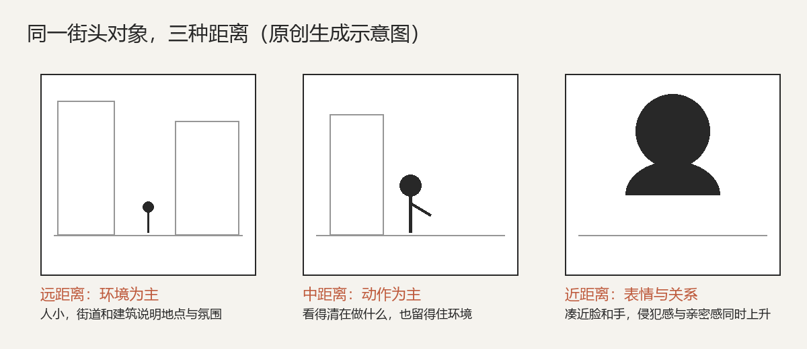
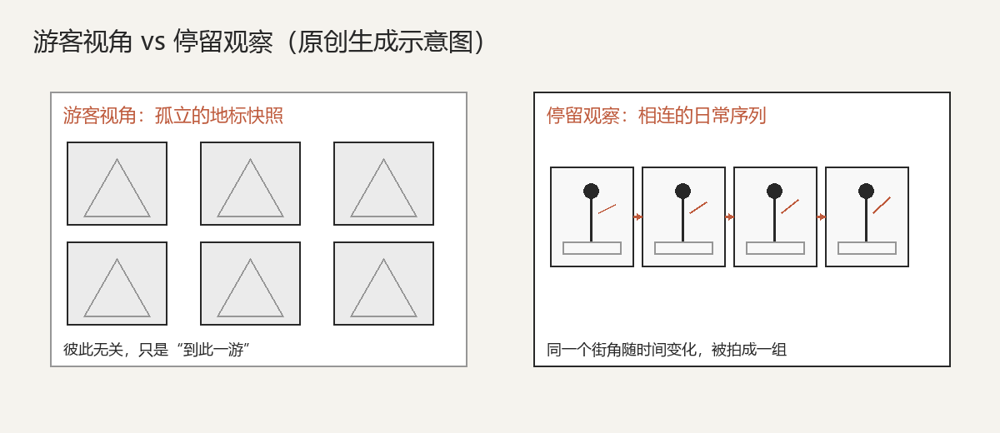

# 第 24 课：街头、纪实、旅行与日常——在公共生活里观察、等待与负责

第 20 课给了你一副"读风格"的六维眼镜：题材与任务、视觉语言、明暗颜色与质感、时间与方法、地区时代与文化语境、器材与后期。第 21 课把地图落到了不同题材。这一课，我们用**同一副眼镜**去看常常被混在一起、其实任务各不相同的四类拍摄：街头、纪实、旅行与日常。它们都发生在真实生活里，都很少布光和摆布，但"拍什么、为谁拍、对谁负责"差别很大。学会分开它们，比记住任何一个大师的色调都重要。

## 1. 题材与任务：拍什么，为谁而拍

先把四个容易混的词分开。

**街头摄影**指在公共空间里、不预先安排、不通知被摄者地记录人与城市的偶然相遇。它通常没有委托人，任务就是"观看与发现"——今天街角那个瞬间，明天也许就不在了。**纪实摄影**则围绕一个议题、一群人或一段经历，系统而长期地记录，它有读者、有目的，往往希望让人看见某种被忽略的处境。**旅行摄影**是离开熟悉的环境，去记录陌生的地方、人与文化差异。**日常摄影**则相反：它不走远，就在你每天经过的那条路、那家小店、那个家人身上反复拍，任务是把熟视无睹重新看得新鲜。

同一台相机，任务完全不同。解海龙受中国青少年发展基金会委托，用数年时间走访贫困地区拍摄失学儿童，最后选出的《我要读书》（人们叫它"大眼睛"）成为希望工程的标志——这是有明确社会任务的纪实，不是随手街拍。[《我要读书》— 解海龙 — 中国青年报](https://zqb.cyol.com/content/2008-12/26/content_2485916.htm)（解海龙，《我要读书》，1991 年，希望工程纪实摄影项目；现代受版权作品，仅链接著录；核验日期 2026-10-01）。而一个保姆在芝加哥街头随手拍了一辈子、生前从未发表的 Vivian Maier，做的几乎是没有委托人的私人记录——这又是另一种任务。

### 1.1 公共空间里的尊重：拍摄伦理从这里开始

在公共场合举起相机，会遇到一条所有题材都绕不开的线：**公共空间不等于没有隐私**。你在街上拍背影、拍环境里的人群，侵犯感很低；但把镜头凑近一个人的脸、拍他的窘迫、哭泣或狼狈时刻，就是另一回事。距离越近、越有辨识度、越暴露脆弱，就越需要谨慎。

一个有用的自检是：**如果照片明天被登在他家楼下的告示栏上，他会感到被尊重还是被冒犯？** 拍别人谋生的手、拍他专注的样子，和拍他出丑、把他的困境当"奇观"，区别就在这里。

**摆拍与纪实的边界**要讲清楚。为杂志、项目可以导演、可以重建场景，但你要对观众说明这是重现；新闻和公共事件则不能事后"补拍""重演"再冒充现场。把摆布说成真实，是对观看者的欺骗。

**怎样对待被摄者？** 拍完点个头、笑一下、说一句"拍得很好"，并不丢脸；长期项目更要回访、告知、尊重他后来的意愿。纪实史上那些有分量的作品，背后往往是摄影师先和人聊了很久、建立了基本信任，而不是按下快门就走。Vivian Maier 用一台腰平取景、看起来像在拍别处的双反相机，在别人毫无察觉时拍了几十万张——她把"未经同意的注视"推到了极致，至今仍被反复讨论（[About Vivian Maier — 官方网站](https://www.vivianmaier.com/about-vivian-maier/)；Vivian Maier，芝加哥街头摄影，1950–1990 年代，遗产受版权保护，仅链接著录；核验日期 2026-10-01）。这些例子不是要让你不敢上街，而是提醒你：**镜头是有重量的，你选择拍谁、怎么对待他，本身就是作品的一部分。**

## 2. 视觉语言：靠近，还是保持距离

街头与纪实的画面组织，几乎总是在一组成对的选择里做决定。

**靠近，还是保持距离？** 森山大道把相机几乎贴到街面上：倾斜的构图、失焦、晃动、粗颗粒，人和招牌都是局部和碎片，街头因此变得冲动、身体化、近乎狂暴。这是一种选择——他不要"看清楚的城市"，要的是被城市击中的感觉（[Biography — Daido Moriyama 官网](https://www.moriyamadaido.com/en/biography/)；森山大道，1960 年代起的粗颗粒近距街头摄影，受版权保护，仅链接著录；核验日期 2026-10-01）。何藩走的是另一条路：他在 1950–60 年代的香港街头，耐心等一个行人走进巷道背光投下的几何阴影里，把嘈杂的市场整理成雕塑般简洁的黑白画面（[《街景》，1956 — 香港 M+ 博物馆藏品](https://www.mplus.org.hk/sc/collection/objects/street-scene-2015443/)；何藩，《街景》，1956 年，香港 M+ 博物馆藏，何藩捐赠，受版权保护，仅链接著录；核验日期 2026-10-01）。

上图：何藩方法的原创示范——先找到一束背光和一片几何阴影，然后等人走进去再按快门。高反差黑白把嘈杂的街道整理成简洁的明暗块面。（原创生成示意图，非真实照片）

一个极近、极乱，一个有距离、有秩序，都是大师，差别只在他想让观众"扎进街头"还是"凝视街头"。

这张图把上一节的伦理问题也一并可视化：**距离不只是构图选择，也是伦理选择。** 同一对象，退远拍环境，和凑到脸前拍特写，是两件不同的事——后者要的信任和承担也更多。

**混乱，还是留白？** 街头常常信息过载：电线、招牌、穿堂而过的人。你可以让画面保留这种拥挤的混乱（它本身就是生活的速度），也可以靠等待、背光和裁切，留出一块干净的阴影让主体跳出来。第 13、14 课讲的主体、背景与留白，在街头直接用上：你留下的每一根电线、每一个招牌，要么帮忙说话，要么就是干扰。

**抓拍，还是摆拍？单张，还是系列？** 街头追求单张——那个手势、那道光、那个人恰好走到位置上的一瞬。纪实则很少靠一张，而是靠一组、一本相册来建立叙事。Robert Frank 横穿美国拍了近八百卷胶卷，最后只选出 83 张编成《美国人》，正是这组照片而不是任何单张，改变了摄影（[Robert Frank — MoMA 艺术家页](https://www.moma.org/artists/1973)；Robert Frank，《The Americans》摄影集，法国 1958 / 美国 1959 年出版，受版权保护，仅链接著录；核验日期 2026-10-01）。

## 3. 明暗、颜色与质感：黑白是选择，不是滤镜

学这一类题材，最容易误以为"街头=黑白=高级"。其实黑白在这里是有理由的选择。

黑白会让颜色关系退后一步，于是**形状、阴影、位置和人的表情**变得更突出。何藩要等的是光与影的几何，彩色只会帮倒忙；Frank 在车里、酒吧、街角看见的是人与人之间的疏离，黑白让这种疏离不被热闹的颜色稀释。今天我们可以用彩色拍街头——颜色本身就是内容，红色的招牌、青色的雨天都能成为主题——但不要把"转黑白"当作一键复古。第 17 课讲过的明暗引导，在黑白照片里被放大到极致。

**环境光是这类拍摄的默认光线。** 街头和纪实几乎永远用现场光：窗口斜进来的光、傍晚路灯、阴天的漫射、逆光里的剪影。你不会随身带一盏灯去街头等人。于是曝光常常要迁就环境：宁可让人成为窗前的剪影，也不要为了"脸够亮"用闪光灯把瞬间打亮、把人吓到。

技术史也在塑造质感。在便携相机普及之前，摄影师出门要带三脚架、趁感光材料还湿的时候曝光，被拍的人往往得静坐片刻——那种灰调、那种静止，是器材决定的，不是谁刻意的风格。今天的快拍质感、颗粒、失焦，则是另一个时代的选择。

## 4. 时间与方法：决定性瞬间、等待，与长期项目的节奏

街头最迷人也最难的，是时间。

**决定性瞬间**不是"拼命连拍碰运气"。Henri Cartier-Bresson 的意思是：你先看懂这个地方的几何和将要发生的动作，然后**等**那个手势、那道影子、那个人恰好走到意义最饱满的一刻，再按快门。

上图：决定性瞬间的示范。它并不是把快门按得够快，而是画面里的几何框架、人物位置和动作刚好在一个瞬间同时成立。（原创生成示意图，非真实照片）他几乎不剪裁、用安静的小相机躲在现场（[Henri Cartier-Bresson (1908–2004) — 大都会博物馆专文](https://www.metmuseum.org/de/essays/henri-cartier-bresson-1908-2004)；他 1947 年参与创立 Magnum 图片社，遗产受版权保护，仅链接著录；核验日期 2026-10-01）。何藩同样是等——等人走进那束背光。等待，是这一类拍摄里最被低估的技术。

**连拍**在数码时代帮我们抓住动作，但要清楚："拍到"不等于"拍好"。一梭子下去几十张，真正成立的往往只有一张，剩下的是供你事后挑选的素材。选择和编辑的功夫，从来没有因为快门变快而变少。

**长期项目的节奏**更值得体会。解海龙不是去一次就拍到了"大眼睛"——他在贫困地区来来回回数年，拍了几千张，那张被记住的照片是漫长时间里的一个节点。Frank 八百卷里挑 83 张。这告诉你：街头单张靠眼疾手快，纪实项目靠的是**反复去、耐心拍、狠心删**。时间和编辑，比快门更能决定一组照片成不成立。

## 5. 地区、时代与文化语境：旅行如何避免"游客视角"

旅行摄影最容易掉进的坑，是**游客视角**：只拍地标、只拍节庆盛装、只拍"异国风情"的他者，把一个活生生的地方压缩成一张明信片式的刻板印象。第 20 课提醒过，"日系""港风"这类标签把太多东西混在一起；旅行里也一样，"某个地方=某种颜色/某种人"是要警惕的。

怎么避免？几条朴素的办法：多待几天而不是只待一天；多拍日常生活而不只是节日表演；出发前读一点当地的历史与语言，知道你镜头里的东西叫什么、意味着什么；拍你自己的困惑，而不是急着给别人下定义。

左边是典型的游客相册：六张互不相关的地标，每张都"到此一游"，却拼不出那个地方的真实生活。右边是停留观察：同一个街角、同一个摆摊的人，在不同时间被反复拍下来，连起来才让人看见它的节奏。**尊重一个地方，意味着既不把它当奇观，也不假装镜头是完全中立的。** 这正是第 26 课要展开的话题。

## 6. 器材与后期：让相机消失，把功夫花在选择上

这一类拍摄对器材的要求，和风光、棚拍正好相反：**越小、越安静、越不起眼越好。** Cartier-Bresson 把 Leica 黑漆包起来，让它在手里不显眼；Maier 用腰平取景的双反，看起来像在拍别处；他们都不想惊动被摄者。一台又大又闪的相机，会立刻改变你和街头的关系。

**快拍设置**的目标是让相机"消失"：固定或预选好对距离（常说的 zone focusing）、用光圈或程序自动、ISO 随光线调高一点，把按下快门之前要想的事降到最少，好把注意力全放在观察和等待上。器材是用来让你敢出门、敢拍，而不是用来炫耀的。

**后期在这里极度克制。** 街头纪实通常只是微调曝光、对比，或转个黑白；你不能靠后期把没拍到的瞬间"造"出来，也不能删掉画面里那些本来在场的人——那会篡改记录。后期是选择，不替代观看，这一条对纪实比对任何题材都严格。真正的后期功夫，在**编辑**：从几千张里挑出八到十二张，排序、写标题和说明，让一组照片自己说话。Frank 的 83 张、解海龙的系列，功夫一半在拍，一半在删与排。这也是为什么我们把 JPEG、胶片模拟和 RAW 的系统比较，留到第 27 课。

## 练习：同一条街，三种距离；一个四周小项目

1. **三种距离**：在你熟悉的一条街或一个市场里，先找一个正在做事的人（修鞋的、卖早点的、骑车经过的）。不换对象，拍三张：保留整个环境的远距离、能看清动作的中距离、靠近到手和表情的近距离。拍完并排看：哪一张信息多？哪一张更让你觉得被摄者是一个"人"而不是一个"景"？靠近之后，你心里的尊重和犹豫有什么变化？
2. **一个四周的日常小项目**：选你每天都会经过、却从没认真看过的一个街角、一家小店或一扇窗。接下来四周，每周在相近时间去拍一张，不追求"决定性瞬间"，只观察它怎么随天气、人流、季节变化。月底把四张按时间排开，写两三句话说明你看到了什么。重点不是拍到惊世之作，而是练习"长期 + 编辑"这件事本身。

下一课我们专门谈黑白、胶片、年代感与电影化视觉：颗粒、色偏、画幅、道具和叙事节奏是怎么组合出"老照片味"的，以及为什么它不是套一个预设。
