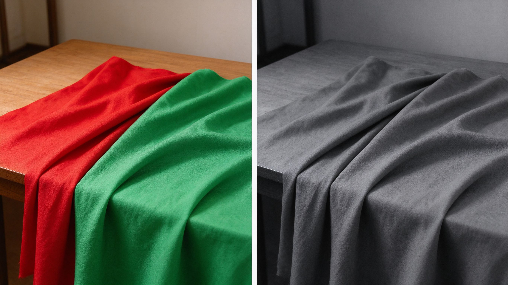
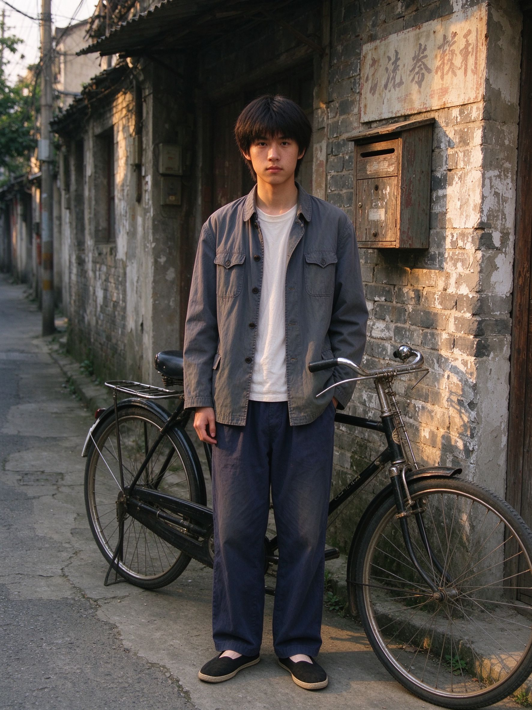
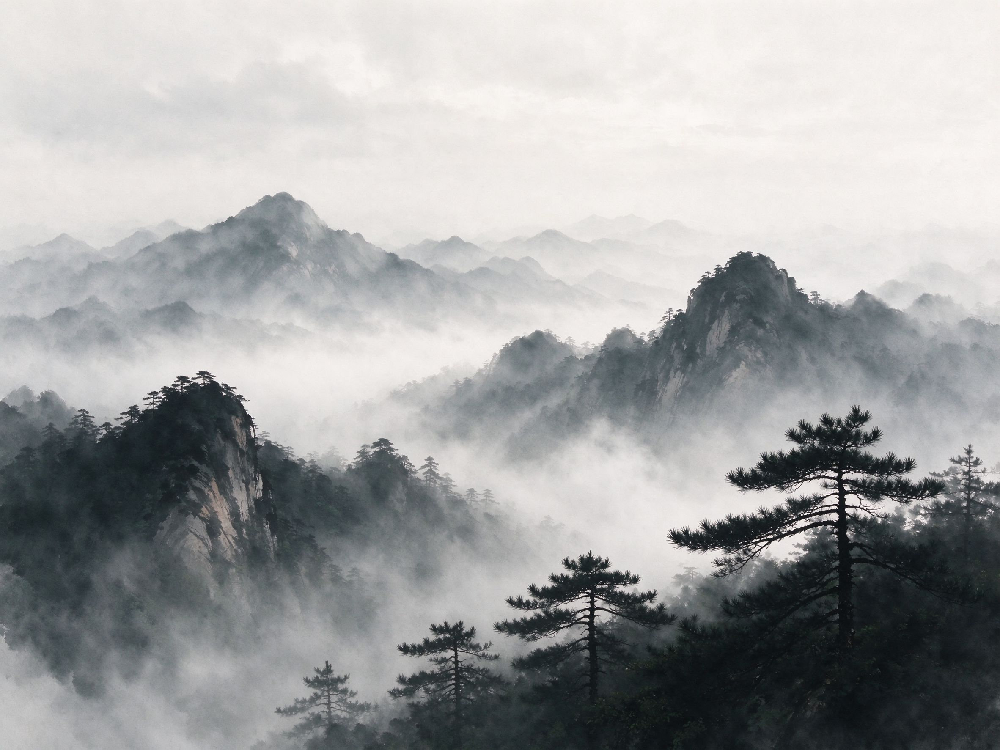
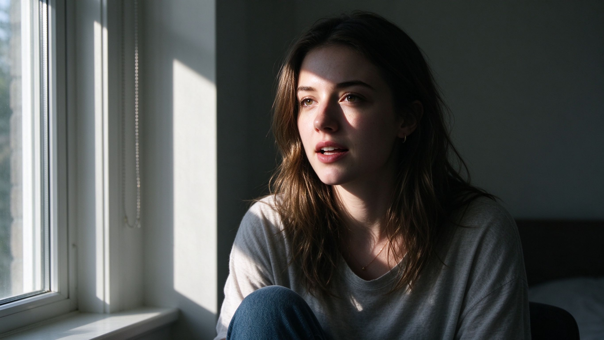

# 第 25 课：黑白、胶片、年代与电影化视觉——质感、道具与叙事，不是套预设

第 20 课我们说过，**胶片感、年代感、电影感**不是一个固定的滤镜。它们是一整套选择的总和：颗粒粗细、反差高低、偏冷还是偏暖、画幅宽窄、光线软硬、人物穿什么、画面里有什么道具、照片有没有在"讲一个故事"。这一课把这些词拆开来看——先从黑白开始，因为黑白是所有"质感"讨论的起点。

## 1. 黑白不是"去掉颜色"

很多人以为黑白就是把彩色照片的饱和度拉到零。这是最常见的误解。彩色照片转黑白时，消失的不只是颜色，还有颜色之间的竞争——观众不再被红裙子、绿招牌、黄墙吸引，转而看见**明暗、形状、质感和表情**。

### 1.1 颜色变成了什么

在黑白照片里，每一种颜色都会变成一个不同深浅的灰。但这个转换不是简单的"亮颜色=浅灰、暗颜色=深灰"：红色在黑白里往往显得很深，蓝色则显得很浅；一块鲜红的布和一块鲜绿的布，在彩色照片里对比强烈，转成黑白后可能变成几乎一样的灰。

上图：同一个场景的左右对照——左边彩色画面里红布和绿布对比强烈，右边转为黑白后两者变成了几乎一样的灰色。这就是黑白重新安排明暗秩序的原因之一。（原创生成示意图，非真实照片）这就是为什么早期摄影师会在镜头前加**滤色镜**——黄镜压暗蓝天、红镜压暗绿叶，人为改变不同颜色变成灰调后的明暗关系。

理解这一点，你就知道为什么黑白摄影不是"没有颜色的照片"，而是一种**重新安排明暗秩序**的语言。它选择让观众看形状和结构，而不是颜色和装饰。

### 1.2 黑白让什么变得突出

当颜色退出画面，以下几样东西会立刻变得显眼：

- **明暗形状：** 人物脸上的光从哪边来、阴影落在哪里、建筑的几何线条怎么分割画面。
- **材质质感：** 皮肤的纹理、布料的褶皱、树皮的粗糙、金属的反光——这些在彩色照片里常被颜色分散注意力，黑白里无处躲藏。
- **人的表情与姿态：** 没有了口红颜色、衣服配色的干扰，眼神、嘴角、肩膀的松紧直接传递情绪。
- **空间层次：** 近景和远景不再靠颜色区分，而是靠明暗和清晰度拉开距离。

看安塞尔·亚当斯（Ansel Adams）的 [Moonrise, Hernandez, New Mexico（1941）](https://www.moma.org/collection/works/56067)（MoMA 馆藏，银盐照片，© Ansel Adams Publishing Rights Trust，核验日期 2026-10-01）。画面里新墨西哥州的暮色天空亮得发白，教堂和墓碑却沉在深黑里，中间是一片灰调的山坡和村落。如果转成彩色，黄昏的橙色、蓝天的深蓝会各自争夺注意力；亚当斯用黑白把这些颜色"翻译"成一条从亮到暗的完整阶梯——这就是他著名的**区域系统（Zone System）**：从最白的雪到最黑的岩石，每一段灰都有它该在的位置。他不是在"拍风景"，他是在控制光从白到黑的整个层次。

再看爱德华·韦斯顿（Edward Weston）的 [Wet Kelp, Point Lobos（1938）](https://www.moma.org/collection/works/46506)（MoMA 馆藏，银盐照片，© Center for Creative Photography, Arizona Board of Regents，核验日期 2026-10-01）。一团被潮水打湿的海带，扭曲、皱褶、表面泛着光。彩色版本里，海带的棕褐色可能只是"一团棕色的东西"；黑白版本里，你能看清它每一条褶子的起伏、表面湿润的反光、边缘卷曲的形状。韦斯顿追求的是"直接摄影"——不加柔焦、不模仿绘画，让物体本身的形状和质感成为主角。

### 1.3 黑白照片的质感从哪来

一张黑白照片"看起来有味道"，靠的不是把颜色去掉再套个滤镜，而是**媒介本身**。请看下面这张示范（原创生成示意图，非真实照片）：窗边的自然光在人物脸上形成从亮到暗的平滑过渡，高光柔和不刺眼，阴影深而有层次；画面里有细腻的颗粒，皮肤纹理、发丝、衣物的褶皱都在灰调里清晰可见。

注意三件事。第一，**黑白让明暗成为主角**：没有了红裙子、绿招牌的干扰，观众只能顺着光看脸部的亮面和暗面。第二，**质感无处躲藏**：皮肤、头发、布料的纹理在彩色里常被颜色分散注意力，黑白里全部浮现出来。第三，**颗粒是一种选择**：细腻的颗粒给画面一种"胶片"的触感，它来自感光材料和冲印过程，不是后期硬加的噪点。

这正好解释了一个常见的误解：网上那些"老照片发黄发灰"，很多并不是摄影师刻意做的风格，而是**材料老化**——相纸存放多年、银盐氧化，留下泛黄、划痕和斑点。这些是时间留在物理载体上的痕迹，不等于"复古滤镜"。真正值得学的是上面示范里那种靠光线、颗粒和层次撑起来的黑白质感。

## 2. 胶片的质感：颗粒、宽容度与感光特性

"胶片感"这个词被用得太多了，以至于它几乎什么都能指。我们把它拆成三个可以观察的物理特性。

### 2.1 颗粒不是噪点

胶片上的**颗粒（grain）**来自卤化银晶体的大小。感光度越高的胶片，银盐晶体越大，颗粒越粗；感光度越低的胶片，晶体越细，画面越干净。但胶片颗粒和数码噪点有本质区别：数码噪点是电信号的杂质，分布不均匀、边缘发脏；胶片颗粒是物理晶体，它有一种均匀的、有机的纹理，甚至会成为画面质感的一部分。你看 1950 年代用 ISO 400 黑白胶片拍的街头照片，粗颗粒不是"缺陷"，它和当时的拍摄节奏、光影强度一起构成了那种粗粝的现场感。

### 2.2 宽容度：胶片怎样对待曝光失误

**宽容度（latitude）**指胶片在过曝或欠曝时仍能保留细节的能力。胶片的特点是：高光部分会"慢慢白下去"，从亮部到过曝之间有一段柔和的过渡；数码传感器则更容易"啪"一下切到死白。这就是为什么胶片照片看起来"高光很舒服"——不是因为颜色好看，而是因为亮部是渐变的，不是硬切的。

反过来，胶片的暗部一旦欠曝，细节也很难拉回来。所以用胶片的人养成了一个习惯：**向右曝光（让亮部尽量亮但不溢出），再在暗房里压暗**——这和数码后期"先保证暗部再拉高光"的思路正好相反。

### 2.3 不同胶片的"性格"

不同型号的胶片不只是感光度不同。它们对不同波长的光敏感程度不同，因此拍出来的反差、色偏、层次都不一样。早期的**正色片（orthochromatic）**对红色不敏感，拍出来的红色嘴唇几乎是黑色的；后来的**全色片（panchromatic）**才能忠实还原所有颜色的明暗。彩色胶片也各有性格：有的偏暖、有的偏冷、有的反差高、有的层次柔。这些具体的胶片模拟和品牌色彩风格，我们留到第 27 课细讲；这一课你只需要记住：**"胶片感"不是一个预设，而是某种胶片在特定光线、冲洗、放大条件下的综合结果。**

## 3. 年代的视觉线索：服装、道具、建筑与媒介

"年代感"是最容易被误解的词。很多人以为把一张照片调成暖黄色、加一点颗粒、裁成方幅，就有了"复古感"。但真正的年代感来自画面里那些**无法后期伪造的视觉证据**——它来自你拍进画面的东西，而不是你事后套的滤镜。

### 3.1 年代感是累积的线索

一张照片为什么让你觉得它属于某个年代？因为它同时满足了好几条线索：

- **服装与发型：** 衣服的剪裁、面料质感、鞋子的款式、人物的发式。
- **道具与物件：** 桌上的茶杯样式、手里的书、路边的招牌、交通工具。
- **建筑与空间：** 街道的宽度、门窗的样式、墙面的材质、电线杆的位置。
- **媒介与印刷：** 照片本身的颗粒、反差、边缘痕迹——它是用什么拍的、印在什么相纸上。

这些线索不是单独起作用的。一个人穿现代西装站在一个旧厂区里，你会觉得"哪里不对"；但如果他的衣服、发型、背景的招牌、身边的旧自行车都对得上，年代感就自然成立了。

上面这张示范（原创生成示意图，非真实照片）里，年轻人穿着棉布外套和布鞋，站在旧街巷中，身旁是老式自行车、斑驳砖墙和褪色招牌。你不需要查资料就能感到它"不属于现在"——因为画面里的服装、道具和建筑组合方式，和今天的城市街头不同。**年代感不是调出来的，是你拍进画面的。**

### 3.2 不要把年代感变成服装秀

这里有一个重要的区分：**"记录一个年代"和"扮演一个年代"是两回事。**上面示范里那种复古服装和道具，是为了演示"时代线索"而特意安排的；如果一位街头摄影师拍一个真的生活在这个环境里的人，那些衣物和物件就是他的日常生活，不是为拍照临时摆的。而如果你穿着租来的民国长衫、站在仿古街道上、再套一个胶片预设，你得到的是一张"主题写真"，不是一张有年代感的照片。

年代感的核心不是"像老照片"，而是**画面里的人和物真的属于那个时间和空间**。作为初学者，你不需要回到过去；你可以拍今天街上那些带有时代痕迹的东西——旧厂房、老式招牌、复古理发店、人们今天穿的衣服、今天用的手机。十年后回头看，这些就是你的"年代感"。

## 4. 画意摄影：当摄影向绘画学习

### 4.1 什么是画意

**画意摄影（Pictorialism）**是摄影史上最早的自觉风格之一。它反对摄影只做机械记录，主张像绘画一样用柔焦镜头、特殊相纸和暗房加工去表达情绪与美感。在中国，画意摄影也走出了一条自己的路：郎静山（1892–1995）借鉴山水画的构图和意境，把在不同地方拍的多张底片在暗房里叠合，合成一幅"中国画"式的风景，这种方法叫**集锦摄影**（代表作《春树奇峰》，1934；[中国美术馆郎静山特展介绍 — 人民网](http://www.people.com.cn/GB/24hour/n/2013/1025/c25408-23320463.html)，郎静山遗产所有，核验日期 2026-10-01）。

### 4.2 "画意感"是什么

请看下面这张示范（原创生成示意图，非真实照片）：雾气把层层远山隐入大气透视，柔焦让明暗像墨色晕染，天空与云雾留出大片空白，近处几枝松树作为暗部点缀。

理解这张示范，你就明白所谓"画意感"不是给照片加一层柔焦滤镜，而是**让画面的明暗层次、空间留白和构图节奏，呼应一种你熟悉的绘画传统**。郎静山用底片的明暗代替水墨的浓淡、用叠放构图代替笔墨章法，追求的正是这种效果。今天你也可以做出"画意"——在拍摄时控制雾、光、留白和虚实，而不是靠后期糊一层柔光。

## 5. 电影化视觉：画幅、布光与叙事

最后说"电影感"。和前两个词一样，电影感也不是一个滤镜。它至少由四样东西组成。

### 5.1 画幅

电影最常见的画幅是 16:9 或更宽的 2.39:1（宽银幕），而照片通常是 3:2 或 4:3。把照片裁成 16:9 或 21:9，观众的第一反应是"这像电影截图"。但画幅只是入口——宽画幅本身不产生电影感，它需要其他元素配合。

上图：一张电影感的完整示范——16:9 宽画幅、有动机的窗光、半张脸在光里半张在影里、画面暗示一个正在发生的瞬间。它不是靠裁宽画幅或套青橙色调得来的，而是光线、构图与叙事一起凑出来的。（原创生成示意图，非真实照片）

### 5.2 布光

电影里的光通常是**有动机的**：光从窗户进来、从台灯出来、从篝火照过来。人物的脸一半亮一半暗（明暗对比法，chiaroscuro），不是因为相机测不准光，而是导演要这种戏剧感。你看很多"电影感"教程只教你把阴影调蓝、高光调橙（俗称"Teal & Orange"），但那只是调色结果；真正的电影感来自**拍摄时就控制光线的方向和软硬**——主光从哪里来、辅光补多少、背景光怎么打。

### 5.3 调色

电影的调色是为叙事服务的。文艺片可能整体压低饱和、偏青灰；商业大片可能高饱和、强对比。但调色不是风格本身——它是在已经拍好的画面上，强化故事的情绪方向。一张手机快照套上电影 LUT，不会变成电影；因为它的光线、构图、叙事都不是按电影逻辑拍的。

### 5.4 叙事：照片里的"前后"

最后，也是最重要的：**电影是讲故事的，照片可以暗示一个故事。**电影感的照片往往有一种"决定性的瞬间"——你觉得这个人物刚刚说了一句话，或者马上要做一个动作；画面边缘留出了未发生的余地。这不是靠滤镜做出来的，是靠构图、人物姿态、环境信息共同暗示的。

## 6. 质感是选择的总和

把这一课的内容收拢一下：

| 你想得到的感觉 | 不是靠一个预设 | 而是这些选择的组合 |
|---|---|---|
| 黑白感 | 饱和度归零 | 形状、质感、表情、明暗层次被推到台前；滤色镜改变颜色转灰的关系 |
| 胶片感 | 一个胶片模拟 LUT | 颗粒粗细、宽容度、高光渐隐、某种胶片的反差特性 |
| 年代感 | 暖黄调色 + 颗粒 | 服装、道具、建筑、媒介痕迹的集体可信；人物真的属于那个时空 |
| 画意感 | 柔焦 + 暗角 | 构图留白、明暗虚实、和绘画传统的对话 |
| 电影感 | 宽画幅 + 青橙色调 | 布光动机、明暗对比、画幅比例、叙事瞬间的暗示 |

所以下次你打开一个滤镜商店，看到"富士胶片""复古港风""电影质感"的预设包，先不要急着买。问自己三个问题：我拍的是什么？我想让人感受到什么？画面里的光线、服装、道具和这个感受对得上吗？**预设是别人总结好的一组选择，你需要先知道自己在选什么。**

## 练习：拆解一张"质感参考"

找一张你觉得"很有胶片感/年代感/电影感"的照片（可以是你喜欢的电影截图、老照片、画册里的作品），不要急着去调自己的照片。拿一张纸，逐项写下：

1. **它是黑白还是彩色？** 如果是黑白，哪些颜色在原场景里可能变成了相近的灰？
2. **颗粒明显吗？** 粗颗粒还是细腻？它让你觉得更粗粝还是更柔和？
3. **光线从哪里来？** 硬光还是柔光？阴影深不深？高光有没有"切死"？
4. **画幅是什么比例？** 这个比例让你觉得像照片、像电影、还是像画册？
5. **画面里有什么道具或环境线索？** 它们说明这是什么时代、什么地方？
6. **这张照片在"讲故事"吗？** 你能感觉到画面之前或之后发生了什么吗？

写完这六项，你就拆解了一个"质感"背后的所有零件。下次拍照前，先想清楚你要哪几个零件，再去按快门。

下一课我们将离开具体风格，进入更宽的视角：城市、时代和文化语境如何塑造影像，以及怎样避免把某个地区或年代简化成刻板滤镜。
