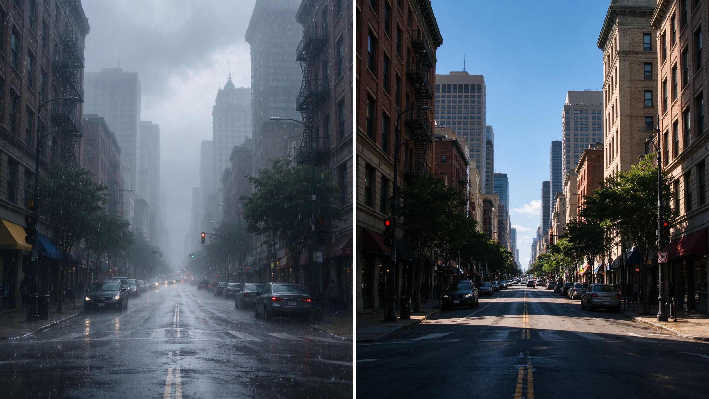

# 第 26 课：地区与文化语境——从城市的真实线索出发，不把地方压成滤镜

在社交平台上搜"港风""日系""法式""新中式"，你会看到大量高度相似的照片：偏色的青橙调、斜射的侧光、窄窄的画幅、老式招牌、电车、雨后路面。它们好看，也容易上手。但如果你只把这些关键词当成一个"一键套用"的滤镜包，你就错过了这一课真正想讲的东西：**一座城市、一个时代的影像气质，是由建筑、光线、生活、媒介和摄影史共同长出来的，不是预设出来的。**

第 20 课 1.5 节已经说过：地区与文化语境是"从线索出发，不贴标签"。这一课把这句话展开成一套可操作的方法。我们要学的不是"怎么拍出港风"，而是"当你想拍一座城市、一个地方时，你应该先观察什么、避开什么、尊重什么"。

## 1. "港风""日系""法式"到底是什么

先把这些词拆开。它们不是摄影史里的正式风格名称，而是近十年社交平台把多种来源压缩之后形成的**标签**。一个标签里通常混着至少五样东西：

- **城市的物理环境：** 建筑密度、街道尺度、招牌制式、行道树、天气、空气湿度。
- **某个年代的生活记忆：** 比如 1980–90 年代香港的公共屋邨、霓虹灯牌、电车；战后至经济高速增长期的东京街头；巴黎奥斯曼街区的咖啡馆与林荫道。
- **流行影像的放大：** 王家卫的电影、是枝裕和的家庭片、无数时尚杂志与旅行 Instagram。这些媒介已经替观众"预定"了观看方式。
- **器材与胶片：** 某个年代常用的胶片、镜头、暗房工艺，在那个时代是"随手拍"，今天被抽象成"质感"。
- **一群摄影师的长期凝视：** 他们选择站在哪里、离人多远、用怎样的光，最终塑造了外界对这座城市的印象。

标签可以作为找参考的入口，但它不能替代你去追问：**你说的"港风"，是 1960 年代何藩镜头里光影切割的中环，还是 1990 年代王家卫电影里湿漉漉的重庆大厦，还是今天 Instagram 上尖沙咀霓虹招牌的标准化打卡？** 这三件事都发生在香港，但它们的光线、人物关系、拍摄立场完全不同。把它们混成一个 LUT，等于把三段不同的历史压成同一种色偏。

## 2. 从线索出发：研究一座城市的五层线索

当你真正想拍一座城市，或者想认真理解一种"地方风格"时，不要先打开调色软件。先做一周的"线索采集"。下面五层，一层都不能少。

### 2.1 建筑与街道：它的空间是什么形状

先不看镜头，看城市本身。

- 街道是窄是宽？人走在其中是被楼夹住，还是被广场摊开？
- 建筑外立面是什么材料、什么年代？玻璃幕墙、骑楼、石库门、混凝土板楼、木造长屋，各自反射不同的光。
- 招牌、广告、电线、空调外机、防盗网、晾衣架——这些"杂物"才是城市真正的皮肤。干净到只剩下地标的照片，往往是游客视角。
- 人行道的尺度决定了你能不能靠近一个人拍，也决定了街头摄影是"隔着街抓拍"还是"擦身而过"。

研究案例：何藩在 1950–60 年代的香港，拍的是高密度街头的光影切割——楼梯间的一束顶光、骑楼下的阴影、行人从亮处走入暗处。他的"香港感"不是来自某个胶片色，而是来自当时中环、湾仔那种狭窄、多层、光线被建筑切碎的街道结构。看 [Fan Ho 官方网站作品页](https://www.fanhohohho.com/)（著录：何藩 Fan Ho，《Hong Kong Yesterday》系列，1950–1960 年代；© 艺术家遗产 / Loftyart Gallery；作品受版权保护，仅链接参考，核验日期 2026-10-01）。你会发现他的画面里大量是黑白、强反差、几何阴影——今天社交平台上那种暖黄霓虹"港风"，和何藩其实不是一回事。这就是标签骗人的地方。

上图：同一个城市的两种影像气质。左半边是社交平台上常见的暖黄霓虹招牌街巷，右半边是黑白、强反差、几何光影的街头。它们都发生在香港，却是两种完全不同的观看方式。（原创生成示意图，非真实照片）

### 2.2 光线与天气：这座城市的光是怎么回事

不同纬度、不同气候的城市，光完全不同。

- 多雨多雾的城市，光是散射的、软的，阴影边缘模糊；干燥晴朗的城市，光是硬的，阴影切割锐利。

上图：同一条街道在两种气候下的光线。左半是潮湿多雾城市的散射柔光，阴影边缘模糊、空气带灰雾感；右半是干燥晴朗城市的硬朗阳光，阴影切割锐利、空气通透。光线是城市物理环境的一部分，不是调色能模拟的。（原创生成示意图，非真实照片）
- 北方干燥空气里的通透感，南方潮湿空气里的灰雾感，海边的高反光，山谷的漫射——这些不是"调色可以模拟"的，它们决定了你取景时什么时间出门。
- 注意一天里光线变化的时长：高纬度城市黄昏很长，低纬度城市天黑得突然。街头摄影师出门的时间窗口因此完全不同。

研究案例：森山大道镜头里的东京，是高反差、粗颗粒、倾斜、失焦、局部裁切的城市。这和东京本身的光线关系不大，更多是他个人选择的观看方式——但你要注意，他拍的不是"整洁的观光东京"，而是夜间街巷、酒吧区、自动售货机、涂鸦墙面那种高密度、快节奏、暧昧不清的局部。看 [Daido Moriyama 官方网站](https://www.daidohosakan.com/)（著录：森山大道 Daido Moriyama，《Nippon》《新宿》《三泽》等系列，1960 年代至今；© Daido Moriyama Photo Foundation；作品受版权保护，仅链接参考，核验日期 2026-10-01）。如果你只是把照片调偏绿、加颗粒，你学到的是他的"皮"，不是他的"眼"。

### 2.3 日常生活：人怎么在这座城市里动

- 人们几点出门、在哪一类空间停留、排队、吃饭、发呆？
- 公共交通是什么样？地铁、电车、小巴、摩的、轮渡——交通工具本身就是这座城市的剧场。
- 市场、早市、夜市、茶馆、公园——这些地方的人不是"背景"，他们是这座城市怎么运转的证据。

旅行时最容易犯的错，是只拍"地标"和"奇风异俗"，不拍日常。一座城市真正的气质，藏在你住下来三天以后才会注意到的那些重复动作里：早餐摊的蒸气、下班高峰挤上公交的人流、傍晚在小区楼下乘凉的老人。

### 2.4 媒介与流行文化：这座城市被怎样看过

今天你对一座城市的视觉印象，很大程度是被电影、电视剧、MV、广告和短视频反复剪辑过的。这不是坏事，但你要意识到它的存在：

- 哪些镜头角度已经被用滥了？（巴黎必须是咖啡馆露台，东京必须是涩谷路口，香港必须是霓虹招牌仰拍。）
- 流行媒介喜欢挑这座城市"上镜"的一面，掩盖它普通、杂乱、甚至无聊的一面。
- 你去拍的时候，是在重复别人已经拍过一万次的角度，还是在拍你自己真正注意到的东西？

### 2.5 摄影史里的这座城市：谁长期拍过它

每一座被反复拍摄的城市，都有自己的摄影史。你不需要背名单，但应该知道：在你之前，已经有人用几十年时间和这座城市相处过，他们的立场会影响你今天能拍到什么。

- 香港：从 19 世纪来华的商业摄影师，到何藩、邱良这一代街头摄影师，再到当代记录城市清拆的项目。
- 东京：从早期画报，到东松照明、森山大道、中平卓马这一代"挑衅派"，再到现代手机街头。
- 上海：从民国月份牌与照相馆，到 1980–90 年代记录市民生活的纪实，到今天的都市更新题材。

了解这些，不是为了在拍摄前给自己加压力，而是为了知道：你按下快门前，这个地方已经被无数镜头解释过；你需要决定，你是在加入那支队伍，还是在偏离它。

## 3. 影像史中的地域叙事：摄影师的立场

谈"地区风格"绕不开一个不舒服的事实：**摄影从一开始就和旅行、殖民、人类学考察绑在一起。**

19 世纪西方人来到中国、日本、北非，拍下大量影像。这些照片在当时被当作"科学记录"，今天回看却带着明确的观看立场：镜头对着哪类人、哪类建筑、哪类"奇风异俗"，已经预设了"我们/他们"的关系。例如 John Thomson 在 1868–1872 年间从华南到华北拍摄的大量中国影像，今天是重要的历史文献，但它们同时也是一位苏格兰摄影师在晚清中国的观看——他选择拍官员的正式肖像、街头的皮影摊、长城的远景，而不是拍自己住在哪家客栈、和哪些中国人打交道。这些作品今天在 Wellcome Collection 以公版/CC BY 开放，可作为历史文献查阅，例如 [Wellcome Collection 中 John Thomson 中国影像检索页](https://wellcomecollection.org/works?q=john+thomson+china)（著录：John Thomson，《Illustrations of China and its People》相关底片，1868–1872；Wellcome Collection，伦敦；多为 Public Domain Mark 或 CC BY 4.0；仅作为影像史线索链接查阅，不作为风格模仿对象，核验日期 2026-10-01）。

这件事对今天的你意味着三件事：

第一，**任何"拍一个地方"的行为都有立场。** 你站在外面看，还是住下来拍？你拍的是"它在我眼里的样子"，还是"它希望自己被看见的样子"？这两种立场都成立，但你要知道自己选了哪个。

第二，**长期项目和旅游快照不是一回事。** 一个摄影师在一个街区住五年，和一个游客待三天，拍到的东西完全不同。前者有权讲述这个地方，后者更诚实的做法是承认自己是外来者，拍"我作为外人的感受"，而不是假装有资格代表这里的人说话。

第三，**看大师作品时要连立场一起看。** Alex Webb 在加勒比、美墨边境用密集色彩和多层重叠构图拍摄，他的"地方感"来自他作为美国摄影师长期游走边境地带的视角；Martin Parr 用夸张色彩和近距离拍摄，直视中产阶级生活的消费与荒诞，他的"英国感"其实是一种带有讽刺的内部观察。看 [Alex Webb 官方网站](https://www.alexwebb.com/)（著录：Alex Webb，《La Calle》《Violet Isle》等，1970 年代至今；© Alex Webb / Magnum Photos；作品受版权保护，仅链接参考，核验日期 2026-10-01）；看 [Martin Parr 官方网站](https://www.martinparr.com/)（著录：Martin Parr，《The Last Resort》《Small World》等，1980 年代至今；© Martin Parr / Magnum Photos；作品受版权保护，仅链接参考，核验日期 2026-10-01）。你会发现，他们的"地方风格"不是地理决定的，是他们长期选择的观看方式决定的。

## 4. 避免刻板化：游客视角、异域化与标签

这是本课最重要的一节。

### 4.1 游客视角：只挑"上镜"的一面

游客视角不是"外地人拍的"——长期居住的摄影师也可能有游客视角。它的真正特征是：

- 只拍奇观，不拍日常；
- 只拍"符合想象"的部分，跳过不符合想象的部分；
- 把当地人当作风景的一部分，而不是有名字、有态度的人。

判断方法很简单：如果你删掉了所有"和旅行手册上不一样"的画面，你就在用游客视角。

### 4.2 异域化：把对方压成他者

异域化（exoticizing）指的是：刻意挑选一个地方"原始、奇怪、落后、浪漫"的瞬间，把它和当地现代、普通、日常的一面切开，喂给外界的想象。

在摄影里它常表现为：

- 去乡村只拍老人和土房，不拍村里的网吧和快递站；
- 去少数民族地区只拍服饰和仪式，不拍他们的工作、上学、吐槽；
- 把城市里的破旧、脏乱当成"风味"来审美，却不拍它背后的居住问题。

避免异域化的一个简单练习：**拍一个地方时，至少拍一张它"普通到不值得发朋友圈"的照片。** 比如写字楼下面的连锁快餐店、小区里的垃圾分类站、路边正在修手机的铺子。这些画面不会立刻给你"地方感"，但它们让你诚实地面对这个地方。

### 4.3 标签化：把地区压成滤镜

回到开头。"港风""日系""法式"这些词最大的风险，不是不准确，而是**它们让你不再观察**。

当你认定"日系=低饱和青绿+逆光发丝"，你就会自动跳过东京那些阴天、阴天、再阴天的灰；当你认定"港风=暖黄霓虹+窄巷"，你就会自动跳过香港今天大量的玻璃幕墙、跨海大桥、公屋社区。你拍到的不是这座城市，是你对这座城市的刻板印象。

**标签是用来找参考的，不是用来拍照片的。** 真正的"地方感"，是你在五层线索里待够时间之后，画面自然长出来的东西，不是你在调色软件里推出来的。

## 5. 旅行与项目拍摄中尊重语境的方法

最后给一组可执行的原则。

1. **先住几天，再按快门。** 到一座城市的头 24 小时尽量不拍。先走路、坐公交、去市场、和人说话。让眼睛从"找机位"切换到"看事情"。
2. **拍人之前，先想你为什么拍他。** 是因为他在做一个动作，还是因为他"长得有地方特色"？后者往往是刻板化的开始。
3. **靠近，但不要侵犯。** 街头摄影可以靠近，但要学会读对方的反应：有人回避镜头，有人看向你，有人主动摆姿势。对回避的人，把相机放下。
4. **系列比单张诚实。** 一个地方拍 30 张，比拍 3 张"大片"更能帮你避免刻板印象。你会被迫看到重复、矛盾、日常的一面。
5. **给当地人留位置。** 如果这组照片以后要公开发表，想一想：被拍的人看到会舒服吗？这个城市的居民看到，会觉得你懂它，还是觉得你又消费了它一次？
6. **说清楚你的位置。** 你是游客、是短期居住者、还是长期项目？在照片说明里诚实写出来，不要假装自己是"本地人视角"。
7. **把标签放进口袋，不要挂在镜头上。** 拍完再回头看：我这组照片，是在拍这座城市，还是在拍"我以为这座城市应该有的样子"？

## 练习：同一座城，拍两种照片

选你现在生活的城市，或者最近去过的一座城市，做一次为期半天的练习：

1. **第一组，"别人眼里的它"：** 找出两个这座城市在社交平台上最常见的机位/题材（比如某个网红路口、某个招牌），各拍一张。拍的时候完全模仿你看到过的角度、光线、色调。
2. **第二组，"你眼里的它"：** 离开那两个机位，走 20 分钟，找三个你真正注意到、但你怀疑"别人不会拍"的画面——比如一条普通的巷口、一个正在干活的人、一块褪色的招牌。拍三张。

拍完后把两组并排看，写三行话：第一组照片和第二组，光线、人物关系、我的距离感有什么不同？哪一组更接近这座城市今天真实的样子？如果只发第一组，会不会有人对这座城市产生刻板印象？

下一课我们会把话题从"地方"拉回到器材本身：相机品牌的 JPEG、胶片模拟、RAW 与所谓"色彩风格"，为什么它们只是可比较的渲染变量，而不是某座城市、某个人群的人格。
