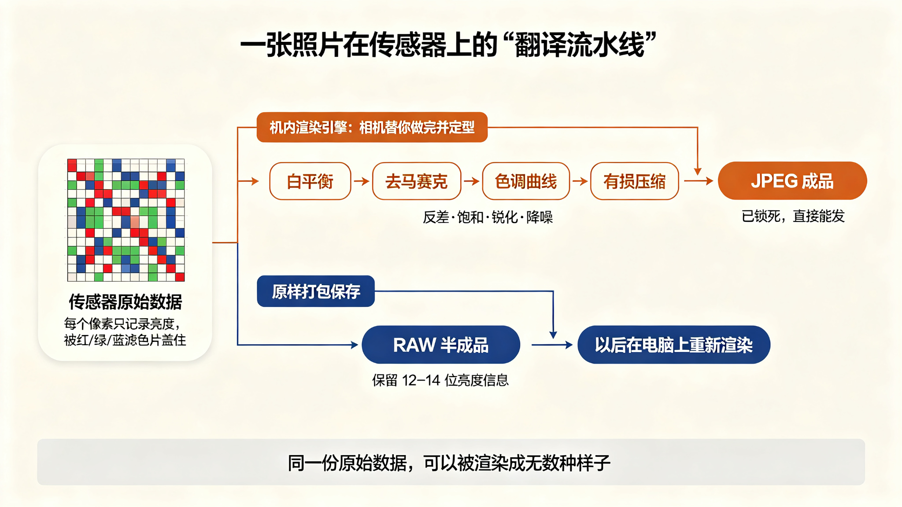
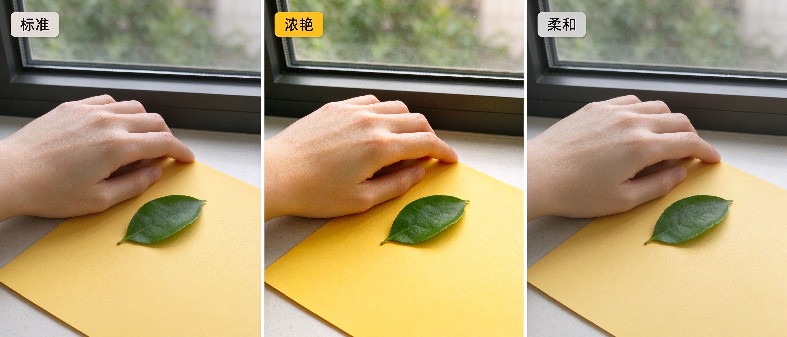

# 第 27 课：相机 JPEG、胶片模拟、RAW 与品牌"色彩风格"——可比较的渲染，不是品牌人格

第 20 课我们说过一句要紧的话：相机品牌确实会提供不同的 JPEG 渲染和预设，但这只是最终样貌的一部分，RAW 保留更大的后期空间，镜头、光线、白平衡、曝光和显示器同样会改变结果。第 25 课又拆开了"胶片感"，告诉你它不是一个滤镜，而是颗粒、宽容度、反差、偏色一整套选择的总和。这一课把话题收回到你手里这台相机上：为什么同一场景，这台相机直出"很舒服"，那台直出"有点怪"？网上说的"尼康黄""佳能红""富士人像"到底是不是真的？答案是：这些都不是相机的"性格"，而是一组可以被拆开、被比较、被重做的**渲染选择**。

## 1. 一张照片在传感器上其实是什么

要理解 JPEG 和 RAW 的区别，先要看懂光线进入相机之后发生了什么。

相机传感器上的每一个微小单元（像素）只能记录一件事：**照到它上面的光有多亮**。它不认识"绿色的树叶""黄色的墙""人的肤色"——它只是被一层红、绿、蓝的滤色片（拜耳阵列）盖住，分别记下三种光的强度。也就是说，传感器交付给相机的，是一堆还没被组织成画面的数字：每个位置一个亮度值，以及它属于红、绿、蓝中的哪一种。

这堆数字本身**还不是一张能看的照片**。相机必须做一系列"翻译"：先猜一个白平衡（把白色还原成白），再把红、绿、蓝三个通道"插"出每个像素的完整颜色（去马赛克），然后套用一条色调曲线决定明暗怎么分布，加上反差、饱和、锐化、降噪，最后压成一个标准格式（通常是 sRGB 的 JPEG）。这条"翻译流水线"，就叫**渲染（rendering）**。

```text
传感器原始数据（一堆亮度数字）
        │
        ├──► 相机机内渲染引擎 ──► 白平衡+色彩+反差+锐化+降噪+压缩 ──► JPEG（成品，直接能发）
        │
        └──► 原样打包保存 ──► RAW 文件（半成品，等你以后在电脑上重新渲染）
```

关键就在这里：**同一份原始数据，可以被渲染成无数种样子。** JPEG 是相机替你渲染好、并且把过程"锁死"的那一份；RAW 是你把原始数据原封不动带走、打算以后自己再渲染一次的那一份。理解了这条流水线，后面所有“色彩风格”的争论都会变得清楚得多。



上图：传感器记下的只是一堆亮度数字，它有两条出路。上面一条暖色路径是相机在机内跑完白平衡、去马赛克、色调曲线、反差饱和锐化降噪和有损压缩，直接交给你一张已经锁死的 JPEG；下面一条蓝色路径是把这份 12–14 位的原始数据原样打包成 RAW，留到以后在电脑上重新渲染。同一份原始数据可以被渲染成无数种样子——这就是 JPEG 与 RAW 的根本差别。（原创生成示意图，非真实照片）

## 2. 相机 JPEG：一次已经做完的“固定渲染”

**JPEG 是什么：** 它不是"底片"，而是相机在你按下快门的一瞬间，用机内芯片跑完上面整条流水线之后，压缩出来的一张成品图。

**它解决什么问题：** 快、方便、开箱即发。拍完就能在屏幕上看、直接导进手机发出去，不用打开任何软件。对纪实、活动、家庭记录，以及对"我今天就想拍到一张能看的照片"的人，JPEG 是合理的选择。

**它不等于什么：** JPEG 不等于"相机自带的颜色真相"。它是一次**固定组合**的结果——白平衡被选定了、色彩被某条曲线映射过了、反差被拉过了、锐化和降噪已经加在像素上了、最后还按有损压缩丢掉了一部分细节。你事后在手机上把它"再调亮一点""肤色再白一点"，并不是在重新渲染原始数据，而是在一张已经渲染好、已经压缩过的成品上做二次修补，每次修补都会再损失一点画质。

用四步的方式记住 JPEG：它是一次已经做完的渲染；它让你省去后期；它不是原始数据，事后改动空间有限；等你进入第 29 课的 RAW 工作流，会更清楚哪些东西"事后补不回来"。

下面这张表把 JPEG 在一次渲染里被同时定死的几样东西列出来，以后你在菜单里看到它们，就知道它们各自在动画面的哪一部分：

| 渲染环节 | 它决定什么 | 一旦压进 JPEG |
|---|---|---|
| 白平衡 | 白色偏冷还是偏暖、肤色整体走向 | 只能整体偏，难以逐通道还原 |
| 色彩空间/色彩矩阵 | 红绿蓝怎么映射成画面颜色 | 通常是 sRGB，色域有限 |
| 色调曲线与反差 | 亮部多亮、暗部多深、中间调软硬 | 明暗分布已被定型 |
| 锐化 | 边缘加多少"人工清晰度" | 多余锐化产生的白边补不掉 |
| 降噪 | 暗部颗粒被抹掉多少 | 被抹掉的细节回不来 |
| 压缩 | 文件大小 | 每次再保存再损一次 |

## 3. 胶片模拟、照片风格、优化校准：它们到底调了哪几样

打开富士相机的菜单，你会看到 PROVIA、Velvia、ASTIA、Classic Chrome、PRO Neg. Std 这一排名字；打开佳能，叫"照片风格"（Picture Style），有人像、风光、标准；打开尼康，叫"优化校准"（Picture Control），有标准、自然、鲜艳、单色。名字各不相同，听起来像三台性格迥异的机器，但如果你去读三家的官方说明，会发现它们说的是同一件事。

富士官方对胶片模拟的描述，从来不说"这是人像模式"或"这是富士味"，而是逐项说明它在**颜色、反差和色调**上做了什么组合。例如官方说明书里：PROVIA/STANDARD 是标准色彩还原，适合从人像到风光的广泛题材；Velvia/VIVID 是高饱和、高反差的配色，适合自然与风光；ASTIA/SOFT 在保留天空蓝色的同时扩展了肤色的色相范围，推荐户外人像；Classic Chrome 压低色彩、提升暗部反差，呈现沉稳的观感；PRO Neg. Std 是柔和色调、扩展肤色范围，适合影棚人像（见 [FUJIFILM 官方数码相机说明书 · Film Simulation](https://fujifilm-dsc.com/en-int/manual/x100f_v21/shooting/film_simulation/index.html)，FUJIFILM 官方，核验日期 2026-10-01）。注意 Velvia 和 PRO Neg. Std 都是"富士"，一个是浓艳风光倾向，一个是柔和人像倾向——**富士自己内部就提供了相反的方向**。这是后面反驳"富士=人像"这句话的第一个硬证据。

佳能官方把 Picture Style 描述为"用颜色和反差来选择外观"，并可在高级设置里调整**锐度、反差、饱和度、色调**四项，还提供用户自定义槽位（见 [Canon 官方指南 · Picture Style](https://cam.start.canon/en/C018/guide2/html/CP-01_Overview_0020.html)，Canon 官方，核验日期 2026-10-01）。

尼康官方的优化校准更是把意图写在了选项名里：[标准]做均衡处理；[自然]做**最小程度的处理以获得自然效果，对稍后需要处理或润饰的照片可选用此项**；[鲜艳]增强主要色彩（见 [Nikon 在线说明书 · 优化校准](https://onlinemanual.nikonimglib.com/z6III/zh-cn/picture_controls_40.html)，Nikon 官方，核验日期 2026-10-01）。尼康自己明确告诉你："自然"这一档，就是为了让你事后去电脑上再渲染。

把三家放在一起看，名字不同，底下的结构是一样的：

| | 富士 | 佳能 | 尼康 |
|---|---|---|---|
| 菜单名称 | 胶片模拟 Film Simulation | 照片风格 Picture Style | 优化校准 Picture Control |
| 同时打包调整的变量 | 颜色＋反差＋色调（＋锐化/降噪） | 锐度＋反差＋饱和度＋色调 | 锐化＋反差＋亮度＋饱和＋色相 |
| 类似"标准"档 | PROVIA | 标准 Standard | 标准 |
| 类似"淡、留后期"档 | PRO Neg. Std / Classic Chrome | 用户自定义/低饱和 | 自然 Neutral |
| 类似"浓艳"档 | Velvia | 风光 Landscape | 鲜艳 Vivid |

所以"胶片模拟"听起来很特别，本质上它和佳能、尼康的机内风格是同一类东西：**把好几项渲染参数预先打包，给你一个现成的起点。** 它不是什么神秘的品牌灵魂，而是一组可以逐项理解的开关。

## 4. RAW：还没被渲染的原始数据

**RAW 是什么：** 它是传感器那堆亮度数字，几乎原样打包存下来的文件。白平衡只是作为"建议值"记在备注里，并没有真正施加；没有套用最终色调曲线；锐化和降噪只做了最基本的处理；它保留了传感器原生的高位数（通常 12–14 位）明暗信息，而不是 JPEG 的 8 位。柯达早年把它叫作"数字底片（digital negative）"，这个说法很贴切：它像一张还没在暗房里显影放大的底片。

**它解决什么问题：** 可逆。白平衡错了可以在电脑上重算而不损画质；亮部过了一两档、暗部死黑了一块，只要原始数据里还有记录，就能拉回来；你可以先按 Velvia 的方向渲染一版，再同一份 RAW 按 Classic Chrome 的方向渲染另一版，而不必重新拍一次。

**它不等于什么：** RAW 不等于"拍得烂也能救"。它救不回完全没有照到光的死黑，也救不回高光彻底溢出、连一个亮度记录都没有的死白；它更不等于"画质自动更好"——一张曝光准确、机内渲染也合你意的 JPEG，拿来发朋友圈完全够用。RAW 换来的是**可编辑性**，不是魔法。它也不能直接当图片看：需要专用的转换软件（相机厂商自带的转换程序，或 Lightroom、Capture One 这类）在电脑上把它渲染一次，第 29 课起我们就做这件事。

一个常被忽略的细节：现在很多相机（尤其富士）在你拍 RAW 的同时，屏幕上回放的、以及嵌入 RAW 文件里给软件预览的小图，其实是**用你当前选的胶片模拟渲染出来的那一版**。所以你在屏幕上看到的"Classic Chrome 的样子"，并不是 RAW 本身的样子，而是相机顺手给你渲的一张预览。真正的 RAW，是这张预览背后那份没有定型的原始数据。

## 5. "尼康黄、佳能红、富士人像"：为什么它们是印象，不是人格

现在可以正面回答网上这些说法了。它们是不是完全瞎编？也不是——很多人确实在某个时期、某台机器上得到过这样的印象。但它们是**在特定条件下形成的经验印象**，不是这台相机稳定、普遍、世代不变的"品牌人格"。

把一个"色彩印象"拆开，你会发现它背后同时叠着这么多变量：

| 你以为是"品牌性格" | 实际上还同时包含了 |
|---|---|
| 这台相机偏黄 | 哪一代机型（早期 CCD/CMOS 色彩科学不同）、默认白平衡偏暖、当时常用的镜头、你拍的是哪种光 |
| 那个品牌人像好看 | 大家用它拍人像最多 → 网上看到的它的样片也多是人像 → 印象被反复强化；以及它的人像风格档本来就把饱和压低、把肤色展开 |
| 这个品牌出片浓艳 | 你用的是它的"风光/鲜艳"档，而不是"标准/自然"档 |

也就是说，当一个人说"佳能拍人肤色好"的时候，他可能真正在说的是：我手里这台佳能、用的人像照片风格、白平衡设在阴天、镜头是 50mm f/1.4、下午朝北的软光、我没怎么后期——这一整串条件合起来，肤色让我舒服。这一长串里，"佳能"只是其中一个标签，而不是原因。第 20 课我们提醒过，不要把地区、年代简化成刻板滤镜；品牌也一样。

几个值得记住的反驳：

- **同一品牌内部自相矛盾。** 富士既有浓艳的 Velvia（风光），又有柔和的 PRO Neg. Std（人像），还有沉稳的 Classic Chrome。说"富士=人像"，等于无视了富士自己给风光准备的那档。
- **色彩科学一直在收敛和更新。** 十年前被吐槽的某种偏色，往往在下一代传感器和固件里就被改了；拿 2010 年的印象评价 2026 年的机器，是在跟历史吵架。
- **风格档是可以调、可以装的。** 三家都允许你改参数、存自己的用户档，甚至导入别人做好的档文件。所谓"品牌味"，很多时候是某个网友在某个时间调好的一组参数，被当成了品牌本身。

所以正确的态度是：**把"尼康黄"这类说法当作一个待检验的假设，而不是一个购买理由。** 真正该做的，是下一节那套自己动手的对比。

## 6. 自己做一次"可比较的渲染"测试

网络上那些"各家直出对比"为什么大多不靠谱？因为它们几乎从不控制变量：不同的机器、不同的镜头、不同的时段、不同的光线、不同的白平衡、甚至不同的模特——最后谁也说不清差异到底来自哪里。要真正看清"渲染"在做什么，你需要一次**受控对比**：只让一个变量变化，其他全部锁死。

具体做法：

1. **选一个固定场景。** 最好同时包含三类颜色：一点接近肤色的东西（比如你自己的手背）、一块绿色（叶子或绿瓶子）、一块有色墙面（红或黄）。靠窗的软光最稳，不要在阳光快速移动时拍。
2. **把机器上脚架，机位、焦距、光圈、快门、ISO 全部固定。** 白平衡不要用自动，手动设一个固定值（比如对着一张白纸设一次自定义白平衡），保证每张图的"白色起点"一样。
3. **唯一改变的，是渲染方式。** 在同一张构图里：拍一张用"标准/标准"档的 JPEG；换一个浓艳档（富士 Velvia / 佳能风光 / 尼康鲜艳）再拍一张；换一个柔和档（PRO Neg. Std / 低饱和 / 自然）再拍一张；最后同样的条件拍一张 RAW。
4. **回到电脑上并排看。** 只问三件事：绿色哪一张更跳？肤色哪一张更柔和不蜡黄？暗部哪一张沉得更死？



上图：同一组静物（手背、绿叶、黄色卡纸、靠窗软光）用三种机内渲染档各出一版并排。左边颜色自然、反差适中，中间饱和度与反差更高、绿叶和卡纸颜色更跳，右边饱和度压低、阴影提亮。所谓品牌味，在你手里其实就是这几条曲线的差别。（原创生成示意图，非真实照片）

```text
固定：机位 / 曝光 / ISO / 白平衡 / 镜头 / 光线 / 主体
变化：标准JPEG ── 浓艳JPEG ── 柔和JPEG ── RAW
比较：肤色 / 绿色饱和 / 暗部反差 / 边缘锐化
```

做完你会发现两件事。第一，"品牌味"在你自己手里其实是几条曲线的差别：浓艳档只是把绿色和红色的饱和度抬高、把反差拉大；柔和档只是压低饱和、把阴影提起来。第二，这些差别你都能在后期里重做——这正是我们要打破的迷思：**你不是在比较两个品牌，你是在比较两组配方。** 看清配方，你就不必为了某一种颜色去崇拜某一块牌子。

## 7. 渲染选择怎样决定你的后续工作流

最后把这件事落到你的实际拍照流程上。你在菜单里选"JPEG 还是 RAW"，不只是在选文件大小，而是在选**把渲染这个动作留在哪里做**。

| 工作流 | 渲染什么时候做 | 优点 | 代价 | 适合 |
|---|---|---|---|---|
| 纯 JPEG | 按下快门瞬间，相机做完 | 快、直接发、不用电脑 | 事后难改、一次定型 | 街头、活动、即拍即发 |
| 纯 RAW | 回家后在电脑上做 | 可逆、可调空间大 | 必须后期、文件大 | 认真创作、需要反复试 |
| RAW＋JPEG | 相机渲一张预览，原始数据另存 | 既能速发，又留后路 | 占存储空间 | 大多数人最稳妥的折中 |

如果你选纯 JPEG，那么第 3 节那一排风格档就是你**最终的**调色板：拍之前就要想好今天用哪一档、白平衡往哪边偏，因为相机替你做的那一次就是成品。如果你选 RAW，那么机内风格更像是一个"预览和起点"——它决定屏幕回放好不好看、决定你第一感觉对不对，但真正的颜色、反差、肤色，留到电脑上由你决定。

这就是为什么从下一课开始，我们要把镜头转向"在电脑上重新渲染"这件事：只有当你亲手把同一份 RAW 渲染成浓艳版和柔和版，第 6 节那套对比才算真正完成，"色彩风格"才从一句网络传闻，变成你手里可重复、可调整、可成长的一套方法。

## 练习：一次受控的渲染对比

找一个靠窗、光线稳定的角落，摆上三样东西：你的手背（肤色参照）、一片绿叶（绿色参照）、一张有色卡纸（红或黄）。把相机上三脚架，固定好曝光和 ISO，手动设一次白平衡。然后只改风格档，按相同构图连拍三张：标准档、浓艳档、柔和档；再补拍一张 RAW。把它们导到电脑上并排放大，逐项写下：

1. 哪一张的绿色最跳？它是不是也把你的手背带偏了？
2. 哪一张的肤色最接近你肉眼看到的样子？
3. 三张的暗部，哪一张沉得最死？
4. 如果只让你留一张发出去，你会选哪一张？它和"你以为这台相机天生的颜色"是同一档吗？

另外，在网上找一条"某某品牌直出色彩好/差"的帖子，对着第 5 节那张表，列出它**没有控制住**的变量：镜头、光线、白平衡、风格档、后期——至少写出三条。你会发现，绝大多数"品牌色彩"之争，争的其实不是品牌。

下一课我们将从"机器的渲染"走到"人的方向"：通过大师案例和参考板，学习怎样把这台机器给你的各种选择，慢慢收拢成属于你自己的观看方式。
