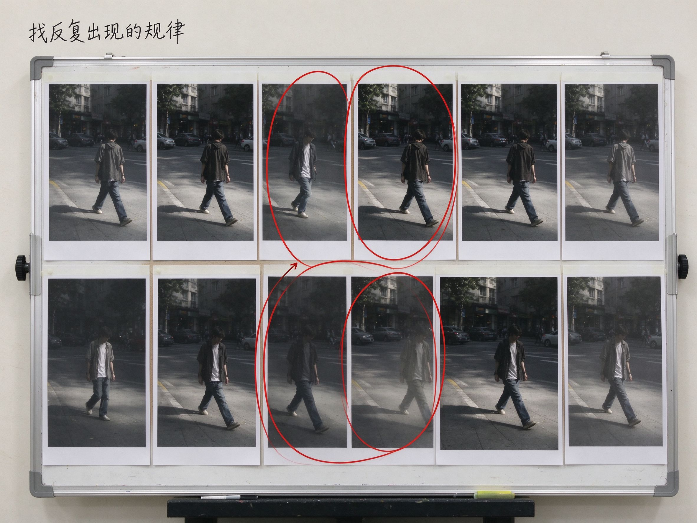

# 第 28 课：大师案例、参考板与个人小项目——从"读一位摄影师"到拍你自己的东西

第 27 课结尾我们说过，下一步要从"机器的渲染"走到"人的方向"：这台相机给你的各种选择，怎样慢慢收拢成你自己的观看方式。第 20 课其实已经给过方法的种子——"大师不是模板，用案例学习选择"，以及"建一个参考板，收 12 到 20 张图，再拍自己的 10 张"。这一课把那颗种子落成一整套能直接照做的步骤：**怎样读一位摄影师、怎样建一块参考板、怎样把参考变成一个真正属于你的小项目。**

先说清楚一件事。新手最常见的路径是："我好喜欢某某的照片，我要拍得像他"——然后去搜他的调色参数、买同款镜头、套同款滤镜，最后出来的东西四不像。问题不在他不够努力，而在于他只抄了**结果**，没有拆**选择**。大师照片的色调只是冰山露出水面的一角；水面之下，是他一辈子在拍谁、站多远、用什么光、对人抱什么态度。这一课要学的，就是把水面之下的那部分捞上来。

## 1. 读一位摄影师：五个问题

第 20 课给过一组问题：他/她拍什么？用怎样的距离与光？颜色和后期在做什么？对人物、地点和时代采取什么态度？哪些方法可以练，哪些只属于其项目与语境？这一课把它变成一套你拿到任何一个摄影师都能用的"五问阅读法"。读的时候不要一次看他几百张作品，那样只会被印象淹没；**先挑他最有名的三到五张，一张一张地按这五问拆开。**

**第一问，他长期在拍什么？** 不是"他拍过什么题材"，而是他反复回到同一个主题、同一群人、同一个地方多少年。Dorothea Lange 拍了一辈子大萧条里的劳动者；何藩十几年只拍 1950、60 年代的香港街头；肖全用十年拍同一批中国文艺界的同代人。知道他的"长期主题"，你才知道他每张照片是在回答什么问题，而不是在随手发朋友圈。

**第二问，他站多远、用什么光？** 距离是态度：他是和当事人并肩站在一起，还是远远地旁观？他凑近了拍人的手和表情，还是退回去让环境说话？光呢——是窗口斜进来的软光，是傍晚低角度的硬光把影子拉得很长，还是他干脆不要光、让人变成窗前的剪影？第 13、16 课讲过距离和视点，到了大师身上，你会发现距离本身就是内容。

**第三问，颜色和后期在做什么？** 他为什么用黑白而不是彩色？反差是高是低？颗粒粗还是细？留白多还是塞满？注意，问的不是"他调了多少"，而是"这些选择把观众的注意力逼向了哪里"。何藩把高反差黑白用得极重，是因为他要的是光和影的几何，颜色只会帮倒忙；肖全用克制的黑白，是因为他想让人物的脸和他们房间里的旧物自己说话。

**第四问，他对人物、地点、时代抱什么态度？** 这一问最容易被跳过，却最重要。他镜头里的人是被尊重地呈现，还是被当成"奇观"？他拍一条街，是在赞美它、哀悼它，还是在批判它？镜头背后是谁在替谁说话？一张同样美的照片，也可能带着拍摄者居高临下的视角——这一点，读大师时必须多问一句。读大师时，这一问决定了你能从他那里学什么、必须警惕什么。

**第五问，也是最关键的一问：哪些是我今天就能练的方法，哪些只属于他的项目和时代？** 这一问把前面四问收束成行动。任何一位大师身上都有两类东西：一类是**可迁移的方法**——"先和人聊十分钟再按快门""找好一束光等人走进去""在接触样片上狠删"；另一类是**他的语境**——政府委托、那个已经拆掉的街市、那个特定年代的文化圈、他半辈子的修养。你能学第一类，永远复制不了第二类。把这两类混在一起，你就会对着一张香港街头照片苦恼"为什么我家楼下没有这种光"，而忘了真正该练的东西。

下面用四位摄影师把这五问走一遍。他们都来自第 20 课的名单和第 21–27 课已经出现过的案例，但这次我们不复述他们的风格，而是拆他们的选择。

## 2. 四个示范拆解

### 2.1 Dorothea Lange：纪实的靠近，与一份一直悬着的伦理追问

[Migrant Mother, Nipomo, California（移民母亲）— Dorothea Lange — 美国国会图书馆](https://www.loc.gov/pictures/item/2017762891/)（Dorothea Lange，《Migrant Mother, Nipomo, California》，1936 年，美国国会图书馆 FSA/OWI 黑白照片系列，公领域历史档案影像；仅链接著录，核验日期 2026-10-01）。

用五问读她：**拍什么**——她受美国联邦农业安全局（FSA）委托，记录大萧条中流离失所的移民农工；**距离与光**——她是先和那位母亲 Florence Thompson 一家聊天、知道她们在豌豆地里挨饿之后才按下快门的，用 4×5 大画幅、现场光，距离近到能看清母亲眉宇间的疲惫；**颜色后期**——黑白，而且她著名的不是单张，而是在接触印相（contact sheet）上反复比较、狠删，最后才选出那一张；**态度**——她替被忽略的人发声，这张照片直接推动了政府紧急拨款救济，但那位母亲此后被全世界反复凝视、自己的生活却没有因此变好，这个追问从 1936 年一直悬到今天（第 21、24 课都提过）。

**可练的**：拍人之前先聊、先了解处境；在一堆底片里狠删而不是每张都舍不得；靠近但不消费对方的脆弱。**不可练的**：FSA 的政府委托、1930 年代美国那场社会运动、那片具体的豌豆地和那个具体的流亡家庭。你今天能带走的，是"靠近之前先了解"和"编辑本身就是作品"，不是那张照片本身的历史重量。

### 2.2 何藩：先搭好几何，等人走进光里

[迷離世界 Smoky World（迷离世界）— 何藩 — M+ 博物馆](https://www.mplus.org.hk/tc/collection/objects/smoky-world-201533/)（何藩，《Smoky World 迷离世界》，1959 年，银盐照片，M+ 香港藏，藏品编号 2015.33，© 何藩；仅链接著录，核验日期 2026-10-01）。

这张拍的是香港中环街市：低角度仰拍，人们正从一道天井漏下的光柱里走下楼梯，空气里浮着烟尘，人影一半浸在光里一半埋在暗部。用五问读他：**拍什么**——1950、60 年代香港街市、巷道、码头的日常人潮；**距离与光**——他自己说过，他常以极大的耐心等待"最佳时机"，等人形与几何线条、一束背光不期而遇，喜欢天井光、烟雾和黄昏拉长的斜影；


上图：何藩式方法的原创示范——先找到一束天井光和几何阴影，然后等人走进去再按快门，高反差黑白把嘈杂的街道整理成简洁的明暗块面。（原创生成示意图，非真实照片）**颜色后期**——高反差黑白，把嘈杂拥挤的市场整理成雕塑般的明暗块面；**态度**——他不拍苦难，他拍一个正在消失的城市的诗意，做过电影导演的他，画面天生带舞台感。

**可练的**：先找好一个几何框架或一束光，**等**一个人走进去再按快门；低角度仰拍能把日常台阶拍成纪念碑；用背光和烟尘做减法，让杂乱的街市只剩光和人影。**不可练的**：那个今天已经拆掉的中环街市、他作为电影导演练出来的光影调度、战后香港那种密度和速度。你在自家楼下能练的，是"等"和"用一束光做减法"，不是复制香港。

### 2.3 郎静山：把一种绘画传统，翻译成摄影

[春樹奇峰 Majestic Solitude（春树奇峰）— 郎静山 — M+ 博物馆](https://www.mplus.org.hk/tc/collection/objects/majestic-solitude-2018244/)（郎静山，《Majestic Solitude 春树奇峰》，1934 年，银盐照片，M+ 香港藏，藏品编号 2018.244，梅洁楼文化创意基金捐赠，© 郎静山；仅链接著录，核验日期 2026-10-01）。

第 25 课见过他。这张《春树奇峰》是他集锦摄影的第一件实验：把分别拍自黄山始信峰和西海的两张底片，在暗房里裁出局部、叠合放大成一张"山水"。用五问读他：**拍什么**——以黄山为母题的"山水"，不是某一座真实的山；**方法与光**——他不靠一次曝光，而靠暗房里的叠放，让近树、云海、奇峰各就其位；**颜色后期**——是黑白银盐，追求的却是水墨的浓淡虚实；M+ 的解说里特别点出他用了传统山水画的"三远法"：峰顶居高远、云海留白、前景树丛给观者一个立足点；**态度**——1930 年代，他用摄影回应中国文人画传统，和当时席卷艺术界的西洋风对话。

**可练的**：用留白和远近层次组织画面，而不是把框塞满；想象你在同一张画里需要一个"近景立足点"、一片"中景留白"、一个"远景高峰"。**不可练的**：他对山水画语汇一辈子的修养、暗房叠放的手工工艺、那个文人圈子。你今天拿手机，能练的是"留白"和"远近层次"这两件事，不是他的画意。

### 2.4 肖全：用十年时间，拍"做自己"的人

[《我们这一代》摄影作品展：历史的语境与肖像 — 肖全 — 中国摄影家协会](https://m.cpanet.org.cn/detail_news_83045.html)（肖全，《我们这一代》系列，拍摄于 1980–1990 年代，摄影集 1996 年初版，2014 年成都当代美术馆同名展览；现代受版权作品，仅链接著录；作者官方资料见 [xiaoquanstudio.com](https://www.xiaoquanstudio.com/page)，核验日期 2026-10-01）。

这是四位里最贴近国内学习者的一位。肖全从 1980 年代中期起，用十年时间遍访同代的文艺工作者——崔健、张艺谋、陈丹青、北岛、杨丽萍、余华……——为他们存像建档。用五问读他：**拍什么**——不是名人写真，而是一群人在时代里的脸；**距离与光**——他不是把人拉到白背景前拍证件照，而是和对象做朋友、在他们自己的房间和街道上、松弛不设防时按快门；**颜色后期**——克制的黑白，人物身后的旧墙、书桌、乐器都留在画面里，环境本身就是时代注脚；**态度**——他是同代人的平视，不是杂志对名人的仰望，他说自己是在为"我们这一代"留档。

**可练的**：把相机先放下、和人聊半小时再拍；在人物自己的环境里拍，而不是把人从生活里抽出来；愿意花很久去认识一个人，而不是十分钟拍完就走。**不可练的**：那个年代文艺圈的密度、他和对象同代同语境的私交。你今天能给朋友拍的，是"先做朋友再按快门"，不是他和崔健二十年的交情。

把四个人放在一起看，你会发现一个共同点：**他们真正被学到的，从来不是色调，而是那条"可练 vs 不可练"的分界线。** Lange 的"先聊再拍"、何藩的"等光里走进一个人"、郎静山的"留白与远近"、肖全的"先做朋友"——这四条，你明天出门就能用；而他们的历史语境，你不需要、也不该去复制。

## 3. 建立参考板：把"我喜欢"变成可比较的一组图

读了几位大师之后，下一步不是马上出门模仿，而是先建一块**参考板**。第 20 课给过它的定义：按一个小主题收集、并排比较的图片组。它和你手机里"喜欢就收藏"的相册最大的区别是——**收藏夹是堆情绪，参考板是做比较。**

**工具不重要。** 手机相册建一个专门相簿、电脑上建一个文件夹、用花瓣或 Pinterest 建一个画板、用 Milanote 这类白板工具，都可以。关键只有一条：这些图能被你并排放在一起看。软件再花哨，图是散的，就不算参考板。

**收集规则有三条。** 第一，先把主题定得很窄。不要建"我喜欢的摄影"——那是个无底洞，永远收不完。要窄到一句话能说清，比如"阴天街头的克制颜色""窗边侧光的侧脸""城市里一个人走在大片空地上""旧物桌上的一束侧光"。第二，收 12 到 20 张就停，宁少勿滥。第三，只收真的打动你的，不收"我应该喜欢"的名作——参考板是用来认识你自己的，不是用来装点品味的。

**每收到一张，只写三行字**（这就是第 20 课说的三要素，现在把它固定成格式）：

```text
【参考卡】
1. 主体与场景：画面里是什么、在哪
2. 视觉特征：距离 / 光 / 明暗 / 颜色 / 构图在做什么
3. 带来的感受：一句话
```

举个例子。假设你建的主题是"城市里一个人走在光里"，收到何藩那张《迷离世界》时，你的卡片应该写成这样，而不是只写"好有感觉"：

> 主体与场景：香港中环街市楼梯上，几个陌生人正走下来。
> 视觉特征：极低角度仰拍，天井一道硬光从上方灌下来，人物一半亮一半埋进烟尘般的暗部；高反差黑白，没有彩色。
> 感受：像走进一座舞台，日常的人忽然有了纪念碑的分量。

**收满 12 到 20 张之后，做最关键的一步：找共同点，而不是直接抄预设。**



上图：一块参考板的示意——约十张同主题的照片并排摊开，其中三四张被红色圈出，标注它们反复出现的共同点。参考板的价值，就是把喜欢什么从模糊感觉变成几条可以照着做的具体决定。（原创生成示意图，非真实照片） 把它们并排摊开，问自己一串具体的问题：

- 它们是不是都离主体很近？还是都退得很远、让人很小？
- 阴影是不是都压得很深？还是都很亮、很灰？
- 颜色是不是都很克制？还是某一种颜色（红、黄）只在画面里出现一点点？
- 人物有没有看镜头？是在走、在等、还是在做事？
- 画面里留白多，还是塞满？

把那些**反复出现三四次以上**的规律圈出来。那几条规律，就是你自己的审美倾向——是你还没意识到、但已经在反复偏爱的东西。参考板的全部价值，就在这一步：它把"我喜欢什么"从一句模糊的感觉，变成了三四条可以照着做的具体决定。

## 4. 从参考板，走到个人小项目

参考板是"看"，看完要"做"。把参考变成一个真正属于你的小项目，分四步。

**第一步，从共同点里选一个极小的主题。** 不要选"拍人像"这种大词，要选你生活里**真的碰得到**的东西：通勤路上那个等车的人、你家窗台上午后的那束光、楼下早餐店忙到飞起的那双手、学校门口放学时的人流。主题越小，越能练出控制力。

**第二步，定死数量：拍 10 到 20 张，中途不换主题。** 这一点和第 21 课的练习一脉相承——不换题，逼着你在同一个对象里翻出不同的拍法，而不是靠换新鲜场景回避问题。

**第三步，带着参考板出门拍。** 注意，不是去复制参考板里任何一张具体的图，而是用你总结出的那三四条"共同点"去拍你自己的生活。参考板说你的偏好是"近、暗背景、人不看镜头"，那你今天就按这三条去拍你楼下的早餐店；至于早餐店的蒸汽、老板的手、清晨的光，那些是你的生活，参考板里没有。

**第四步，复盘，诚实地回答两句话。** 拍完把你的 10 到 20 张和参考板并排，然后写下：

1. **我借用了他们什么方法？** 是靠近了？是压暗了背景？是等了一个走进光里的人？
2. **我的生活里，有什么是参考板里那些大师没有、只有我能拍的？**

第二句最重要。大师的语境你复制不了——你没有 1930 年代的豌豆地，没有 1960 年代的中环街市——但你楼下早餐店的蒸汽、你下班地铁里的疲惫、你窗台那盆长得歪歪扭扭的植物，他们也没有。**参考板教你怎么看，你的日常才是你要拍的东西。** 这就是"从模仿方法到建立个人方向"的真正含义：你借的是方法，不是生活。

## 5. 一个可以直接照做的小项目方案

下面这套方案，两周就能跑完，不需要特殊器材，手机也行。

**主题（二选一）：** "上下班路上，一个人走在光里或影子里"；或者"我每天经过、却从没认真看过的一个角落"。

**第 1–2 天，建参考板。** 先别拍。花两天，按第 3 节的规则收 12 张同主题的图（比如"一个人 + 一束光/一片影"），每张写满三要素卡片。然后圈出三四条共同点，写在最上面。

**第 3–9 天，拍摄。** 连续五到七天，每天在同一个时段走同一条路。只拍这个主题，拍到 10 到 20 张。按你圈出的那三四条共同点去取景——但人物、街道、光线，必须是你自己真实生活里的，不是从大师照片里搬来的。黑白还是彩色，由你参考板里的偏好决定，不要临时看心情。

**第 10 天，复盘。** 从 20 张里挑出四张：两张最接近参考板方法的，两张最像你自己生活的。在下面写三行字：我借了参考板的哪两三条方法；我的生活里多出了什么是他们没有的；下一次我想再试哪一条。

这个项目的目的，不是拍出一张能拿出去比赛的照片，而是让你完整走一遍"读大师→建参考→拍自己→复盘"这个闭环。走完这一遍，你以后再看到任何一张喜欢的照片，都不会只想"求参数"，而会自然地问出那五个问题。

## 练习：建一块参考板，跑完一个小项目

1. **建板：** 选一个你最近两周真能拍到的小主题，收 12 张参考图，每张写满"主体与场景／视觉特征／感受"三行卡片。收完后，用第 3 节那串问题找共同点，圈出三四条反复出现的规律。
2. **小项目：** 用上面第 5 节的方案拍 10 到 20 张同主题照片。
3. **复盘：** 挑四张，写下"我借了什么方法""我的生活多出了什么""下次想再试什么"。如果写完发现自己一张都没敢靠近人、或全是随手扫街没有等待，那就是下一次练习的重点。

## 本段小结与下一课

从第 20 课到这一课，我们走完了一整条"风格学习"的路：第 20 课画了一张六维的风格地图；第 21 课把地图落到八类题材，讲清每一类"为谁而拍、谁在场、后期敢动哪一刀"；第 22 到 24 课用同一副六维眼镜，分别钻进人像、风光建筑静物、街头纪实三组；第 25 课拆掉了"黑白、胶片、年代、电影感"这些被滤镜滥用的词；第 26 课提醒我们城市、时代和文化语境怎样塑造影像，怎样不把一个地方压成刻板印象；第 27 课把 JPEG、胶片模拟、RAW 和品牌"色彩风格"拆成一组可以比较、可以重做的渲染选择；这一课则把前面所有东西收拢成一件事——**你不再需要崇拜任何一块牌子或任何一位大师的色调，你学会了读他们的选择、建自己的参考板、拍自己的生活。**

到这里，"怎么看"和"拍什么"都讲完了。但第 27 课说过，RAW 是一份还没被渲染的原始数据，真正的颜色、反差和肤色，要在电脑上由你决定。从下一课开始，我们就打开电脑，正式做这件事：RAW 工作流到底怎么一步步走，白平衡、曝光、对比、色彩，先动哪个、后动哪个，哪些刀能下、哪些刀下了就回不来。
