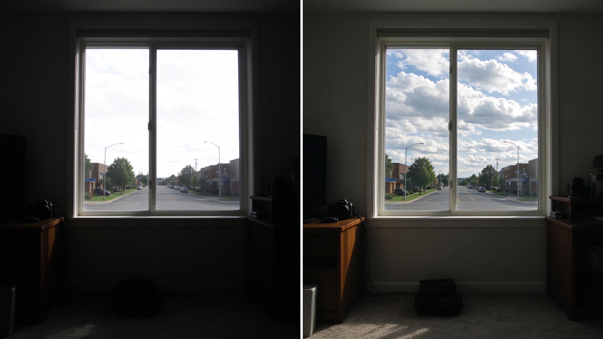
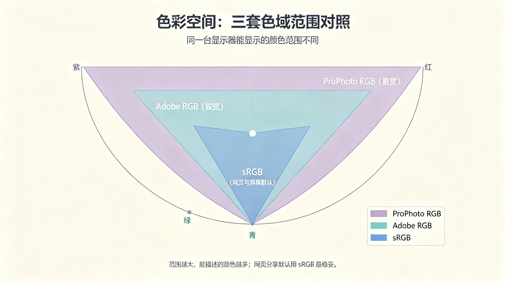

# 第 29 课：RAW、JPEG 与色彩空间——从"记录"到"可编辑"

你按下快门，相机替你记录光线；但这之后发生的事，才是"后期"真正的起点。很多人把后期想成"修图"，其实后期是从"我拍了什么"到"我让这张照片成为什么样"的一连串决定。这一课先把一个最重要的基础讲清楚：你的相机到底记录了什么、它替你处理了多少、你之后还能编辑多少。

## 1. 相机"直出"的其实是一个成品

当你把相机设为最常见的 JPEG 模式并按下快门，相机内部会立刻做一连串处理：把传感器读到的原始数据转成影像，套上白平衡，压一条影调曲线，再降噪、锐化、压缩，最后存成一个 JPEG 文件。这一整套动作，中文常叫**相机直出**（或"机内处理"）。

JPEG 直接就能看、能发、能打印——它是相机替你"定稿"后的成品。也就是说，你按下快门那一刻，只是决定的开端；JPEG 模式下，后面大部分"这张照片长什么样"的选择，已经由相机替你做了。

这句话不是贬低 JPEG。恰恰相反，绝大多数照片用 JPEG 直出完全够用。你要明白的只是：直出是一条"相机替你定稿"的路，而下面要讲的 RAW 是另一条"把定稿权留给你自己"的路。先认识这两条路的差别，再决定自己常用哪条。

## 2. RAW：传感器的"原始记录"

**RAW** 不是某一种固定的图片格式，而是一类"原始记录文件"：各家相机扩展名不同（`.NEF`、`.CR2`、`.ARW`、`.RAF` 等），但共同点是——它把传感器读到的数据，连同白平衡、色彩模式、镜头信息等设置，基本原样保存下来，只做很少甚至不做压缩。

### 2.1 RAW 解决什么问题

因为相机没有替你"定稿"，你可以在电脑上重新决定很多事：白平衡到底是偏冷还是偏暖、影调是压暗还是提亮、颜色是鲜明还是沉稳。而且这些决定不是"改坏了就没法回头"，而是随时可以重来、随时能回到最初的记录。

更重要的是**宽容度**。简单理解，宽容度就是"记录下来的信息能容忍多大范围的明暗调整"。RAW 保留了比 JPEG 更多的中间信息，所以当画面明暗跨度很大时，RAW 能帮你把过亮或过暗的部分找回更多细节；JPEG 在机内处理时已经丢掉了一部分，能找回的就少。

上图：同一个窗边的高反差场景。左半像相机直出的 JPEG——亮部（窗外）和暗部（室内）都被推到极限，细节丢了；右半像从同一张 RAW 处理出来的结果——窗外的云和室内的陈设都还看得清。RAW 的作用不是让照片"凭空更漂亮"，而是给你更多"把信息找回来"的空间。（原创生成示意图，非真实照片）

### 2.2 RAW 不等于什么

- **RAW 不是"更漂亮"**，而是"更可编辑"。在还没有做任何处理、也没开任何软件时，RAW 看起来往往比相机直出更灰、更平淡，这是因为机内的影调、反差和锐化都还没套上去。看到 RAW"变灰"不要慌，这是正常的，不是照片坏了。
- **不是每张都值得 RAW**。连拍抓拍、长焦打鸟、纯记录，一口气拍几百张时全用 RAW 会让卡存不下、整理更慢。很多相机支持"RAW + JPEG 同时存"，你可以在拍重要素材时用它。
- **RAW 不等于万能**。如果拍摄时信息就没记下来（比如严重欠曝到一片死黑、或严重过曝到一片死白），RAW 也找不回没有的东西。

### 2.3 何时再深入

宽容度能"找回多少"的精确边界，会在第 32 课结合影调曲线细讲；RAW 转档时怎么取舍、要不要转成什么，第 33、34 课会用到。这一课你只要建立两个判断：**我拍的是成品（JPEG）还是原料（RAW）？我需要把多少定稿权留给自己？**

## 3. 色彩空间：一个"怎么描述颜色"的约定

后期里经常出现 sRGB、Adobe RGB、ProPhoto RGB 这些词。它们不是滤镜，而是**色彩空间**——一组"用数字怎么描述颜色"的约定。同一个数字，在不同色彩空间里代表的是不同的颜色。

色彩空间解决的是"颜色传到别处不变样"：你在一台屏幕上看是偏红的，传到别人手机或打印出来会不会偏？如果大家都用同一套"颜色字典"来描述照片里的颜色，跨设备时就更不容易跑偏。

它**不等于调色**。色彩空间解决的是“颜色到别处还是不是这个颜色”，不解决“这个颜色好不好看”——好不好看是你在后期里主动做的选择。对初学者，这一课只需记住一条最常用的默认：**网页和绝大多数手机、电脑屏幕都按 sRGB 来理解颜色**，所以面向屏幕分享时，sRGB 是最不容易出错的起点。更细的屏幕与打印适配留到第 34 课。

上图：把 sRGB、Adobe RGB、ProPhoto RGB 三套色彩空间叠在同一张马蹄形色域图里能看出——sRGB 范围最小，Adobe RGB 更宽，ProPhoto RGB 最宽。范围越大，能描述的颜色越多；但跨设备分享时，sRGB 是最不容易跑偏的默认起点。（原创生成示意图，非真实照片）

再补一个常和“色彩空间”一起出现、其实相关的词：**位深**。它描述一张照片把亮度分成多少个台阶——8 位大约能存 256 个明暗台阶，16 位能存数万级。台阶越密，从亮到暗的过渡越平滑。如果在一张信息很少的渐变区域（比如大片的天空）上强行拉反差，台阶不够密时，过渡处会出现肉眼可见的“断层”或色块。这也是“色阶”上的一种损失，和“明暗跨度太大”是两回事。RAW 通常在更高位深下处理，正是为了让这样的过渡更稳；这也再次说明，重要素材留 RAW 的价值不只在于“找回亮度”。

## 4. 非破坏性编辑：不改变原图的工作方式

现在主流后期软件（例如 Lightroom、Capture One 这类"参数型"软件）采用的工作方式叫**非破坏性编辑**：你每一步调整都被存成"参数/调整记录"，原图文件本身并不被改写。你随时可以撤销、重调、把某一步回到最初。

它解决的是"改错了怎么办"的顾虑——因为原图一直没动，你可以放心大胆地尝试；也便于以后再换一种思路重新处理同一张 RAW。它**不等于**"永远不会变差"：一旦你把调整好的结果导出成 JPEG 发给别人或打印，那个导出物就定型了。所以一个负责任的习惯是：**原始文件始终备份一份、始终不覆盖**，你改来改去的是参数，不是把唯一的原图越改越少。

## 5. 本课先不学软件按钮

最后说明一个原则：这套后期课程**从"我希望照片成为什么样"开始，而不是从软件按钮开始**。我们不在一开始就教某一个软件里的一百个滑块，那会让你记住一堆操作、却不知道怎么用。后续每一课会反过来——先讲清楚你想达到哪类效果，再告诉你"这类目标通常对应哪种调整"。工具可以换，思路是通用的。

## 练习：看一次"原料"和"成品"的差别

找一张明暗跨度大的照片去拍（例如室内朝窗外、日落天空、逆光的树影），用相机同时存 JPEG 和 RAW（若你的相机不支持，就借或先跳过，用手机也可以做"尽量保留暗部"的观察）。然后：
1. 先只看相机直出的 JPEG，记下窗外和暗部各丢了多少细节。
2. 再把 RAW 导入任意能处理 RAW 的软件，尝试把暗部提亮、把高光压回，观察能找回多少。
3. 同样地对 JPEG 做一次相同的调整，对比 JPEG 是否更容易出现死白、断层或色块。

把这次对比记下来：以后你就会知道，什么时候值得为一张照片留 RAW。

## 下一课：拍完之后，最先要做的事不是"修"，而是"选"——下一课讲照片筛选、文件整理与选片。
