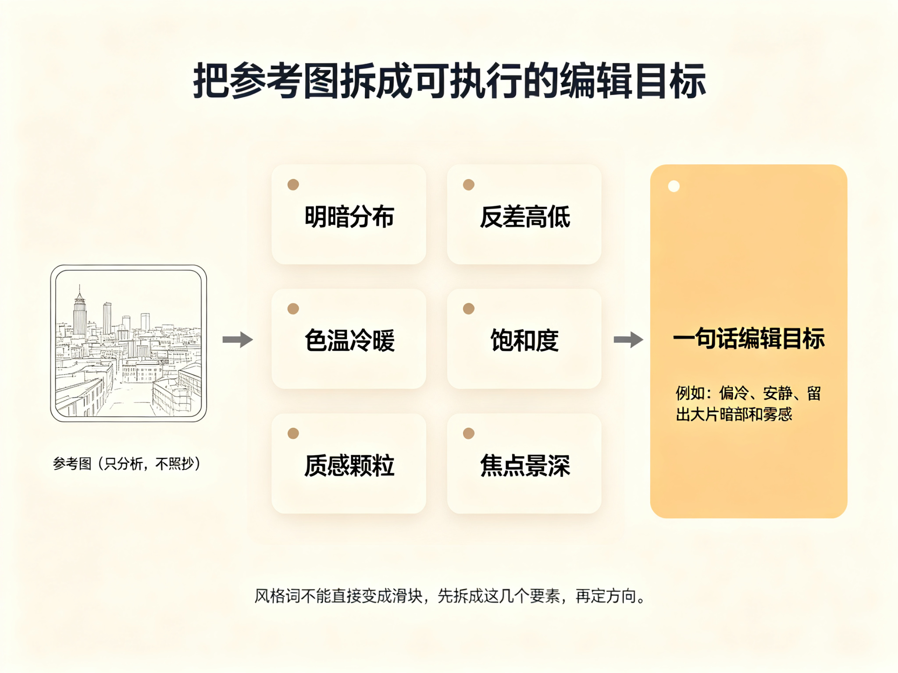
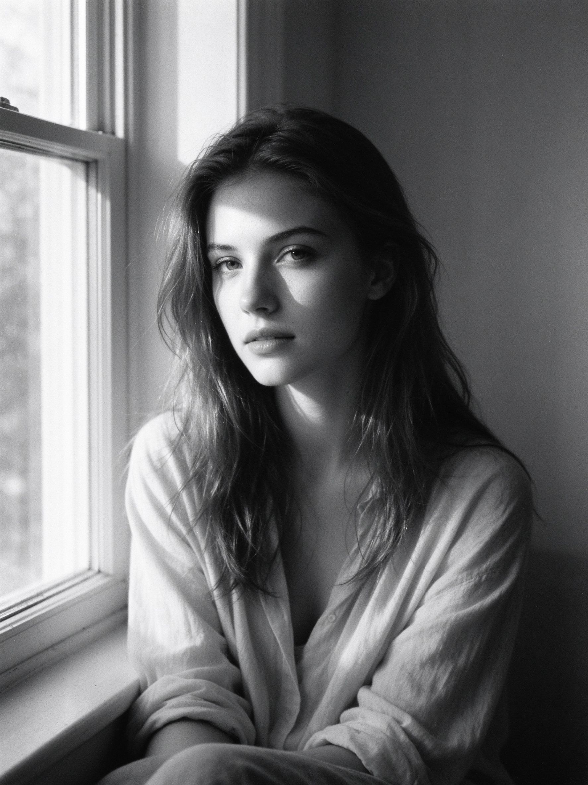

# 第 31 课：参考图分析与编辑目标——先把"想变成什么样"说清楚

选好照片之后，最容易犯的错是一头扎进软件里乱拉滑块。更高效率的做法是：在动手之前，先花几分钟想清楚——**这张照片到底要成为什么样**。这一课讲怎样用"参考图分析"把模糊的感觉，翻译成可以执行的编辑目标。

## 1. 先写出一句话目标

"想让它成为什么样"不能是一团感觉。试着把它压缩成一句话，比如："这是一张雨天街头的照片，我想让它偏冷、安静、留出大片的暗部和雾感。"或者"这是人物逆光，我想让人物脸亮一点、窗外保留细节、整体自然。"

这句话就是你的**编辑目标**。它不一定要完美，但一定要能说出来。说不出来，说明你还没决定要什么，这时候动手多半是来回试错。

## 2. 怎么分析一张参考图：拆成可读的"后期要素"

参考图不是为了让你照着抄色调，而是帮你把想要的效果**具体化**。你不需要复制它，只需要从它身上读出几个"这次我想要哪个"。

围绕后期，通常值得拆这几个要素：

- **明暗分布**：整张偏亮还是偏暗？是低曝光偏沉，还是高调偏亮？暗部是厚实的黑还是柔和的灰？
- **反差**：明暗过渡是陡峭（高反差、黑白分明）还是平缓（低反差、柔和平淡）？
- **色温与白平衡**：整体偏冷（蓝）、偏暖（黄）还是中性？肤色、墙面是往哪个方向偏？
- **饱和度与克制**：颜色鲜明，还是大面积克制、只留一处亮色？
- **质感与颗粒**：画面是干净锐利，还是有胶片颗粒、柔化、暗角？
- **焦点与景深**：是浅景深把背景虚掉，还是全景深交代环境？

上图：参考图不是拿来照抄的，而是拿来"读"的。把它拆成明暗分布、反差、色温冷暖、饱和度、质感颗粒、焦点景深这六个要素，读出每一项的倾向，最后收束成一句能说出口的编辑目标——比如"偏冷、安静、留出大片暗部和雾感"。（原创生成示意图，非真实照片）

下面用第 25 课的一张黑白示范图来演示怎么读它（这也是一个很好的分析练习对象）：

上图：如果我们要把这张黑白照片当作参考，可以读出——整体偏中低调、有明确的暗部；反差偏高，明暗分界清楚；没有彩色干扰，观看被集中在形状和光影上；带一点颗粒和暗角，让边缘不那么"数码感"。这些就是"编辑目标"里的可操作要素，而不是一句"想要黑白"。（原创生成示意图，非真实照片）

## 3. 把"风格词"翻译成"可操作目标"

"想要电影感""想要港风""想要日系"这些词，都不能直接变成滑块。它们先要被拆成要素——电影感可能是"低饱和、偏冷、暗部压沉、暗角"；港风可能偏"高对比、偏暖、颗粒、夜晚霓虹"；日系可能偏"高调、低反差、偏冷、干净"。**这些拆法没有唯一标准**，重要的是你会自己拆，而不是一键套"港风滤镜"。

这正是第 20 课和第 27 课反复强调过的：风格是多个变量的组合，不是滤镜预设。你在后期里做的，其实就是"自己把这几个变量调成想要的那个组合"。

## 4. 用参考图和自己的照片做"差距清单"

把参考图放在旁边，和你要处理的照片对照，写下差距：

- 我的照片明暗和它差在哪？它压暗/提亮了哪里？
- 色温冷暖差多少？要不要往冷或暖拉？
- 反差、饱和、颗粒，各差多少？

这张"差距清单"就是你接下来动手的顺序。它不是让你把照片改得和参考图一模一样，而是让你知道：**我从现在这个状态，往哪个方向走，才更接近我想要的样子。**

## 5. 参考图从哪来：自己的参考板

你不需要去抄别人的成品。更好的来源，是你之前建立的**参考板**——第 28 课讲过的方法：把你喜欢的、能说明"我想要这种效果"的照片收集在一起，每张写一句"我为什么喜欢它"。真实作品和受版权作品只作分析来源，不下载不冒充；原创生成的示范图你可以随意保存。这样你的参考板是"自己的口味"，不是"别人的风格"。

## 练习：写一张"差距清单"

1. 从你的参考板（或上面这张黑白示范图）挑一张，用本课的六个要素各写一句，读出它的编辑倾向。
2. 挑一张你自己要修的照片，和参考图并排对照，写出差距清单：明暗差在哪、色温差多少、反差/饱和/颗粒各差多少。
3. 把差距清单压缩成一句编辑目标（像第 1 节那样），写在那张照片旁边。

## 下一课：目标已经说清楚，就可以真正动手了——下一课讲全局调整：明暗、白平衡与色彩。
