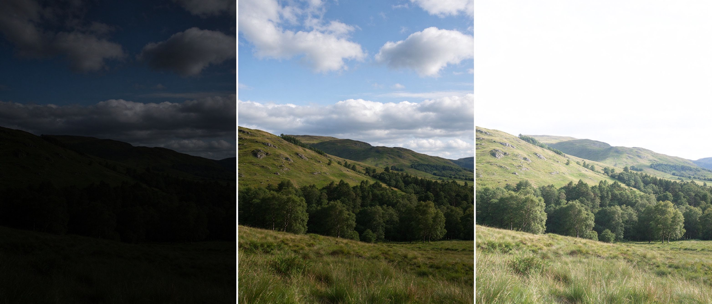
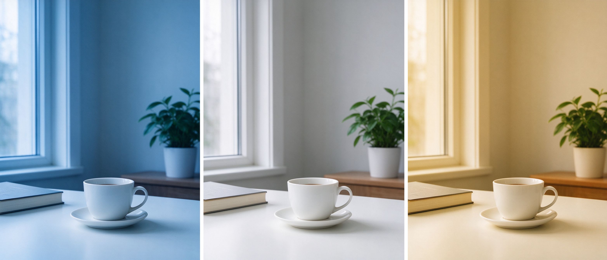
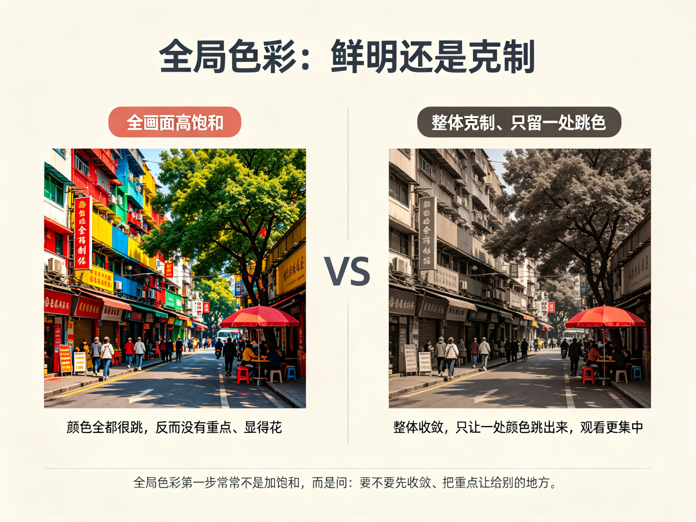

# 第 32 课：全局调整——明暗、白平衡与色彩

这一课开始真正动手。**全局调整**指的是"影响整张照片"的那类设置：明暗、白平衡、色彩。它是后期的基础——先把"整体"调对，再谈局部。反过来如果整体方向没定就急着抠局部，很容易越调越乱。

## 1. 全局明暗：决定整张照片是亮是暗

全局明暗的核心是"整张照片偏亮还是偏暗、反差是强是弱"。常用的对应调整包括：曝光、亮度/对比度、以及更精细的影调曲线（后面细讲）。这一课先建立判断：**明暗没有唯一的"正确值"，它服从你想表达的目标**。

上图：同一张风景，左格明显欠曝——整体偏暗、暗部发黑；中格曝光正常，明暗细节都在；右格明显过曝——整体偏亮、天空发白。全局明暗调整，就是在这些状态之间选择，而不是"一定要把照片调到最亮"。（原创生成示意图，非真实照片）

一个实用的观察工具是**直方图**：它大致显示照片从暗到亮的像素分布。你不需要背规则，只要学会看"直方图偏向左边就是整体偏暗、偏向右边就是整体偏亮、两端顶满就是有死黑或死白"。当你做全局明暗调整时，可以一边看画面一边看直方图，确认没有把本可保留的细节推到死黑或死白。

前面第 29 课讲的**宽容度**在这里派上用场：如果照片高光或阴影还留有信息，你可以在后期里"压回高光、提亮暗部"，把细节找回来；如果已经死白或死黑，那一块就救不回了。这就是为什么重要素材值得保留 RAW。

## 2. 白平衡：决定照片里的"白色"是冷是暖

**白平衡**解决的是"照片里的白色该是什么颜色"——更进一步说，它决定整张照片的冷暖基调。同样是白墙或白纸，偏冷（发蓝）会显得清冷、偏暖（发黄）会显得温暖。

相机在拍摄时通常会按现场光线设定白平衡，尽量把白色还原成白色；但你在后期里可以重新决定：是让这张照片保持中性、还是故意偏冷或偏暖来传达情绪。

上图：同一个白瓷杯与桌面。左格白平衡偏冷，整体发蓝；中格中性，白色还原为白色；右格偏暖，整体发黄。**白平衡是后期里很便宜却很有力量的调整**——它不改变主体，却能改变整张照片的情绪。（原创生成示意图，非真实照片）

要注意，白平衡**不等于调色**。白平衡主要管"白色/中性色的基准、以及整体冷热"，是对还是错（偏不偏）有相对客观的标准；而"色调/曲线/饱和"是更有主观选择空间的部分。先学会把白平衡调"对"（白色不偏色），再去考虑要不要故意偏冷偏暖来表情绪。

## 3. 全局色彩：鲜明还是克制

色彩层面的全局调整，通常围绕**饱和与克制**展开：是让整张照片颜色鲜明，还是让颜色收敛、留出安静。常用的对应调整包括饱和度、自然饱和度、以及色相微调。

一个常见的误区是把"饱和度拉满"当成"调色"。真正的选择是：**先决定我要的是鲜明、还是克制，再决定让哪一处跳出来**。如果全画面都饱和，往往反而没有重点；如果整体克制、只让一处颜色跳出来（像第 17 课那把红伞），观看会更集中。所以全局色彩调整的第一步，常常不是加饱和，而是问自己"我要不要收敛一下、把重点让给别的地方"。

上图：同样的街头场景，左格把所有颜色都拉到高饱和，反而花哨、没有重点；右格把整体压低成克制的灰调，只让一把红色雨伞跳出来，视线立刻被抓住。全局色彩的关键不是"加多少饱和"，而是"要不要先收敛、把重点让给一处颜色"。（原创生成示意图，非真实照片）

## 4. 一个建议的顺序：明暗 → 白平衡 → 色彩

动手时不必死板，但按这个顺序往往更顺：先做全局明暗（把曝光和反差调到大致对），再调白平衡（把冷热定下来），最后处理色彩（鲜明或克制）。每一步都只做一件事、做完看一眼直方图和画面，确认没有把不该丢的细节丢掉。改坏了也不怕——第 29 课讲过，这些调整是非破坏性的，随时可以重来。

全局调整做的不是"让它变好看"这种模糊的事，而是"先定下整张照片的骨架"：亮暗到哪、冷热到哪、颜色鲜明到哪。骨架定了，下一课的局部调整才有地方落脚。

## 练习：一张照片的"全局三连"

1. 挑一张你要修的照片，先只做**全局明暗**：把它分别调成偏暗、正常、偏亮三种，各看一眼直方图，选一个最接近你编辑目标的，写下为什么。
2. 接着调**白平衡**：从偏冷到偏暖慢慢移动，找到"白色还原正确"的位置，再试试故意偏冷和偏暖，各写一句情绪。
3. 最后做**全局色彩**：比较"整体克制"和"整体鲜明"两种状态，决定你要哪一种。

## 下一课：全局定好了，就该处理画面的"某一块"了——下一课讲局部调整，以及人像、风光、黑白等不同题材的差异。
