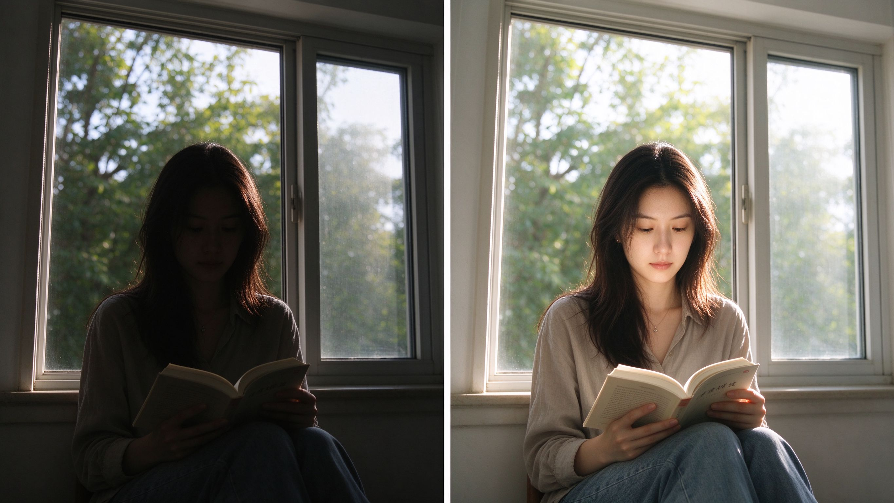
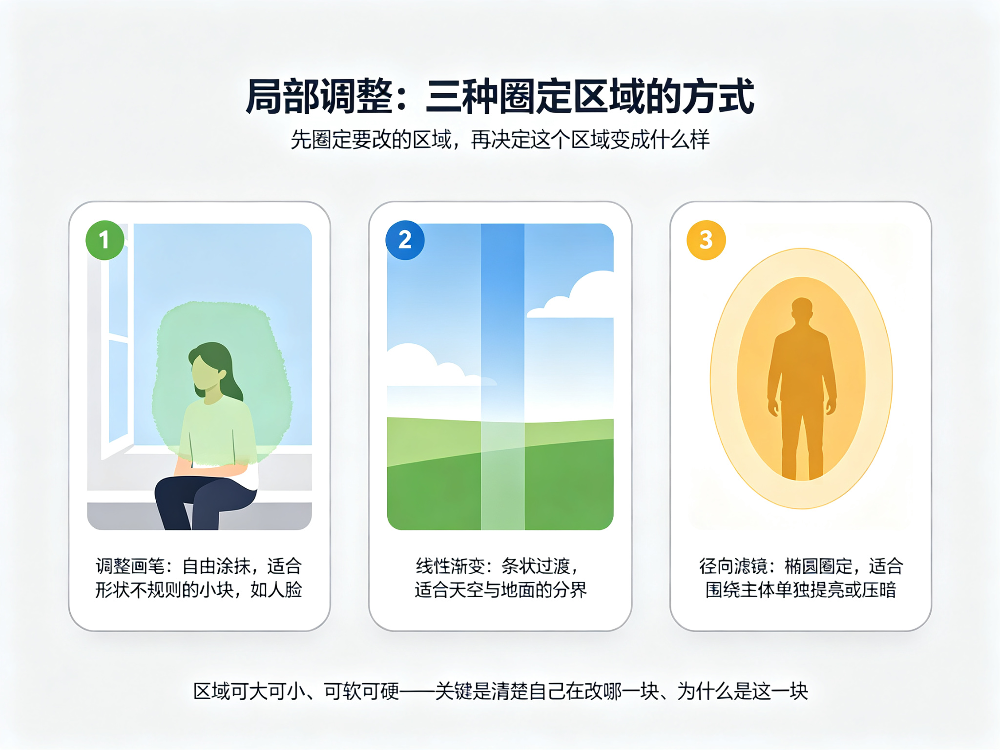

# 第 33 课：局部调整与不同题材的处理策略

上一课的全局调整决定了整张照片的"骨架"：亮到哪、冷到哪、颜色鲜明到哪。这一课讲**局部调整**——只改画面里的"某一块"，以及同一套工具在不同题材下该怎样取舍。

## 1. 局部调整：只动画面的一块

很多时候，问题不在整张照片，而在某一处：人脸太暗、天空太亮、背景抢眼、某块颜色发脏。全局提亮会把天空也提过头，全局压暗又把主体也压下去——这时候需要的是**局部调整**：只改变画面里某一块区域的明暗、颜色或清晰度，其他部分保持不动。

上图：同一张逆光人像。左半是原始画面——人物在逆光下偏暗、看不清脸；右半做局部调整——只把人物脸部与书本提亮、让面孔清晰，窗外保持原样。局部调整的价值就是"单独处理一块"，而不是因为一处问题把整张照片都动了。（原创生成示意图，非真实照片）

实现"只改一块"的具体工具（蒙版、径向滤镜、调整画笔、渐变等）会因软件而异，这里不逐一教按钮。你只需要掌握它的思路：**先圈定"我要改的区域"，再决定这个区域改成什么样**。区域可大可小、可软可硬，关键是你要清楚地知道自己在改"哪一块"、以及"为什么是这一块"。

上图：三种常见的局部工具，圈出来的"选区"形状各不相同。左边是调整画笔，像笔刷一样自由涂抹，最适合人脸这种不规则的小块；中间是线性渐变，一条从上到下或从左到右的柔和条带，最适合天空和地面这种有分界线的地方；右边是径向滤镜，一个椭圆形的圈，最适合围绕主体单独提亮或压暗。它们名字不同，但思路都一样：先圈定要动的那一块，再决定这块要变成什么样。（原创生成示意图，非真实照片）

## 2. 不同的题材，处理的重心不一样

局部和全局工具是同一套，但用在不同题材上，取舍差别很大。下面按第 28 课的项目思路，给几个常见题材的处理要点（都是倾向，不是公式）：

### 2.1 人像：把观看留在脸和眼神

人像后期最常做的是让**脸、眼睛、肤色**自然突出：逆光时提亮脸部、压暗喧闹背景，让视线回到人脸；处理皮肤质感时，"干净"不等于"塑料"——把明显的瑕疵和噪点去掉，但保留皮肤应有的纹理和光泽，避免磨成无质感的白板。肤色要自然，不要为了"冷/暖"把脸弄得发青或发黄。

### 2.2 风光：天空和地面分开对待

风光的高反差常发生在"天空亮、地面暗"。常见的做法是**分别处理**：把天空压一点、把地面提一点，让两者都保留细节，而不是整体提高对比把一边推死。细节锐化可以做，但要避免"锐到起白边"；饱和度同样要克制，绿色草地、蓝色天空一旦拉满，很容易失真。真实的天气与光线本身就有层次，后期是把它找回来，不是把它填满。

### 2.3 黑白：重心在明暗结构

黑白照片里没有颜色替你说话，观看集中在**形状、明暗与反差**上。所以黑白处理的重点不是"去饱和"（直接去饱和往往发灰发闷），而是重新分配明暗：压暗或提亮某块，让主体从背景里"跳出来"。颗粒与柔化在黑白里能强化质感，但同样要适度。

### 2.4 项目一致性：一批照片用同一套目标

如果你在做一个系列或一个项目（第 28 课讲过），那重要的不是单张，而是**一批照片的观感一致**：明暗基调、冷热、饱和、颗粒要大致统一。做法是先确定一套"编辑目标"（回到第 31 课的那句话），再把这套目标应用到每一张，而不是一张一个样。项目一致性不是"每张都套同一个滤镜"，而是"每张都服务于同一个表达"。

## 3. 克制：修得越少越好

后期最容易被忽略的纪律是**克制**。每次动手前先问一句：这一处，是真的需要改，还是只是"顺手调一下"？过度后期最常见的后果，是照片失去真实感、边缘发脏、颜色失真，最后"修得太过"比"没修"更糟。一个实用的做法：调完暂停，隔一段时间再回来看，如果觉得"其实原来没那么差"，就把过头的部分收回来。

## 练习：一处局部 + 一个项目

1. 挑一张逆光人像（或窗边人物），只做局部调整：把人物脸提亮、把过亮的背景适当压回，**其他部分保持不变**，做完对比左右，确认你只改了该改的一块。
2. 如果你正在做一个小项目，把上一课定好的编辑目标写下来，对这一批的 3–5 张照片用同一套目标处理，比较它们是否观感一致。

## 下一课：处理和修整不是终点，能正确"输出"才是——下一课讲输出到屏幕、社交媒体与打印的检查方法。
