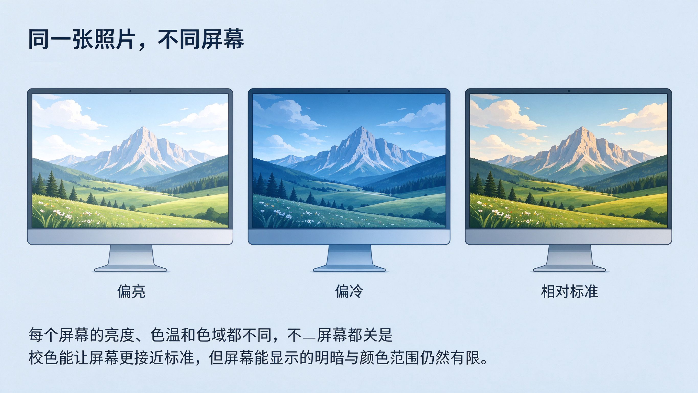

# 第 34 课：输出与检查——屏幕、社交媒体与打印

处理完一张照片，还差最后一步：**把它正确地输出出去**。很多人在这里栽跟头——在电脑上看着很好，发到手机却灰了、打印出来却偏色、或者传到网上被压缩得发糊。这一课把输出前后的检查与准备讲清楚，也是后期工作流的收尾。

## 1. 输出前，先在屏幕上"完整地"检查一遍

不要一调完就急着发。先把照片从头到尾检查一遍，重点看几处：

- **整体明暗与白平衡**：回到第 32 课的三个判断——明暗到没到你要的、冷热对不对、颜色是鲜明还是克制。
- **边缘与细节**：放大看主体边缘有没有发脏、锐化过头起白边、噪点明显到影响观看的地方。
- **有没有修过头**：特别是肤色、天空、高光——是否失真到不像真的。
- **换个视角再看**：有条件的话，用另一台设备（手机、另一块屏幕）或隔一段时间再看一次，避免被自己的屏幕"带偏"。屏幕亮度、偏色会显著影响你的判断。

这一遍检查对应的是第 31 课那句编辑目标：**成品有没有达到你一开始想表达的样子？**

### 1.1 你的屏幕“可信”吗：校色与显示范围

第 10 课讲过，任何能显示照片的设备——屏幕、相纸，也包括我们的眼睛——能容纳的明暗跨度都是有限的。屏幕也不例外，而且每块屏幕都不一样：有的偏亮、有的偏冷、有的饱和度过高。你在自己屏幕上看到的效果，并不自动等于它“真正长什么样”。

所以在输出前检查时，先让屏幕“可信”一点：

- **校色（校准）**：用校色仪或系统自带的显示配置文件，把屏幕的亮度、色温（白点）和伽马曲线调到接近标准的状态。不校色的话，屏幕本身的偏色和偏亮会持续误导你对“够不够亮、够不够冷”的判断。
- **记住显示范围本身有限**：哪怕校色过的屏幕，能显示的色域（如 sRGB）和明暗跨度也是固定的。超出显示范围的高光或阴影，在屏幕里就是死白或死黑，但原始文件里可能还留有信息——这正是第 10 课那句话：别把“屏幕上看不到”当成“文件里没有”。判断时不妨结合直方图和分通道直方图，而不是只信眼睛。
- **多一个参照**：有条件就把照片放到另一台设备（手机）或打印小样上对照，避免被单块屏幕带偏。

这一小节的作用是提醒：屏幕既是检查工具，也是“显示范围有限的设备”。校色能减少偏色，却不能扩大屏幕能显示的范围；真正决定成品观感的，是文件里记录的信息和你对输出的选择。

上图：同一张照片在不同屏幕上可能呈现很不一样——每块屏幕的亮度、色温和色域都不同。校色能让屏幕更接近标准，但屏幕能显示的明暗与颜色范围仍然有限。（原创生成示意图，非真实照片）

## 2. 不同的输出，需要不同的准备

"把照片导出"不是只有一种答案。你发给手机和打印出来，关注的东西很不一样。

### 2.1 屏幕与社交媒体

面向手机、电脑和社交媒体时，大多数情况用 **sRGB** 色彩空间（第 29 课讲过，网页和主流屏幕按它理解颜色）就能避免"换设备变样"。尺寸和压缩要合理：原图往往有几 MB 甚至几十 MB，社交媒体会再压缩一次，你要保证导出时没有被过度压缩到发糊，也要选一个合适的边长（通常够大且能看清细节即可，不必追求原尺寸）。记住：**你在软件里看到的效果，不等于发到平台后的效果**，很多平台还会再压一遍、再调一次对比。

### 2.2 打印

打印是另一套规则。它关心的是**输出尺寸与分辨率**：打印多大、需要多少像素，和屏幕显示的计算不一样。同时，打印有它自己的色彩空间（比如 CMYK 或打印机的特定空间），直接从屏幕导出原图去打印，常常会偏色或偏暗。打印的色域通常比屏幕更窄，所以为打印准备时，往往要在有限的打印色域里重新做取舍——这和前面讲过的明暗取舍是同一个道理：设备能显示的范围有限，你要决定这一版优先保住哪些。还有一个常被忽略的变量是**纸**：光面纸和哑光纸对明暗、反差的呈现明显不同，同一张图在不同的纸上观感差别很大。所以如果真的要打印，最好先针对你要用的纸和打印服务做小样测试，而不是一张大图直接冲。

### 2.3 不要幻想"一张图打天下"

屏幕分享和打印的准备是不同的，甚至分享到手机 vs 电脑也可以有差别。能少做就少做，但要知道：**为打印准备的导出，和为屏幕分享准备的导出，不是同一个导出。**

## 3. 锐化与导出：这是"定型"的一步

锐化在后期里要谨慎：过度锐化会出白边，影响质感。合理的做法是**只在最后、针对输出方式做适量锐化**，而不是一开始就把照片锐满。更重要的是，第 29 课讲过，你在软件里做的所有调整都是非破坏性的——**导出那一刻，成品才真正定型**。所以导出的东西，就是你要交付的那个版本；原图和"还没定型的工程"依然保留着，随时可以重调。

## 4. 备份与归档：成品之外的收尾

输出完成不等于工作完成。把三样东西分清楚并保管好：
- **原始文件**（RAW/JPEG 原图）：永不覆盖、留一份备份。
- **工程/调整记录**：让你以后还能改的"非破坏性"版本。
- **成品**（导出的 JPEG 等）：你交付给别人的那一个。

回到第 30 课的习惯——先备份、再删减、原图只读。等这些都安顿好，一张照片从拍摄、选片、分析、全局调整、局部处理到正确输出，才算走完一个完整的闭环。

## 练习：一次"双输出"对照

1. 挑一张你处理完的照片，分别准备两种输出：一种是给手机/社交媒体分享的版本（选好尺寸与压缩，用 sRGB），一种是打印版本（按你要用的打印服务和纸型准备）。
2. 把分享版发到你自己的手机上，和电脑屏幕对照，写下颜色和清晰度有没有变化。
3. 若条件允许，打印一张小样，对照屏幕看明暗与颜色差异，记下"下次该注意什么"。

## 结束语：从"拍下来"到"好好交付"的完整闭环

到这里，29–34 课的后期工作流就走完了：先想清楚要什么（参考图与编辑目标），再从全局到局部动手（明暗、白平衡、色彩、局部），最后正确地输出与交付。它和你前面学过的拍摄、构图、风格一起，构成一个完整的闭环——**先决定想让照片成为什么样，再通过拍摄和后期把它实现**。

课程地图到这里告一段落。之后没有必须继续的"下一课"，真正延续课程的是你的拍摄与项目：给自己定一个能持续做的小项目，用参考板、编辑目标和项目一致性方法，一批一批地拍、选、修、输出，再回来看这些课。风格和后期能力，都是在这个过程中越磨越清晰的。
