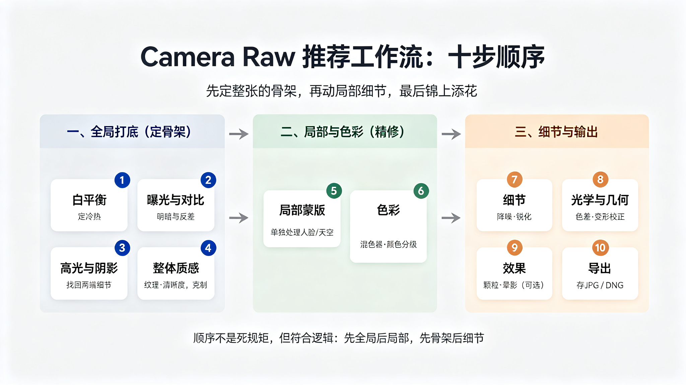
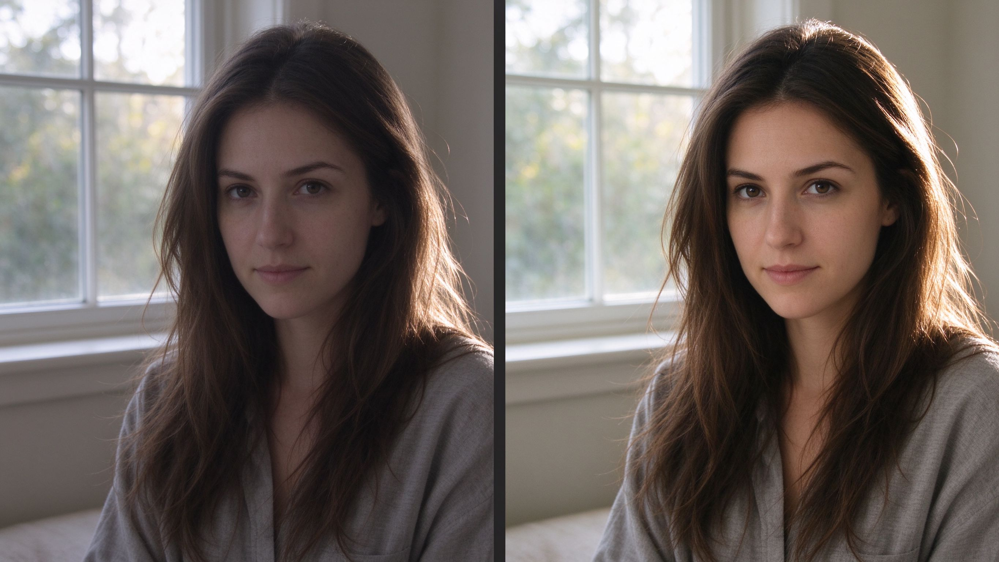
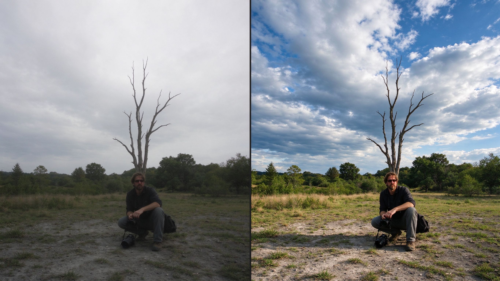

# 第 35 课：Camera Raw 实战工作流——从原图到成品（Photoshop 2027 · Camera Raw 18.6）

前面几课把后期的"理念"讲清楚了：先想好要什么，再从全局到局部，最后正确输出。这一课给你一套可以直接照做的**实操工作流**，用 Photoshop 2027 自带的 Camera Raw 18.6，把一张原始照片一步步修成成品。你不需要背软件里所有按钮，只需要记住"顺序 + 每个滑块是干什么的"。

## 0. 打开 RAW：先认识入口和界面

Camera Raw 是 Adobe 处理 RAW（以及 JPEG）的"打底"工具。常见的打开方式：
- 用 **Adobe Bridge** 选中照片，右键 → "在 Camera Raw 中打开"；
- 在 **Photoshop** 里用"文件 > 打开"直接打开 RAW，会先进 Camera Raw；
- 也可以对一张已打开的照片用"滤镜 > Camera Raw 滤镜"重新进。

打开后你会看到：左侧是照片和预览/缩放、直方图；右侧是一竖排**编辑面板**。Camera Raw 18.6 的编辑面板主要标签（自下而上大致是）：**基本、曲线、细节、混色器、颜色分级、光学、几何、效果、校准、预设**；上方还有**裁剪与扩展、蒙版、移除**等工具。18.6 版本还加入了几个方便的新功能，后面用到时会提：效果面板里的**发光（Glow）**、裁剪和扩展面板里的**修剪（Trim）**、元数据**信息**面板，以及 18.5 加入的 AI 皮肤**瑕疵**移除等。

### 推荐操作顺序（先给总纲，两个案例照做）

把"先想清楚要什么"落到具体步骤上，一个推荐的顺序是：

1. **白平衡**：先让白色是白色、冷热定下来
2. **曝光与对比**：决定整张是亮是暗、反差强弱
3. **找回高光与阴影**：把窗外、暗部该留的细节找回来
4. **整体质感**：纹理、清晰度、去薄雾（克制）
5. **局部蒙版**：单独处理关键区域（人脸、天空）
6. **色彩**：混色器、颜色分级、黑白转换
7. **细节**：降噪与锐化
8. **光学与几何**：色差、变形、透视校正
9. **效果**：颗粒、晕影、发光（可选）
10. **导出**：存成 JPEG 或渲染为 DNG

这个顺序对应第 32、33 课的思路：先全局后局部、先定骨架后补细节。下面两个案例会一步步演示。

上图：把上面十步按逻辑分成三段看。第一段"全局打底"先定整张照片的骨架——冷暖、明暗、两端细节和基本质感；第二段"局部与色彩"再单独处理人脸、天空这些关键区域，并把颜色调顺；第三段"细节与输出"做降噪锐化、镜头校正这类收尾，最后导出。先全局后局部、先骨架后细节，就是这个顺序的意义。（原创生成示意图，非真实照片）

## 1. 案例 A：人像——从"逆光灰暗"到"自然通透"

下面这张就是你要修的照片的"起点"和"终点"对照：左半是刚导入 Camera Raw 的原始画面（偏灰偏冷、窗外偏亮、人脸不清），右半是我们要调成的样子（肤色自然、明暗均衡、眼神清楚）。

跟着下面一步步做（每一步标了目标/工具/效果）：

**第 1 步 · 白平衡**
- 目标：让肤色不发青、整体不偏冷。
- 工具：编辑面板 → 基本 → **色温 / 色调**（可先用滴管在衣服或墙上的中性处点一下）。
- 效果：偏冷偏沉的画面恢复自然中性的肤色基调。

**第 2 步 · 曝光与对比**
- 目标：画面别太灰、太沉。
- 工具：基本 → **曝光**（略加）、**对比度**（略加）。
- 效果：整体清亮，明暗分界更清楚，但仍要保留暗部氛围。

**第 3 步 · 找回高光与阴影**
- 目标：窗外别死白、脸的暗部保留细节。
- 工具：基本 → **高光**（向左压回窗外）、**阴影**（向右提亮脸与暗部）。
- 效果：亮部和暗部两边都留下信息，这正是第 29 课讲的宽容度在后期里的用武之地。

**第 4 步 · 整体质感（克制）**
- 目标：皮肤细节清楚但不过度。
- 工具：基本 → **纹理**（小幅上调）、**清晰度**（尽量不要拉高，拉高容易让脸发脏）。
- 效果：细节有层次，却不会"磨过头"或"脏"。

**第 5 步 · 局部蒙版，把观看留在脸上**
- 目标：脸更突出、背景别抢眼。
- 工具：上方 **蒙版** → 选择主体（18.4 起主体检测更准；蒙版里还有**羽化/边缘**滑块让边界更平滑）。对主体加蒙版后，微调曝光/对比把脸提亮一点；再用线性渐变或双向渐变（18.4）把背景适当压暗。
- 效果：观看自然地落在脸上，背景安静下来。

**第 6 步 · 去瑕疵（AI）**
- 目标：去掉明显痘痘、杂点，但保留自然纹理。
- 工具：**移除**面板 → **瑕疵**（18.5 的 AI 瑕疵移除），可对每个点精细调整移除或恢复。
- 效果：皮肤干净，却不像塑料。

**第 7 步 · 降噪与锐化**
- 目标：暗部干净、边缘清楚。
- 工具：编辑面板 → 细节 → **减少杂色**（降噪）与**锐化**（小幅，宁可不足不要过头）。
- 效果：噪点减轻、边缘清楚；锐化过了会起白边，放大检查。

**第 8 步 · 导出**
- 目标：交付可用的成品。
- 工具：左下 **保存图像** → 格式选 JPEG、色彩空间 sRGB、尺寸按用途。
- 效果：得到能直接分享的成品。调完的原图与参数仍在，随时可重调。

## 2. 案例 B：风光——从"灰蒙平淡"到"通透有层次"

下面这张是风光的"起点 / 终点"：左半灰蒙、天空发白无层次、地面偏暗，右半是我们想调成的通透、天空有云、地面有细节的样子。

**第 1 步 · 白平衡**
- 目标：天空、地面别偏冷灰。
- 工具：基本 → 色温 / 色调。
- 效果：画面回到中性自然的色感。

**第 2 步 · 曝光与对比**
- 目标：灰蒙的画面清亮起来。
- 工具：基本 → 曝光（略加）、对比度。
- 效果：明暗拉开，不再灰成一片。

**第 3 步 · 找回高光与阴影**
- 目标：天空留住云层、地面不黑。
- 工具：基本 → **高光**（压回天空）、**阴影**（提亮地面）。
- 效果：天空和地面各自都有层次。

**第 4 步 · 去薄雾（去朦胧）**
- 目标：远处别灰蒙蒙。
- 工具：基本 → **去除薄雾**（向右小幅）。
- 效果：画面通透。提醒：别一次拉满，拉太猛会发黑、发脏。

**第 5 步 · 渐变蒙版，分开控制天空和地面**
- 目标：上下各自处理。
- 工具：**蒙版** → 渐变（或双向渐变），给天空一条渐变把天空再压一点、增强云层，给地面一条渐变把地面再提一点。
- 效果：天空更沉、地面更亮，层次分明又不生硬。

**第 6 步 · 混色器微调**
- 目标：天空蓝、草木绿自然，不过分。
- 工具：编辑面板 → **混色器（HSL）** → 调整蓝色的明度/饱和度、绿色的色相。
- 效果：颜色干净协调，而不是"饱和拉满"。

**第 7 步 · 光学与几何校正**
- 目标：楼不歪、边缘不发紫边。
- 工具：**光学**面板 → 消除色差；**几何**面板 → 垂直/透视校正。
- 效果：横平竖直、边缘干净。

**第 8 步 · 细节与增强**
- 目标：清晰、经得起放大。
- 工具：细节 → 降噪与锐化；若要更大尺寸，可用**增强**做超分辨率。
- 效果：细节扎实（增强会新建大图，不覆盖原图）。

**第 9 步 · 导出**
- 工具：保存图像 → JPEG（sRGB、合适尺寸）。
- 效果：成品。别忘了：饱和度要克制，去薄雾也要克制，宁可"通透但不假"。

## 3. 换一个目标，同一套工作流：黑白转换

把同一条工作流换个目标，就得到黑白处理（呼应第 25 课）：在第 1 步白平衡之后，**不先加饱和**，而是把饱和度降到接近 0，再用**混色器**里各颜色的明度滑块重新分配"哪种颜色变亮、哪种变暗"（例如让天空暗一点、让衣服亮一点），最后用蒙版微调明暗结构。你看，工具没变，变的只是"目标"——这就是第 31 课"先想清楚要变成什么样"的意义。

## 4. 为什么是这个顺序

白平衡（冷热）→ 明暗（曝光/对比）→ 找回高光阴影 → 质感 → 局部 → 色彩 → 细节 → 光学 → 效果 → 导出，这个顺序不是死规矩，但很符合逻辑：先定"整张的骨架"，再动"局部的细节"，最后才做"锦上添花的效果"。Camera Raw 的面板和按钮会随版本略变（18.6 只是界面更顺、AI 更多），但"目标 → 工具 → 效果"的思考方式不变。你学的是这个方法，不是某个按钮的位置。

## 练习：照着一张自己的 RAW，走完一遍工作流

1. 拿一张你自己的 RAW（人像或风光都行），从第 0 节的操作顺序开始，一步一步走。
2. 每一步都写下来三件事：这一步的**目标**是什么、用了**哪个工具/滑块**、调整后**画面和直方图**发生了什么。
3. 走完后导出，并把成品和"还没调的原始图"并排比较，确认达到了你第 31 课写的那句编辑目标。

## 下一课：到这里，你就具备了"用 Camera Raw 修一张照片"的完整能力。之后想继续深入，可以学曲线与颜色分级的进阶、多张照片的一致性批处理，或转入 Photoshop 的图层与蒙版——每一步都是从这套"目标→工具→效果"的工作流延伸出去的。
